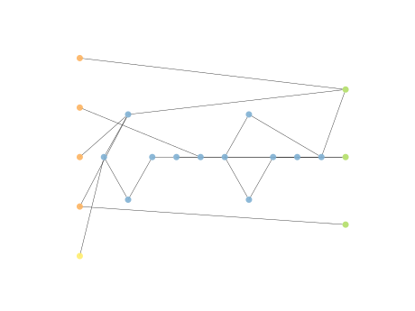

# Report Iris Uniform Distribution [-4, 4] run 0

## Best results in hall of fame

| measure       |    value |   individual |
|:--------------|---------:|-------------:|
| mean accuracy | 0.697    |         8826 |
| max accuracy  | 0.966667 |         8826 |
| mean kappa    | 0.5455   |         8826 |
| max kappa     | 0.95     |         8826 |

## Individuals in hall of fame

### Individual 8826

| key                    |     value |
|:-----------------------|----------:|
| mean log_loss:         |  0.786091 |
| mean accuracy:         |  0.697    |
| mean kappa:            |  0.5455   |
| number of edges        | 24        |
| number of hidden nodes |  4        |
| number of layers       |  3        |
| birth                  | 99        |

#### Network

### Individual 8960

| key                    |      value |
|:-----------------------|-----------:|
| mean log_loss:         |   0.768878 |
| mean accuracy:         |   0.6714   |
| mean kappa:            |   0.5071   |
| number of edges        |  26        |
| number of hidden nodes |   5        |
| number of layers       |   4        |
| birth                  | 100        |

#### Network

### Individual 8765

| key                    |     value |
|:-----------------------|----------:|
| mean log_loss:         |  0.78117  |
| mean accuracy:         |  0.673733 |
| mean kappa:            |  0.5106   |
| number of edges        | 22        |
| number of hidden nodes |  3        |
| number of layers       |  2        |
| birth                  | 98        |

#### Network

### Individual 12369

| key                    |      value |
|:-----------------------|-----------:|
| mean log_loss:         |   0.764808 |
| mean accuracy:         |   0.586267 |
| mean kappa:            |   0.3794   |
| number of edges        |  38        |
| number of hidden nodes |   9        |
| number of layers       |   8        |
| birth                  | 138        |

#### Network

### Individual 11962

| key                    |      value |
|:-----------------------|-----------:|
| mean log_loss:         |   0.765459 |
| mean accuracy:         |   0.585667 |
| mean kappa:            |   0.3785   |
| number of edges        |  36        |
| number of hidden nodes |   8        |
| number of layers       |   7        |
| birth                  | 133        |

#### Network

### Individual 13179

| key                    |      value |
|:-----------------------|-----------:|
| mean log_loss:         |   0.761224 |
| mean accuracy:         |   0.5902   |
| mean kappa:            |   0.3853   |
| number of edges        |  44        |
| number of hidden nodes |  12        |
| number of layers       |  10        |
| birth                  | 147        |

#### Network

### Individual 12824

| key                    |      value |
|:-----------------------|-----------:|
| mean log_loss:         |   0.765258 |
| mean accuracy:         |   0.586333 |
| mean kappa:            |   0.3795   |
| number of edges        |  38        |
| number of hidden nodes |   9        |
| number of layers       |   8        |
| birth                  | 143        |

#### Network

### Individual 12830

| key                    |      value |
|:-----------------------|-----------:|
| mean log_loss:         |   0.765289 |
| mean accuracy:         |   0.586067 |
| mean kappa:            |   0.3791   |
| number of edges        |  38        |
| number of hidden nodes |   9        |
| number of layers       |   7        |
| birth                  | 143        |

#### Network

### Individual 16595

| key                    |      value |
|:-----------------------|-----------:|
| mean log_loss:         |   0.765013 |
| mean accuracy:         |   0.574067 |
| mean kappa:            |   0.3611   |
| number of edges        |  51        |
| number of hidden nodes |  15        |
| number of layers       |  12        |
| birth                  | 185        |

#### Network

### Individual 13167

| key                    |      value |
|:-----------------------|-----------:|
| mean log_loss:         |   0.763471 |
| mean accuracy:         |   0.582333 |
| mean kappa:            |   0.3735   |
| number of edges        |  44        |
| number of hidden nodes |  12        |
| number of layers       |  11        |
| birth                  | 147        |

#### Network

