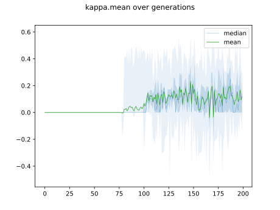

# Report Iris Uniform Distribution [-4, 4] run 1

## Best results in hall of fame

| measure       |    value |   individual |
|:--------------|---------:|-------------:|
| mean accuracy | 0.595467 |         7231 |
| max accuracy  | 0.96     |        11912 |
| mean kappa    | 0.3932   |         7231 |
| max kappa     | 0.94     |        11912 |

## Individuals in hall of fame

### Individual 7231

| key                    |     value |
|:-----------------------|----------:|
| mean log_loss:         |  0.997427 |
| mean accuracy:         |  0.595467 |
| mean kappa:            |  0.3932   |
| number of edges        | 15        |
| number of hidden nodes |  0        |
| number of layers       |  0        |
| birth                  | 81        |

#### Network

### Individual 7271

| key                    |     value |
|:-----------------------|----------:|
| mean log_loss:         |  0.997427 |
| mean accuracy:         |  0.595467 |
| mean kappa:            |  0.3932   |
| number of edges        | 15        |
| number of hidden nodes |  0        |
| number of layers       |  0        |
| birth                  | 81        |

#### Network

### Individual 8643

| key                    |     value |
|:-----------------------|----------:|
| mean log_loss:         |  0.997427 |
| mean accuracy:         |  0.595467 |
| mean kappa:            |  0.3932   |
| number of edges        | 15        |
| number of hidden nodes |  0        |
| number of layers       |  0        |
| birth                  | 97        |

#### Network

### Individual 8461

| key                    |     value |
|:-----------------------|----------:|
| mean log_loss:         |  0.997427 |
| mean accuracy:         |  0.595467 |
| mean kappa:            |  0.3932   |
| number of edges        | 15        |
| number of hidden nodes |  0        |
| number of layers       |  0        |
| birth                  | 95        |

#### Network

### Individual 11912

| key                    |      value |
|:-----------------------|-----------:|
| mean log_loss:         |   1.0227   |
| mean accuracy:         |   0.569733 |
| mean kappa:            |   0.3546   |
| number of edges        |  22        |
| number of hidden nodes |   3        |
| number of layers       |   3        |
| birth                  | 133        |

#### Network

### Individual 11987

| key                    |     value |
|:-----------------------|----------:|
| mean log_loss:         |   1.05727 |
| mean accuracy:         |   0.5496  |
| mean kappa:            |   0.3244  |
| number of edges        |  15       |
| number of hidden nodes |   0       |
| number of layers       |   0       |
| birth                  | 134       |

#### Network

### Individual 8545

| key                    |     value |
|:-----------------------|----------:|
| mean log_loss:         |  0.997427 |
| mean accuracy:         |  0.568733 |
| mean kappa:            |  0.3531   |
| number of edges        | 15        |
| number of hidden nodes |  0        |
| number of layers       |  0        |
| birth                  | 95        |

#### Network

### Individual 13273

| key                    |      value |
|:-----------------------|-----------:|
| mean log_loss:         |   1.10643  |
| mean accuracy:         |   0.561267 |
| mean kappa:            |   0.3419   |
| number of edges        |  27        |
| number of hidden nodes |   5        |
| number of layers       |   4        |
| birth                  | 148        |

#### Network

### Individual 12282

| key                    |      value |
|:-----------------------|-----------:|
| mean log_loss:         |   1.29842  |
| mean accuracy:         |   0.549733 |
| mean kappa:            |   0.3246   |
| number of edges        |  23        |
| number of hidden nodes |   3        |
| number of layers       |   3        |
| birth                  | 137        |

#### Network

### Individual 10435

| key                    |     value |
|:-----------------------|----------:|
| mean log_loss:         |   1.04323 |
| mean accuracy:         |   0.574   |
| mean kappa:            |   0.361   |
| number of edges        |  15       |
| number of hidden nodes |   0       |
| number of layers       |   0       |
| birth                  | 116       |

#### Network

