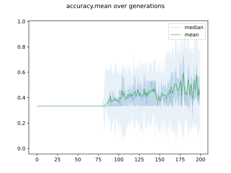
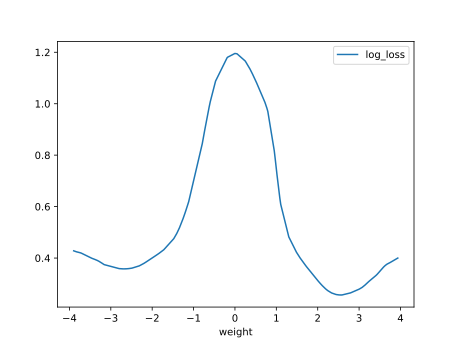
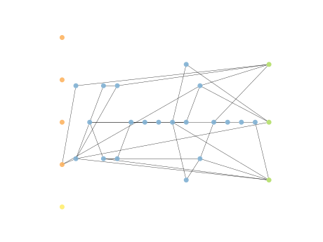
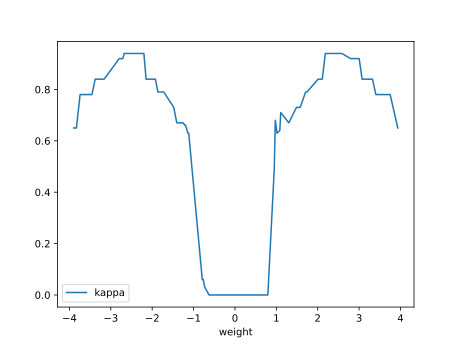

# Report Iris Uniform Distribution [-4, 4] run 2

## Best results in hall of fame

| measure       |    value |   individual |
|:--------------|---------:|-------------:|
| mean accuracy | 0.801933 |        17587 |
| max accuracy  | 0.96     |        17587 |
| mean kappa    | 0.7029   |        17587 |
| max kappa     | 0.94     |        17587 |

## Individuals in hall of fame

### Individual 17587

| key                    |      value |
|:-----------------------|-----------:|
| mean log_loss:         |   0.478299 |
| mean accuracy:         |   0.801933 |
| mean kappa:            |   0.7029   |
| number of edges        |  68        |
| number of hidden nodes |  20        |
| number of layers       |  14        |
| birth                  | 196        |

#### Network

### Individual 17553

| key                    |      value |
|:-----------------------|-----------:|
| mean log_loss:         |   0.504276 |
| mean accuracy:         |   0.8012   |
| mean kappa:            |   0.7018   |
| number of edges        |  68        |
| number of hidden nodes |  20        |
| number of layers       |  14        |
| birth                  | 196        |

#### Network

### Individual 17330

| key                    |      value |
|:-----------------------|-----------:|
| mean log_loss:         |   0.481451 |
| mean accuracy:         |   0.7942   |
| mean kappa:            |   0.6913   |
| number of edges        |  65        |
| number of hidden nodes |  19        |
| number of layers       |  14        |
| birth                  | 193        |

#### Network

### Individual 17492

| key                    |      value |
|:-----------------------|-----------:|
| mean log_loss:         |   0.481451 |
| mean accuracy:         |   0.7942   |
| mean kappa:            |   0.6913   |
| number of edges        |  66        |
| number of hidden nodes |  19        |
| number of layers       |  14        |
| birth                  | 195        |

#### Network

### Individual 15750

| key                    |      value |
|:-----------------------|-----------:|
| mean log_loss:         |   0.57486  |
| mean accuracy:         |   0.795733 |
| mean kappa:            |   0.6936   |
| number of edges        |  60        |
| number of hidden nodes |  18        |
| number of layers       |  12        |
| birth                  | 176        |

#### Network

### Individual 17677

| key                    |      value |
|:-----------------------|-----------:|
| mean log_loss:         |   0.478299 |
| mean accuracy:         |   0.801933 |
| mean kappa:            |   0.7029   |
| number of edges        |  70        |
| number of hidden nodes |  21        |
| number of layers       |  15        |
| birth                  | 197        |

#### Network

### Individual 16193

| key                    |      value |
|:-----------------------|-----------:|
| mean log_loss:         |   0.508328 |
| mean accuracy:         |   0.779733 |
| mean kappa:            |   0.6696   |
| number of edges        |  60        |
| number of hidden nodes |  18        |
| number of layers       |  13        |
| birth                  | 180        |

#### Network

### Individual 16635

| key                    |      value |
|:-----------------------|-----------:|
| mean log_loss:         |   0.495611 |
| mean accuracy:         |   0.786133 |
| mean kappa:            |   0.6792   |
| number of edges        |  64        |
| number of hidden nodes |  19        |
| number of layers       |  14        |
| birth                  | 185        |

#### Network

### Individual 16690

| key                    |      value |
|:-----------------------|-----------:|
| mean log_loss:         |   0.499187 |
| mean accuracy:         |   0.7838   |
| mean kappa:            |   0.6757   |
| number of edges        |  65        |
| number of hidden nodes |  19        |
| number of layers       |  14        |
| birth                  | 186        |

#### Network

### Individual 16658

| key                    |      value |
|:-----------------------|-----------:|
| mean log_loss:         |   0.492203 |
| mean accuracy:         |   0.788667 |
| mean kappa:            |   0.683    |
| number of edges        |  65        |
| number of hidden nodes |  19        |
| number of layers       |  14        |
| birth                  | 186        |

#### Network

