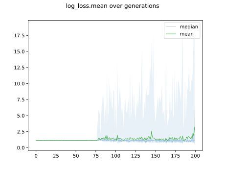
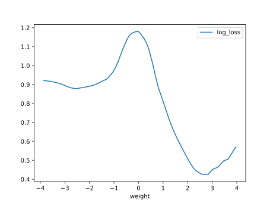

# Report Iris Uniform Distribution [-4, 4] run 3

## Best results in hall of fame

| measure       |    value |   individual |
|:--------------|---------:|-------------:|
| mean accuracy | 0.726733 |        13757 |
| max accuracy  | 0.96     |        15193 |
| mean kappa    | 0.5901   |        13757 |
| max kappa     | 0.94     |        15193 |

## Individuals in hall of fame

### Individual 13757

| key                    |      value |
|:-----------------------|-----------:|
| mean log_loss:         |   0.73434  |
| mean accuracy:         |   0.726733 |
| mean kappa:            |   0.5901   |
| number of edges        |  54        |
| number of hidden nodes |  16        |
| number of layers       |  12        |
| birth                  | 153        |

#### Network

### Individual 15193

| key                    |      value |
|:-----------------------|-----------:|
| mean log_loss:         |   0.842831 |
| mean accuracy:         |   0.684467 |
| mean kappa:            |   0.5267   |
| number of edges        |  61        |
| number of hidden nodes |  19        |
| number of layers       |  15        |
| birth                  | 169        |

#### Network

### Individual 14358

| key                    |      value |
|:-----------------------|-----------:|
| mean log_loss:         |   0.833511 |
| mean accuracy:         |   0.7046   |
| mean kappa:            |   0.5569   |
| number of edges        |  58        |
| number of hidden nodes |  18        |
| number of layers       |  14        |
| birth                  | 160        |

#### Network

### Individual 16369

| key                    |      value |
|:-----------------------|-----------:|
| mean log_loss:         |   0.845371 |
| mean accuracy:         |   0.700267 |
| mean kappa:            |   0.5504   |
| number of edges        |  63        |
| number of hidden nodes |  19        |
| number of layers       |  17        |
| birth                  | 182        |

#### Network

### Individual 15355

| key                    |      value |
|:-----------------------|-----------:|
| mean log_loss:         |   0.84175  |
| mean accuracy:         |   0.683867 |
| mean kappa:            |   0.5258   |
| number of edges        |  62        |
| number of hidden nodes |  19        |
| number of layers       |  15        |
| birth                  | 171        |

#### Network

### Individual 15316

| key                    |      value |
|:-----------------------|-----------:|
| mean log_loss:         |   0.842439 |
| mean accuracy:         |   0.684467 |
| mean kappa:            |   0.5267   |
| number of edges        |  61        |
| number of hidden nodes |  19        |
| number of layers       |  15        |
| birth                  | 171        |

#### Network

### Individual 13503

| key                    |      value |
|:-----------------------|-----------:|
| mean log_loss:         |   0.814726 |
| mean accuracy:         |   0.647333 |
| mean kappa:            |   0.471    |
| number of edges        |  53        |
| number of hidden nodes |  15        |
| number of layers       |  11        |
| birth                  | 151        |

#### Network

### Individual 14691

| key                    |      value |
|:-----------------------|-----------:|
| mean log_loss:         |   0.849108 |
| mean accuracy:         |   0.688733 |
| mean kappa:            |   0.5331   |
| number of edges        |  62        |
| number of hidden nodes |  20        |
| number of layers       |  16        |
| birth                  | 164        |

#### Network

### Individual 15668

| key                    |      value |
|:-----------------------|-----------:|
| mean log_loss:         |   0.863298 |
| mean accuracy:         |   0.6488   |
| mean kappa:            |   0.4732   |
| number of edges        |  61        |
| number of hidden nodes |  19        |
| number of layers       |  15        |
| birth                  | 175        |

#### Network

### Individual 15752

| key                    |      value |
|:-----------------------|-----------:|
| mean log_loss:         |   0.840958 |
| mean accuracy:         |   0.676933 |
| mean kappa:            |   0.5154   |
| number of edges        |  61        |
| number of hidden nodes |  19        |
| number of layers       |  15        |
| birth                  | 176        |

#### Network

