# Report Iris Uniform Distribution [-4, 4] run 4

## Best results in hall of fame

| measure       |    value |   individual |
|:--------------|---------:|-------------:|
| mean accuracy | 0.672333 |        15290 |
| max accuracy  | 0.96     |        17156 |
| mean kappa    | 0.5085   |        15290 |
| max kappa     | 0.94     |        17156 |

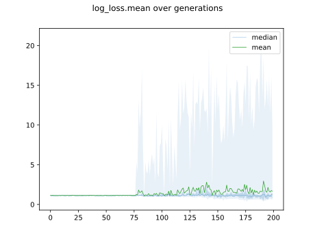

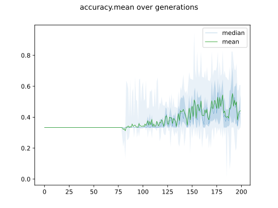

## Individuals in hall of fame

### Individual 17156

| key                    |      value |
|:-----------------------|-----------:|
| mean log_loss:         |   0.606204 |
| mean accuracy:         |   0.672267 |
| mean kappa:            |   0.5084   |
| number of edges        |  40        |
| number of hidden nodes |   9        |
| number of layers       |   5        |
| birth                  | 191        |

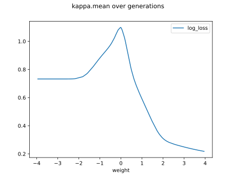

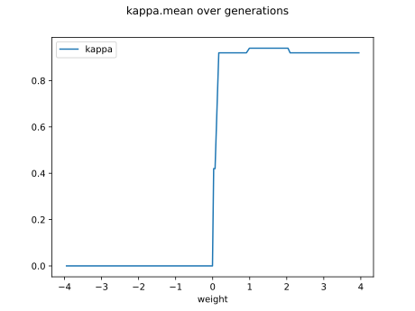

#### Network

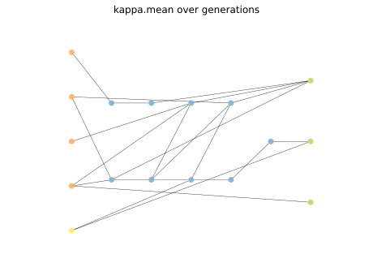

### Individual 17167

| key                    |      value |
|:-----------------------|-----------:|
| mean log_loss:         |   0.615179 |
| mean accuracy:         |   0.671867 |
| mean kappa:            |   0.5078   |
| number of edges        |  41        |
| number of hidden nodes |   9        |
| number of layers       |   5        |
| birth                  | 191        |

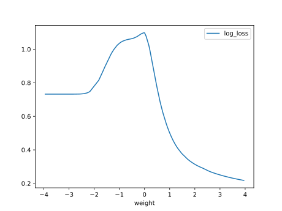

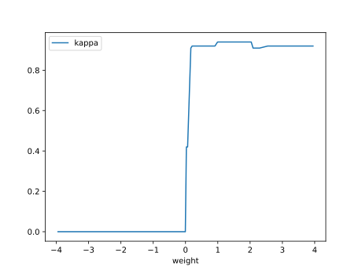

#### Network

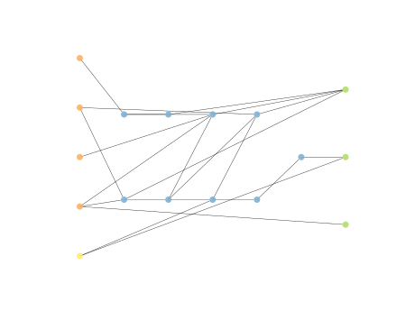

### Individual 17187

| key                    |      value |
|:-----------------------|-----------:|
| mean log_loss:         |   0.605066 |
| mean accuracy:         |   0.670133 |
| mean kappa:            |   0.5052   |
| number of edges        |  42        |
| number of hidden nodes |  10        |
| number of layers       |   8        |
| birth                  | 191        |

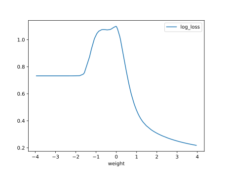

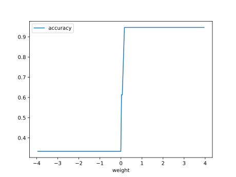

#### Network

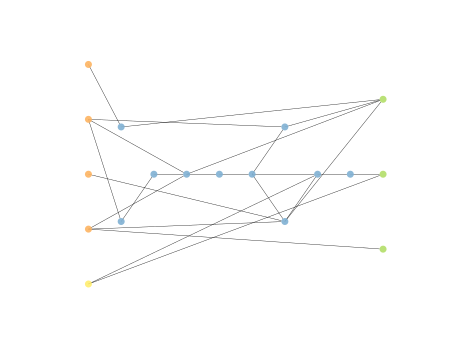

### Individual 17120

| key                    |      value |
|:-----------------------|-----------:|
| mean log_loss:         |   0.637705 |
| mean accuracy:         |   0.669333 |
| mean kappa:            |   0.504    |
| number of edges        |  42        |
| number of hidden nodes |  10        |
| number of layers       |   5        |
| birth                  | 191        |

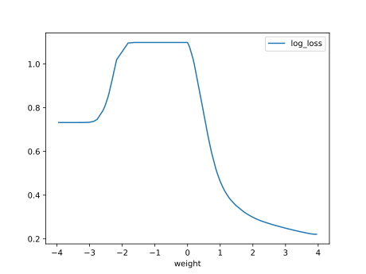

#### Network

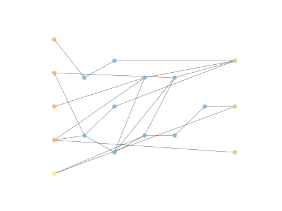

### Individual 15308

| key                    |      value |
|:-----------------------|-----------:|
| mean log_loss:         |   0.609865 |
| mean accuracy:         |   0.671533 |
| mean kappa:            |   0.5073   |
| number of edges        |  35        |
| number of hidden nodes |   7        |
| number of layers       |   4        |
| birth                  | 171        |

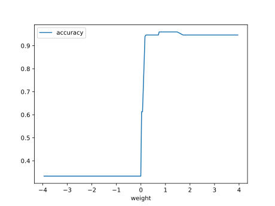

#### Network

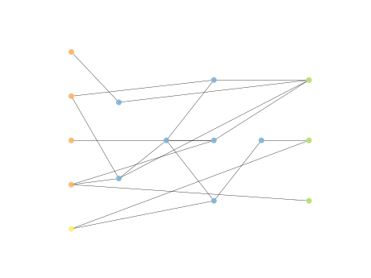

### Individual 15788

| key                    |      value |
|:-----------------------|-----------:|
| mean log_loss:         |   0.589852 |
| mean accuracy:         |   0.671067 |
| mean kappa:            |   0.5066   |
| number of edges        |  40        |
| number of hidden nodes |   9        |
| number of layers       |   6        |
| birth                  | 176        |

#### Network

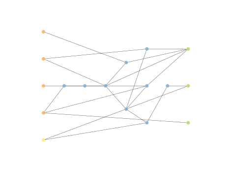

### Individual 15323

| key                    |      value |
|:-----------------------|-----------:|
| mean log_loss:         |   0.628089 |
| mean accuracy:         |   0.666667 |
| mean kappa:            |   0.5      |
| number of edges        |  37        |
| number of hidden nodes |   8        |
| number of layers       |   4        |
| birth                  | 171        |

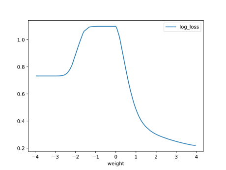

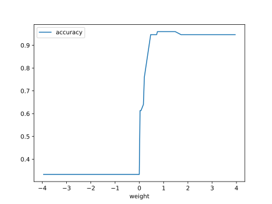

#### Network

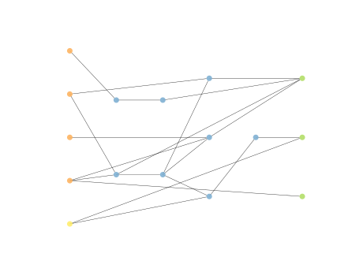

### Individual 15290

| key                    |      value |
|:-----------------------|-----------:|
| mean log_loss:         |   0.699291 |
| mean accuracy:         |   0.672333 |
| mean kappa:            |   0.5085   |
| number of edges        |  33        |
| number of hidden nodes |   7        |
| number of layers       |   4        |
| birth                  | 170        |

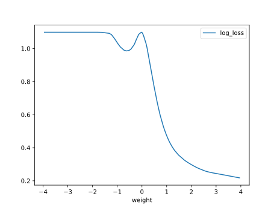

#### Network

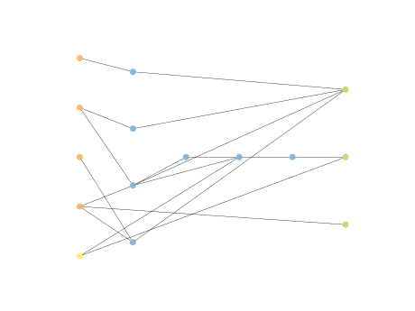

### Individual 16344

| key                    |      value |
|:-----------------------|-----------:|
| mean log_loss:         |   0.618248 |
| mean accuracy:         |   0.668467 |
| mean kappa:            |   0.5027   |
| number of edges        |  39        |
| number of hidden nodes |   9        |
| number of layers       |   6        |
| birth                  | 182        |

#### Network

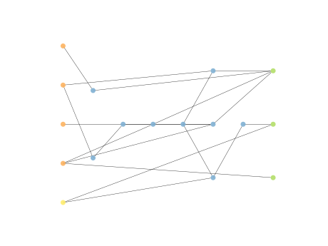

### Individual 15274

| key                    |      value |
|:-----------------------|-----------:|
| mean log_loss:         |   0.590344 |
| mean accuracy:         |   0.669667 |
| mean kappa:            |   0.5045   |
| number of edges        |  35        |
| number of hidden nodes |   7        |
| number of layers       |   4        |
| birth                  | 170        |

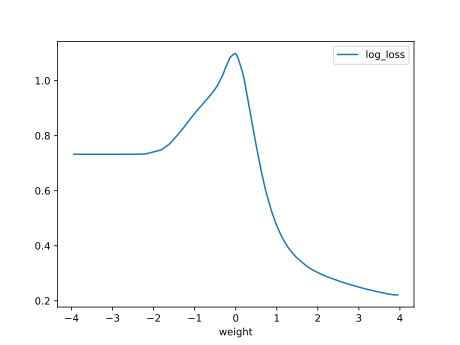

#### Network

