# Report Iris Uniform Distribution [-4, 4] run 5

## Best results in hall of fame

| measure       |    value |   individual |
|:--------------|---------:|-------------:|
| mean accuracy | 0.797133 |        13142 |
| max accuracy  | 0.96     |        13142 |
| mean kappa    | 0.6957   |        13142 |
| max kappa     | 0.94     |        13142 |

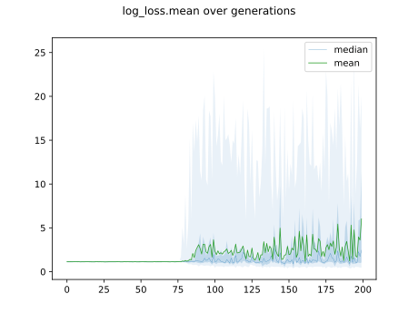

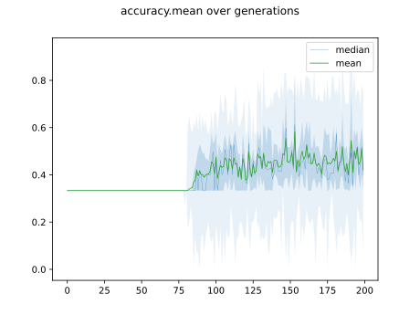

## Individuals in hall of fame

### Individual 13142

| key                    |      value |
|:-----------------------|-----------:|
| mean log_loss:         |   0.574141 |
| mean accuracy:         |   0.797133 |
| mean kappa:            |   0.6957   |
| number of edges        |  41        |
| number of hidden nodes |  10        |
| number of layers       |   6        |
| birth                  | 147        |

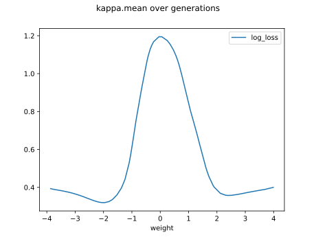

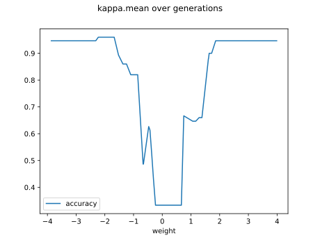

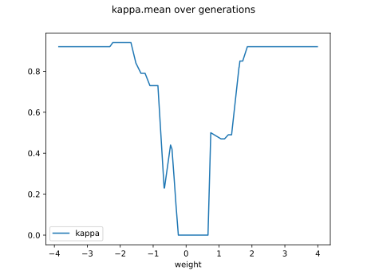

#### Network

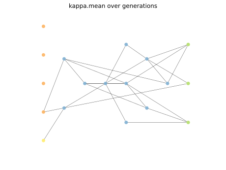

### Individual 13140

| key                    |      value |
|:-----------------------|-----------:|
| mean log_loss:         |   0.563213 |
| mean accuracy:         |   0.724067 |
| mean kappa:            |   0.5861   |
| number of edges        |  41        |
| number of hidden nodes |  10        |
| number of layers       |   7        |
| birth                  | 147        |

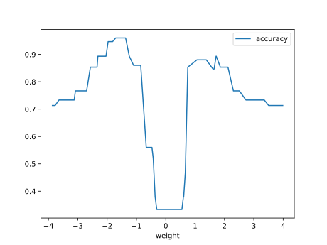

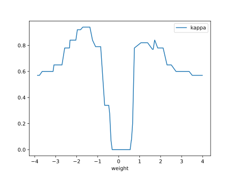

#### Network

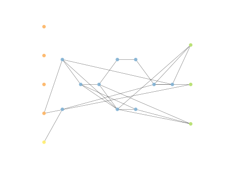

### Individual 12560

| key                    |      value |
|:-----------------------|-----------:|
| mean log_loss:         |   0.579069 |
| mean accuracy:         |   0.734133 |
| mean kappa:            |   0.6012   |
| number of edges        |  37        |
| number of hidden nodes |   8        |
| number of layers       |   5        |
| birth                  | 140        |

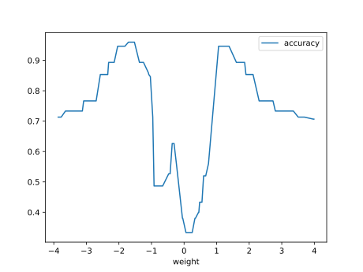

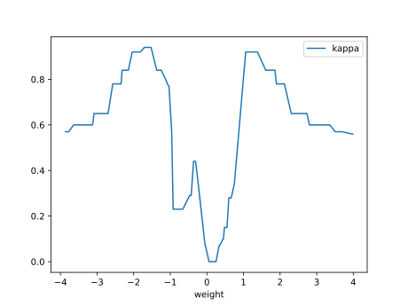

#### Network

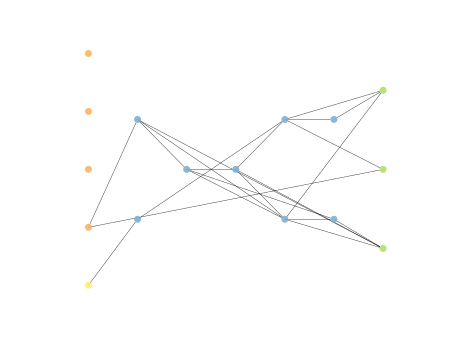

### Individual 12557

| key                    |      value |
|:-----------------------|-----------:|
| mean log_loss:         |   0.583165 |
| mean accuracy:         |   0.718533 |
| mean kappa:            |   0.5778   |
| number of edges        |  37        |
| number of hidden nodes |   8        |
| number of layers       |   5        |
| birth                  | 140        |

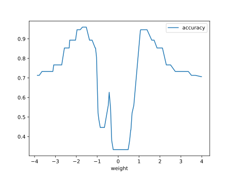

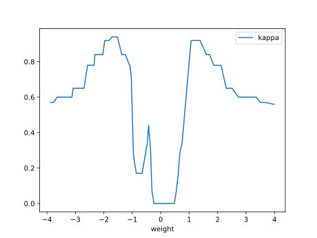

#### Network

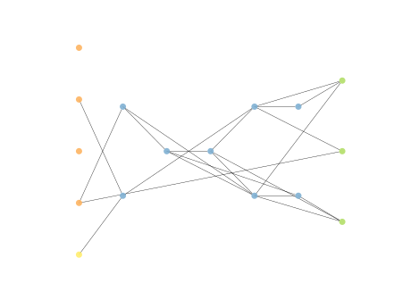

### Individual 13579

| key                    |      value |
|:-----------------------|-----------:|
| mean log_loss:         |   0.57338  |
| mean accuracy:         |   0.707933 |
| mean kappa:            |   0.5619   |
| number of edges        |  41        |
| number of hidden nodes |   9        |
| number of layers       |   6        |
| birth                  | 151        |

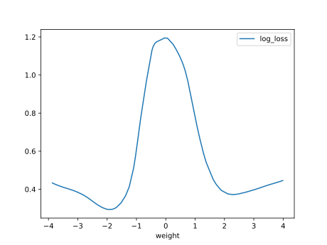

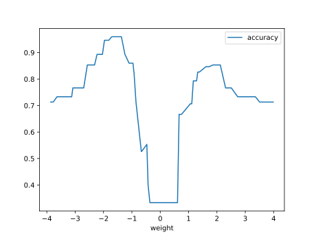

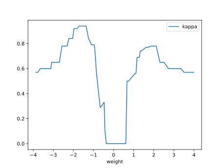

#### Network

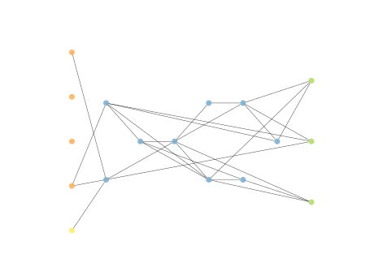

### Individual 13347

| key                    |      value |
|:-----------------------|-----------:|
| mean log_loss:         |   0.564455 |
| mean accuracy:         |   0.733333 |
| mean kappa:            |   0.6      |
| number of edges        |  40        |
| number of hidden nodes |   9        |
| number of layers       |   6        |
| birth                  | 149        |

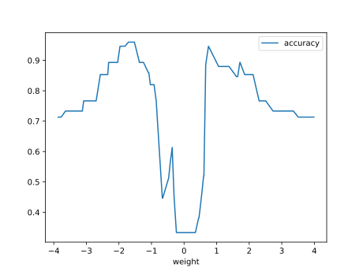

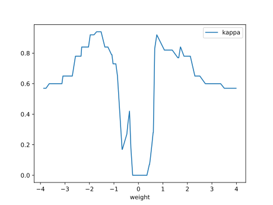

#### Network

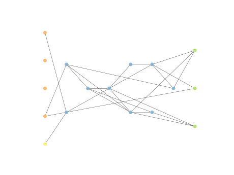

### Individual 13059

| key                    |      value |
|:-----------------------|-----------:|
| mean log_loss:         |   0.564035 |
| mean accuracy:         |   0.719533 |
| mean kappa:            |   0.5793   |
| number of edges        |  39        |
| number of hidden nodes |   9        |
| number of layers       |   6        |
| birth                  | 146        |

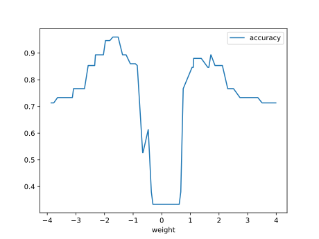

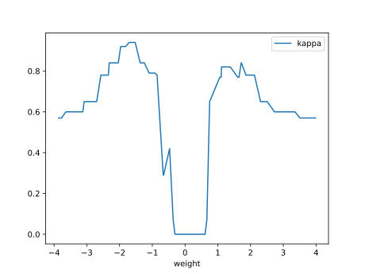

#### Network

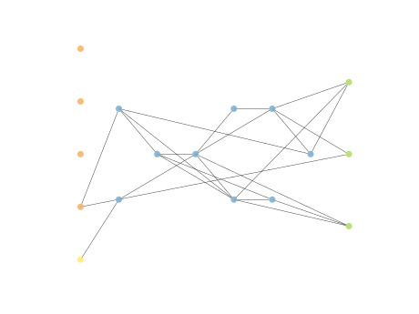

### Individual 16296

| key                    |      value |
|:-----------------------|-----------:|
| mean log_loss:         |   0.576004 |
| mean accuracy:         |   0.7434   |
| mean kappa:            |   0.6151   |
| number of edges        |  42        |
| number of hidden nodes |  10        |
| number of layers       |   5        |
| birth                  | 182        |

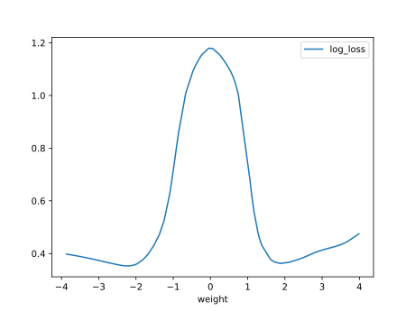

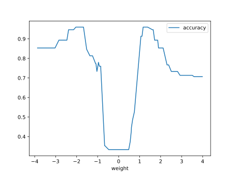

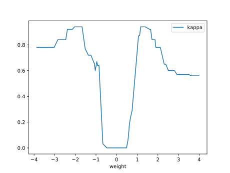

#### Network

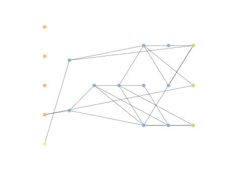

### Individual 13027

| key                    |      value |
|:-----------------------|-----------:|
| mean log_loss:         |   0.581486 |
| mean accuracy:         |   0.716333 |
| mean kappa:            |   0.5745   |
| number of edges        |  38        |
| number of hidden nodes |   9        |
| number of layers       |   6        |
| birth                  | 145        |

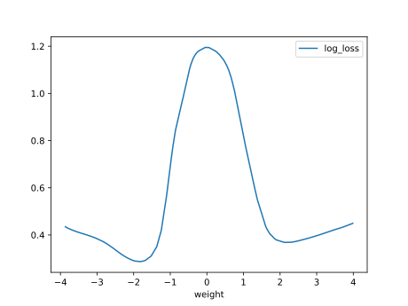

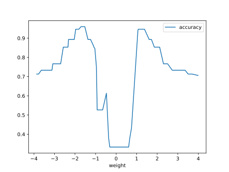

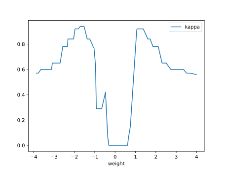

#### Network

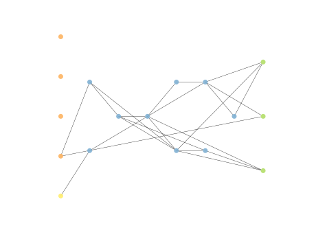

### Individual 13247

| key                    |      value |
|:-----------------------|-----------:|
| mean log_loss:         |   0.564035 |
| mean accuracy:         |   0.719533 |
| mean kappa:            |   0.5793   |
| number of edges        |  39        |
| number of hidden nodes |   9        |
| number of layers       |   6        |
| birth                  | 148        |

#### Network

