# Report Iris Uniform Distribution [-4, 4] run 6

## Best results in hall of fame

| measure       |    value |   individual |
|:--------------|---------:|-------------:|
| mean accuracy | 0.6976   |        17972 |
| max accuracy  | 0.933333 |        17972 |
| mean kappa    | 0.5464   |        17972 |
| max kappa     | 0.9      |        17972 |

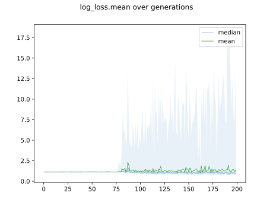

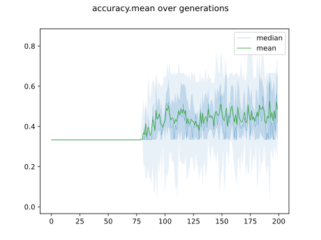

## Individuals in hall of fame

### Individual 17972

| key                    |      value |
|:-----------------------|-----------:|
| mean log_loss:         |   0.815168 |
| mean accuracy:         |   0.6976   |
| mean kappa:            |   0.5464   |
| number of edges        |  59        |
| number of hidden nodes |  17        |
| number of layers       |  15        |
| birth                  | 200        |

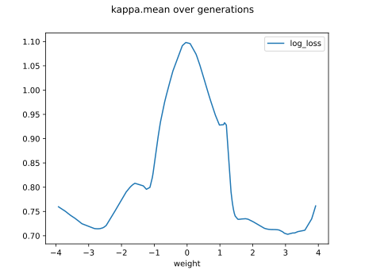

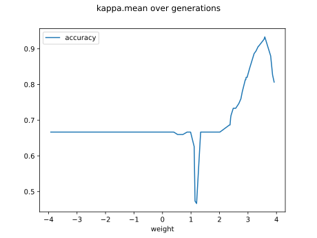

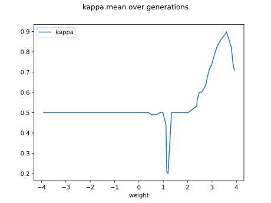

#### Network

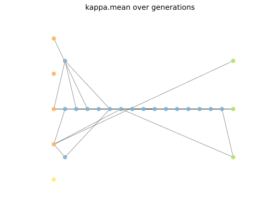

### Individual 17897

| key                    |      value |
|:-----------------------|-----------:|
| mean log_loss:         |   0.814873 |
| mean accuracy:         |   0.695933 |
| mean kappa:            |   0.5439   |
| number of edges        |  57        |
| number of hidden nodes |  16        |
| number of layers       |  14        |
| birth                  | 199        |

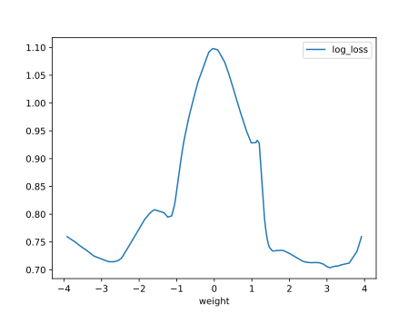

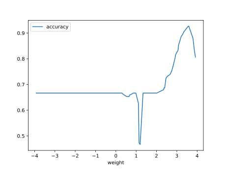

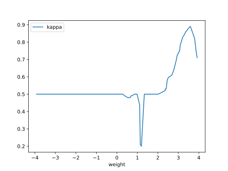

#### Network

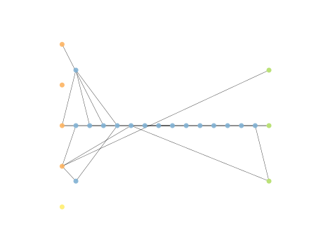

### Individual 17990

| key                    |      value |
|:-----------------------|-----------:|
| mean log_loss:         |   0.812701 |
| mean accuracy:         |   0.690933 |
| mean kappa:            |   0.5364   |
| number of edges        |  58        |
| number of hidden nodes |  16        |
| number of layers       |  14        |
| birth                  | 200        |

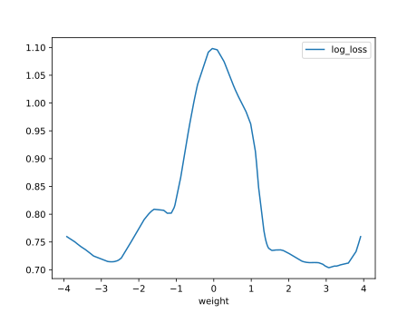

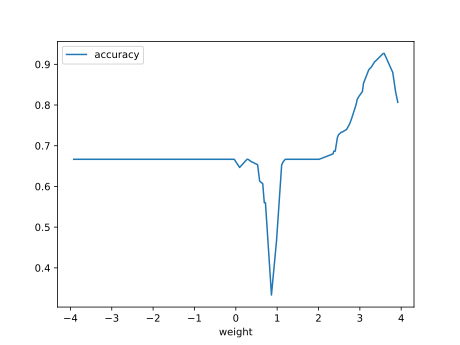

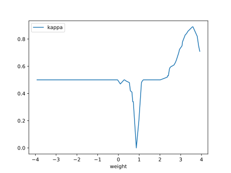

#### Network

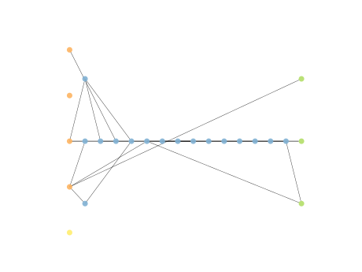

### Individual 14138

| key                    |      value |
|:-----------------------|-----------:|
| mean log_loss:         |   0.813541 |
| mean accuracy:         |   0.666067 |
| mean kappa:            |   0.4991   |
| number of edges        |  52        |
| number of hidden nodes |  14        |
| number of layers       |  13        |
| birth                  | 158        |

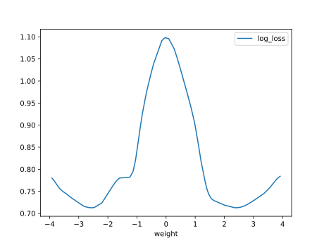

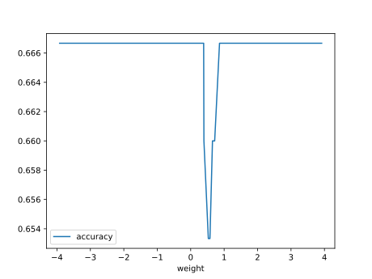

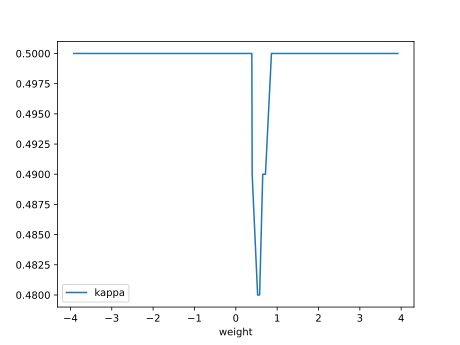

#### Network

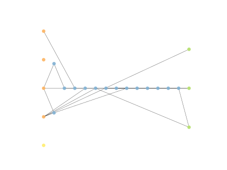

### Individual 17283

| key                    |     value |
|:-----------------------|----------:|
| mean log_loss:         |   0.81783 |
| mean accuracy:         |   0.6606  |
| mean kappa:            |   0.4909  |
| number of edges        |  57       |
| number of hidden nodes |  16       |
| number of layers       |  14       |
| birth                  | 193       |

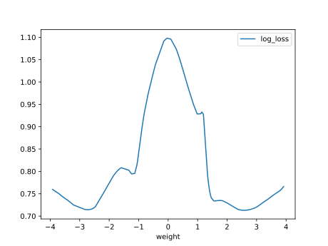

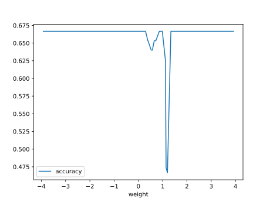

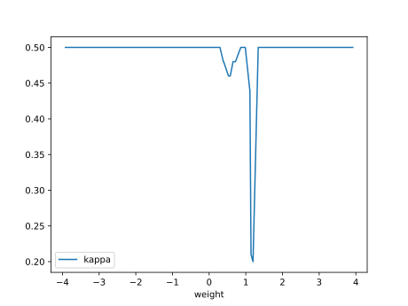

#### Network

### Individual 10052

| key                    |      value |
|:-----------------------|-----------:|
| mean log_loss:         |   0.883564 |
| mean accuracy:         |   0.657333 |
| mean kappa:            |   0.486    |
| number of edges        |  27        |
| number of hidden nodes |   5        |
| number of layers       |   4        |
| birth                  | 112        |

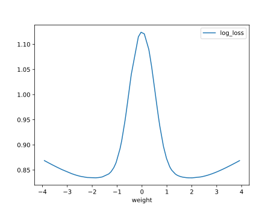

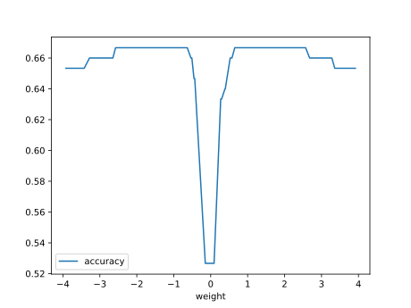

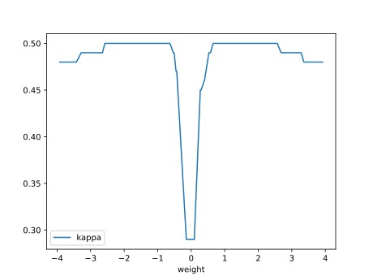

#### Network

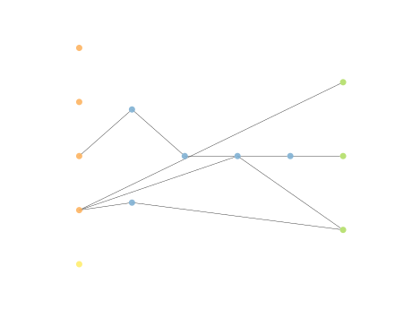

### Individual 17627

| key                    |     value |
|:-----------------------|----------:|
| mean log_loss:         |   0.81783 |
| mean accuracy:         |   0.6606  |
| mean kappa:            |   0.4909  |
| number of edges        |  57       |
| number of hidden nodes |  16       |
| number of layers       |  14       |
| birth                  | 196       |

#### Network

### Individual 9354

| key                    |      value |
|:-----------------------|-----------:|
| mean log_loss:         |   0.911168 |
| mean accuracy:         |   0.6542   |
| mean kappa:            |   0.4813   |
| number of edges        |  28        |
| number of hidden nodes |   6        |
| number of layers       |   5        |
| birth                  | 104        |

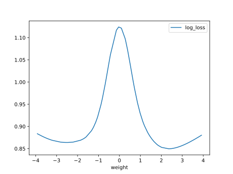

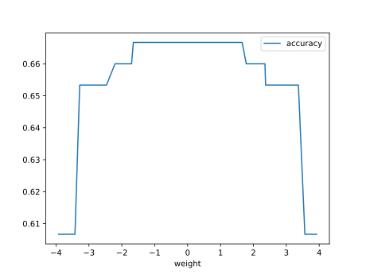

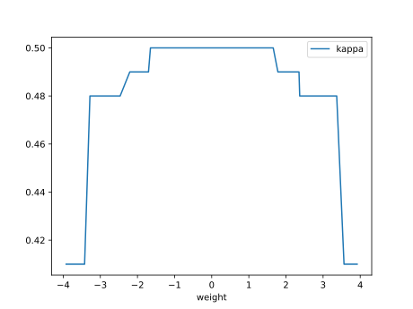

#### Network

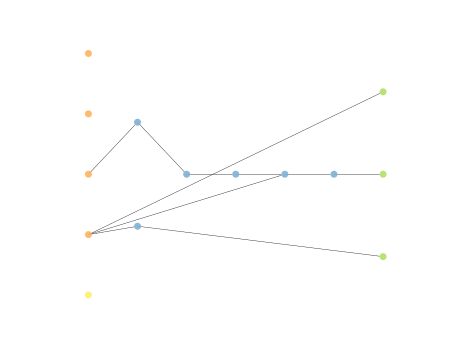

### Individual 9390

| key                    |      value |
|:-----------------------|-----------:|
| mean log_loss:         |   0.911963 |
| mean accuracy:         |   0.6542   |
| mean kappa:            |   0.4813   |
| number of edges        |  29        |
| number of hidden nodes |   6        |
| number of layers       |   5        |
| birth                  | 105        |

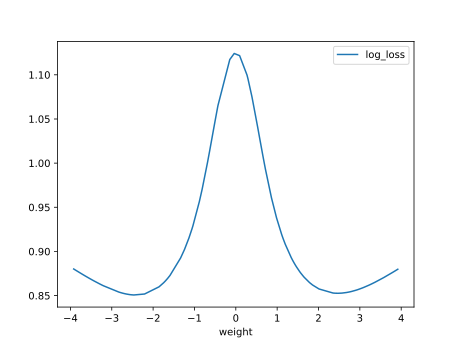

#### Network

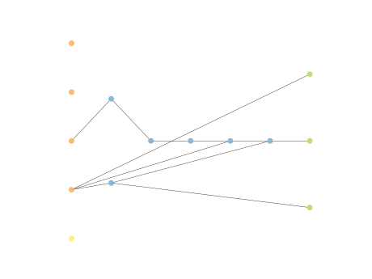

### Individual 9294

| key                    |      value |
|:-----------------------|-----------:|
| mean log_loss:         |   0.923536 |
| mean accuracy:         |   0.650933 |
| mean kappa:            |   0.4764   |
| number of edges        |  26        |
| number of hidden nodes |   5        |
| number of layers       |   4        |
| birth                  | 104        |

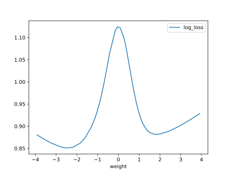

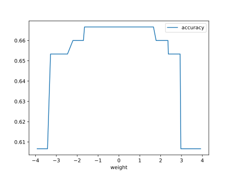

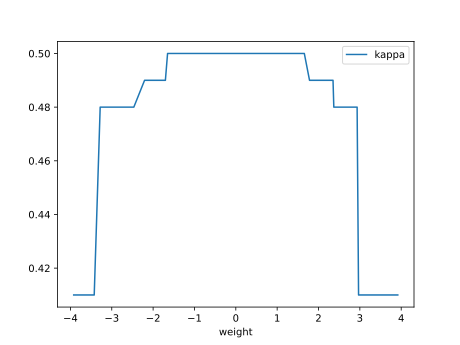

#### Network

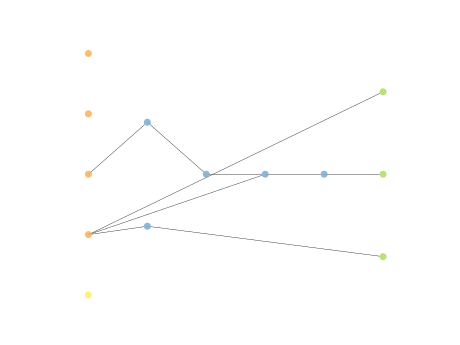

