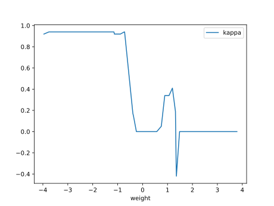

# Report Iris Uniform Distribution [-4, 4] run 7

## Best results in hall of fame

| measure       |    value |   individual |
|:--------------|---------:|-------------:|
| mean accuracy | 0.691067 |         9257 |
| max accuracy  | 0.96     |         9257 |
| mean kappa    | 0.5366   |         9257 |
| max kappa     | 0.94     |         9257 |

## Individuals in hall of fame

### Individual 9257

| key                    |      value |
|:-----------------------|-----------:|
| mean log_loss:         |   1.21788  |
| mean accuracy:         |   0.691067 |
| mean kappa:            |   0.5366   |
| number of edges        |  26        |
| number of hidden nodes |   4        |
| number of layers       |   3        |
| birth                  | 103        |

#### Network

### Individual 8887

| key                    |    value |
|:-----------------------|---------:|
| mean log_loss:         |  1.90401 |
| mean accuracy:         |  0.6166  |
| mean kappa:            |  0.4249  |
| number of edges        | 27       |
| number of hidden nodes |  4       |
| number of layers       |  2       |
| birth                  | 99       |

#### Network

### Individual 8948

| key                    |      value |
|:-----------------------|-----------:|
| mean log_loss:         |   1.34718  |
| mean accuracy:         |   0.610133 |
| mean kappa:            |   0.4152   |
| number of edges        |  26        |
| number of hidden nodes |   4        |
| number of layers       |   3        |
| birth                  | 100        |

#### Network

### Individual 17803

| key                    |      value |
|:-----------------------|-----------:|
| mean log_loss:         |   6.45157  |
| mean accuracy:         |   0.579067 |
| mean kappa:            |   0.3686   |
| number of edges        |  48        |
| number of hidden nodes |  11        |
| number of layers       |   8        |
| birth                  | 198        |

#### Network

### Individual 8635

| key                    |    value |
|:-----------------------|---------:|
| mean log_loss:         |  1.94019 |
| mean accuracy:         |  0.6034  |
| mean kappa:            |  0.4051  |
| number of edges        | 24       |
| number of hidden nodes |  3       |
| number of layers       |  3       |
| birth                  | 96       |

#### Network

### Individual 12213

| key                    |      value |
|:-----------------------|-----------:|
| mean log_loss:         |   1.20358  |
| mean accuracy:         |   0.619267 |
| mean kappa:            |   0.4289   |
| number of edges        |  39        |
| number of hidden nodes |   9        |
| number of layers       |   7        |
| birth                  | 136        |

#### Network

### Individual 8984

| key                    |     value |
|:-----------------------|----------:|
| mean log_loss:         |   1.32629 |
| mean accuracy:         |   0.5942  |
| mean kappa:            |   0.3913  |
| number of edges        |  28       |
| number of hidden nodes |   5       |
| number of layers       |   4       |
| birth                  | 100       |

#### Network

### Individual 11994

| key                    |    value |
|:-----------------------|---------:|
| mean log_loss:         |   1.5648 |
| mean accuracy:         |   0.5816 |
| mean kappa:            |   0.3724 |
| number of edges        |  37      |
| number of hidden nodes |   9      |
| number of layers       |   4      |
| birth                  | 134      |

#### Network

### Individual 8700

| key                    |    value |
|:-----------------------|---------:|
| mean log_loss:         |  1.29089 |
| mean accuracy:         |  0.6402  |
| mean kappa:            |  0.4603  |
| number of edges        | 25       |
| number of hidden nodes |  3       |
| number of layers       |  3       |
| birth                  | 97       |

#### Network

### Individual 8969

| key                    |     value |
|:-----------------------|----------:|
| mean log_loss:         |   1.90353 |
| mean accuracy:         |   0.6166  |
| mean kappa:            |   0.4249  |
| number of edges        |  27       |
| number of hidden nodes |   4       |
| number of layers       |   2       |
| birth                  | 100       |

#### Network

