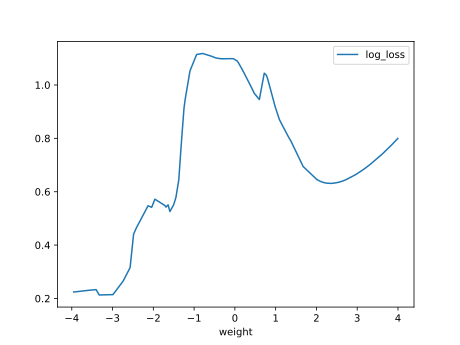

# Report Iris Uniform Distribution [-4, 4] run 8

## Best results in hall of fame

| measure       |   value |   individual |
|:--------------|--------:|-------------:|
| mean accuracy |   0.676 |         8291 |
| max accuracy  |   0.96  |        10697 |
| mean kappa    |   0.514 |         8291 |
| max kappa     |   0.94  |        10697 |

## Individuals in hall of fame

### Individual 10697

| key                    |      value |
|:-----------------------|-----------:|
| mean log_loss:         |   2.83873  |
| mean accuracy:         |   0.646667 |
| mean kappa:            |   0.47     |
| number of edges        |  55        |
| number of hidden nodes |  15        |
| number of layers       |   8        |
| birth                  | 119        |

#### Network

### Individual 12188

| key                    |     value |
|:-----------------------|----------:|
| mean log_loss:         |   1.00807 |
| mean accuracy:         |   0.6582  |
| mean kappa:            |   0.4873  |
| number of edges        |  55       |
| number of hidden nodes |  15       |
| number of layers       |   8       |
| birth                  | 136       |

#### Network

### Individual 16239

| key                    |      value |
|:-----------------------|-----------:|
| mean log_loss:         |   0.683395 |
| mean accuracy:         |   0.6346   |
| mean kappa:            |   0.4519   |
| number of edges        |  78        |
| number of hidden nodes |  24        |
| number of layers       |  14        |
| birth                  | 181        |

#### Network

### Individual 14211

| key                    |      value |
|:-----------------------|-----------:|
| mean log_loss:         |   0.905655 |
| mean accuracy:         |   0.627333 |
| mean kappa:            |   0.441    |
| number of edges        |  61        |
| number of hidden nodes |  17        |
| number of layers       |  12        |
| birth                  | 158        |

#### Network

### Individual 8775

| key                    |    value |
|:-----------------------|---------:|
| mean log_loss:         |  2.76217 |
| mean accuracy:         |  0.6402  |
| mean kappa:            |  0.4603  |
| number of edges        | 54       |
| number of hidden nodes | 15       |
| number of layers       |  8       |
| birth                  | 98       |

#### Network

### Individual 8291

| key                    |    value |
|:-----------------------|---------:|
| mean log_loss:         |  1.02103 |
| mean accuracy:         |  0.676   |
| mean kappa:            |  0.514   |
| number of edges        | 50       |
| number of hidden nodes | 14       |
| number of layers       |  8       |
| birth                  | 93       |

#### Network

### Individual 13732

| key                    |      value |
|:-----------------------|-----------:|
| mean log_loss:         |   1.0008   |
| mean accuracy:         |   0.661467 |
| mean kappa:            |   0.4922   |
| number of edges        |  61        |
| number of hidden nodes |  17        |
| number of layers       |  12        |
| birth                  | 153        |

#### Network

### Individual 17781

| key                    |      value |
|:-----------------------|-----------:|
| mean log_loss:         |   0.855818 |
| mean accuracy:         |   0.629333 |
| mean kappa:            |   0.444    |
| number of edges        |  64        |
| number of hidden nodes |  17        |
| number of layers       |  12        |
| birth                  | 198        |

#### Network

### Individual 17323

| key                    |      value |
|:-----------------------|-----------:|
| mean log_loss:         |   0.733664 |
| mean accuracy:         |   0.651333 |
| mean kappa:            |   0.477    |
| number of edges        |  63        |
| number of hidden nodes |  17        |
| number of layers       |  12        |
| birth                  | 193        |

#### Network

### Individual 9158

| key                    |     value |
|:-----------------------|----------:|
| mean log_loss:         |   1.16551 |
| mean accuracy:         |   0.6616  |
| mean kappa:            |   0.4924  |
| number of edges        |  53       |
| number of hidden nodes |  14       |
| number of layers       |   8       |
| birth                  | 102       |

#### Network

