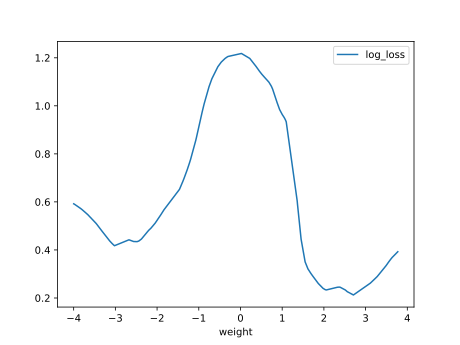

# Report Iris Uniform Distribution [-4, 4] run 9

## Best results in hall of fame

| measure       |    value |   individual |
|:--------------|---------:|-------------:|
| mean accuracy | 0.739267 |        13462 |
| max accuracy  | 0.96     |        13388 |
| mean kappa    | 0.6089   |        13462 |
| max kappa     | 0.94     |        13388 |

## Individuals in hall of fame

### Individual 13388

| key                    |      value |
|:-----------------------|-----------:|
| mean log_loss:         |   0.599118 |
| mean accuracy:         |   0.720533 |
| mean kappa:            |   0.5808   |
| number of edges        |  50        |
| number of hidden nodes |  12        |
| number of layers       |   6        |
| birth                  | 149        |

#### Network

### Individual 16919

| key                    |      value |
|:-----------------------|-----------:|
| mean log_loss:         |   0.653455 |
| mean accuracy:         |   0.722933 |
| mean kappa:            |   0.5844   |
| number of edges        |  61        |
| number of hidden nodes |  17        |
| number of layers       |   9        |
| birth                  | 188        |

#### Network

### Individual 16236

| key                    |      value |
|:-----------------------|-----------:|
| mean log_loss:         |   0.650778 |
| mean accuracy:         |   0.712333 |
| mean kappa:            |   0.5685   |
| number of edges        |  55        |
| number of hidden nodes |  15        |
| number of layers       |   8        |
| birth                  | 181        |

#### Network

### Individual 16519

| key                    |     value |
|:-----------------------|----------:|
| mean log_loss:         |   0.67078 |
| mean accuracy:         |   0.7028  |
| mean kappa:            |   0.5542  |
| number of edges        |  58       |
| number of hidden nodes |  16       |
| number of layers       |   8       |
| birth                  | 184       |

#### Network

### Individual 13462

| key                    |      value |
|:-----------------------|-----------:|
| mean log_loss:         |   0.593005 |
| mean accuracy:         |   0.739267 |
| mean kappa:            |   0.6089   |
| number of edges        |  50        |
| number of hidden nodes |  12        |
| number of layers       |   6        |
| birth                  | 150        |

#### Network

### Individual 17529

| key                    |      value |
|:-----------------------|-----------:|
| mean log_loss:         |   0.685167 |
| mean accuracy:         |   0.704733 |
| mean kappa:            |   0.5571   |
| number of edges        |  57        |
| number of hidden nodes |  15        |
| number of layers       |   7        |
| birth                  | 195        |

#### Network

### Individual 16301

| key                    |      value |
|:-----------------------|-----------:|
| mean log_loss:         |   0.643244 |
| mean accuracy:         |   0.7166   |
| mean kappa:            |   0.5749   |
| number of edges        |  57        |
| number of hidden nodes |  16        |
| number of layers       |   8        |
| birth                  | 182        |

#### Network

### Individual 16362

| key                    |      value |
|:-----------------------|-----------:|
| mean log_loss:         |   0.644648 |
| mean accuracy:         |   0.711867 |
| mean kappa:            |   0.5678   |
| number of edges        |  55        |
| number of hidden nodes |  15        |
| number of layers       |   8        |
| birth                  | 182        |

#### Network

### Individual 17575

| key                    |      value |
|:-----------------------|-----------:|
| mean log_loss:         |   0.670742 |
| mean accuracy:         |   0.7102   |
| mean kappa:            |   0.5653   |
| number of edges        |  58        |
| number of hidden nodes |  15        |
| number of layers       |   7        |
| birth                  | 196        |

#### Network

### Individual 16623

| key                    |      value |
|:-----------------------|-----------:|
| mean log_loss:         |   0.653758 |
| mean accuracy:         |   0.722933 |
| mean kappa:            |   0.5844   |
| number of edges        |  59        |
| number of hidden nodes |  16        |
| number of layers       |   8        |
| birth                  | 185        |

#### Network

