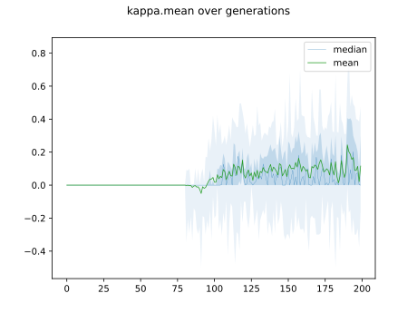
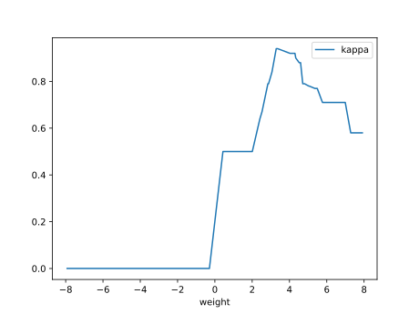
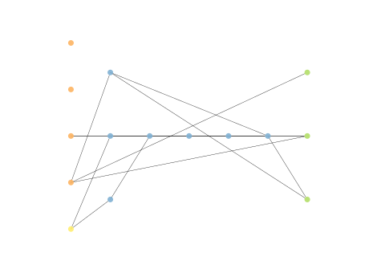
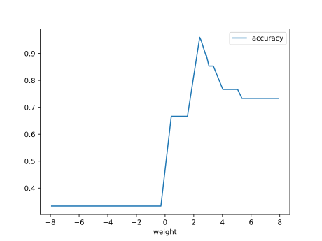

# Report Iris Uniform Distribution [-8, 8] run 0

## Best results in hall of fame

| measure       |    value |   individual |
|:--------------|---------:|-------------:|
| mean accuracy | 0.550533 |        17198 |
| max accuracy  | 0.96     |        17198 |
| mean kappa    | 0.3258   |        17198 |
| max kappa     | 0.94     |        17198 |

## Individuals in hall of fame

### Individual 17198

| key                    |      value |
|:-----------------------|-----------:|
| mean log_loss:         |   1.47423  |
| mean accuracy:         |   0.550533 |
| mean kappa:            |   0.3258   |
| number of edges        |  32        |
| number of hidden nodes |   6        |
| number of layers       |   4        |
| birth                  | 192        |

#### Network

### Individual 17269

| key                    |      value |
|:-----------------------|-----------:|
| mean log_loss:         |   1.4728   |
| mean accuracy:         |   0.549467 |
| mean kappa:            |   0.3242   |
| number of edges        |  35        |
| number of hidden nodes |   7        |
| number of layers       |   5        |
| birth                  | 192        |

#### Network

### Individual 17212

| key                    |      value |
|:-----------------------|-----------:|
| mean log_loss:         |   1.57782  |
| mean accuracy:         |   0.549667 |
| mean kappa:            |   0.3245   |
| number of edges        |  35        |
| number of hidden nodes |   7        |
| number of layers       |   5        |
| birth                  | 192        |

#### Network

### Individual 17016

| key                    |      value |
|:-----------------------|-----------:|
| mean log_loss:         |   1.47327  |
| mean accuracy:         |   0.549467 |
| mean kappa:            |   0.3242   |
| number of edges        |  34        |
| number of hidden nodes |   7        |
| number of layers       |   5        |
| birth                  | 190        |

#### Network

### Individual 15828

| key                    |     value |
|:-----------------------|----------:|
| mean log_loss:         |   2.29776 |
| mean accuracy:         |   0.5358  |
| mean kappa:            |   0.3037  |
| number of edges        |  32       |
| number of hidden nodes |   6       |
| number of layers       |   4       |
| birth                  | 176       |

#### Network

### Individual 17691

| key                    |     value |
|:-----------------------|----------:|
| mean log_loss:         |   2.50172 |
| mean accuracy:         |   0.5286  |
| mean kappa:            |   0.2929  |
| number of edges        |  35       |
| number of hidden nodes |   7       |
| number of layers       |   5       |
| birth                  | 197       |

#### Network

### Individual 15753

| key                    |      value |
|:-----------------------|-----------:|
| mean log_loss:         |   2.30196  |
| mean accuracy:         |   0.533733 |
| mean kappa:            |   0.3006   |
| number of edges        |  33        |
| number of hidden nodes |   6        |
| number of layers       |   4        |
| birth                  | 176        |

#### Network

### Individual 15829

| key                    |      value |
|:-----------------------|-----------:|
| mean log_loss:         |   2.25737  |
| mean accuracy:         |   0.534733 |
| mean kappa:            |   0.3021   |
| number of edges        |  32        |
| number of hidden nodes |   6        |
| number of layers       |   4        |
| birth                  | 176        |

#### Network

### Individual 10344

| key                    |     value |
|:-----------------------|----------:|
| mean log_loss:         |   1.00178 |
| mean accuracy:         |   0.5462  |
| mean kappa:            |   0.3193  |
| number of edges        |  26       |
| number of hidden nodes |   4       |
| number of layers       |   3       |
| birth                  | 115       |

#### Network

### Individual 15493

| key                    |     value |
|:-----------------------|----------:|
| mean log_loss:         |   2.29769 |
| mean accuracy:         |   0.5358  |
| mean kappa:            |   0.3037  |
| number of edges        |  32       |
| number of hidden nodes |   6       |
| number of layers       |   4       |
| birth                  | 173       |

#### Network

