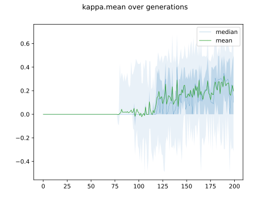
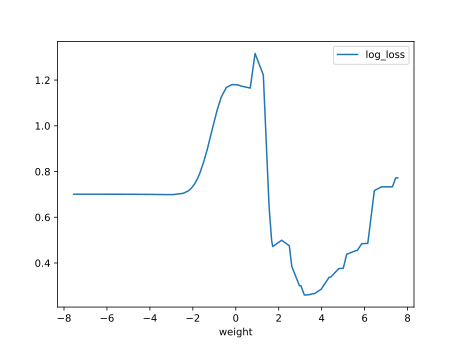

# Report Iris Uniform Distribution [-8, 8] run 1

## Best results in hall of fame

| measure       |    value |   individual |
|:--------------|---------:|-------------:|
| mean accuracy | 0.689467 |        17871 |
| max accuracy  | 0.96     |        17862 |
| mean kappa    | 0.5342   |        17871 |
| max kappa     | 0.94     |        17862 |

## Individuals in hall of fame

### Individual 17862

| key                    |      value |
|:-----------------------|-----------:|
| mean log_loss:         |   0.655432 |
| mean accuracy:         |   0.688467 |
| mean kappa:            |   0.5327   |
| number of edges        |  58        |
| number of hidden nodes |  18        |
| number of layers       |  17        |
| birth                  | 199        |

#### Network

### Individual 17871

| key                    |      value |
|:-----------------------|-----------:|
| mean log_loss:         |   0.657399 |
| mean accuracy:         |   0.689467 |
| mean kappa:            |   0.5342   |
| number of edges        |  58        |
| number of hidden nodes |  18        |
| number of layers       |  17        |
| birth                  | 199        |

#### Network

### Individual 17284

| key                    |      value |
|:-----------------------|-----------:|
| mean log_loss:         |   0.658465 |
| mean accuracy:         |   0.6878   |
| mean kappa:            |   0.5317   |
| number of edges        |  58        |
| number of hidden nodes |  18        |
| number of layers       |  17        |
| birth                  | 193        |

#### Network

### Individual 17313

| key                    |     value |
|:-----------------------|----------:|
| mean log_loss:         |   1.27067 |
| mean accuracy:         |   0.683   |
| mean kappa:            |   0.5245  |
| number of edges        |  58       |
| number of hidden nodes |  18       |
| number of layers       |  17       |
| birth                  | 193       |

#### Network

### Individual 17361

| key                    |      value |
|:-----------------------|-----------:|
| mean log_loss:         |   0.658465 |
| mean accuracy:         |   0.6878   |
| mean kappa:            |   0.5317   |
| number of edges        |  58        |
| number of hidden nodes |  18        |
| number of layers       |  17        |
| birth                  | 193        |

#### Network

### Individual 16288

| key                    |      value |
|:-----------------------|-----------:|
| mean log_loss:         |   1.27192  |
| mean accuracy:         |   0.682467 |
| mean kappa:            |   0.5237   |
| number of edges        |  58        |
| number of hidden nodes |  18        |
| number of layers       |  17        |
| birth                  | 181        |

#### Network

### Individual 17514

| key                    |      value |
|:-----------------------|-----------:|
| mean log_loss:         |   0.665655 |
| mean accuracy:         |   0.6886   |
| mean kappa:            |   0.5329   |
| number of edges        |  58        |
| number of hidden nodes |  18        |
| number of layers       |  17        |
| birth                  | 195        |

#### Network

### Individual 17278

| key                    |      value |
|:-----------------------|-----------:|
| mean log_loss:         |   1.27093  |
| mean accuracy:         |   0.684067 |
| mean kappa:            |   0.5261   |
| number of edges        |  58        |
| number of hidden nodes |  18        |
| number of layers       |  17        |
| birth                  | 192        |

#### Network

### Individual 17274

| key                    |      value |
|:-----------------------|-----------:|
| mean log_loss:         |   0.658465 |
| mean accuracy:         |   0.6878   |
| mean kappa:            |   0.5317   |
| number of edges        |  58        |
| number of hidden nodes |  18        |
| number of layers       |  17        |
| birth                  | 192        |

#### Network

### Individual 16845

| key                    |      value |
|:-----------------------|-----------:|
| mean log_loss:         |   0.662377 |
| mean accuracy:         |   0.6888   |
| mean kappa:            |   0.5332   |
| number of edges        |  58        |
| number of hidden nodes |  18        |
| number of layers       |  17        |
| birth                  | 188        |

#### Network

