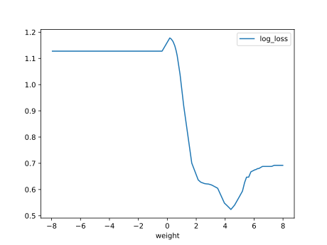
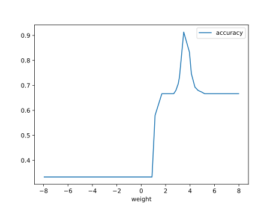
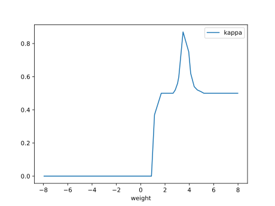
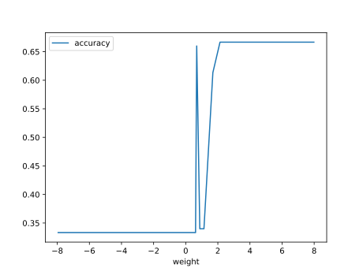

# Report Iris Uniform Distribution [-8, 8] run 2

## Best results in hall of fame

| measure       |    value |   individual |
|:--------------|---------:|-------------:|
| mean accuracy | 0.5682   |        12928 |
| max accuracy  | 0.973333 |        16860 |
| mean kappa    | 0.3523   |        12928 |
| max kappa     | 0.96     |        16860 |

## Individuals in hall of fame

### Individual 12928

| key                    |    value |
|:-----------------------|---------:|
| mean log_loss:         |   1.0089 |
| mean accuracy:         |   0.5682 |
| mean kappa:            |   0.3523 |
| number of edges        |  20      |
| number of hidden nodes |   2      |
| number of layers       |   1      |
| birth                  | 144      |

#### Network

### Individual 8513

| key                    |     value |
|:-----------------------|----------:|
| mean log_loss:         |  0.959899 |
| mean accuracy:         |  0.4698   |
| mean kappa:            |  0.2047   |
| number of edges        | 25        |
| number of hidden nodes |  4        |
| number of layers       |  3        |
| birth                  | 95        |

#### Network

### Individual 13877

| key                    |      value |
|:-----------------------|-----------:|
| mean log_loss:         |   0.902205 |
| mean accuracy:         |   0.463067 |
| mean kappa:            |   0.1946   |
| number of edges        |  45        |
| number of hidden nodes |  10        |
| number of layers       |   5        |
| birth                  | 155        |

#### Network

### Individual 13928

| key                    |      value |
|:-----------------------|-----------:|
| mean log_loss:         |   0.902205 |
| mean accuracy:         |   0.463067 |
| mean kappa:            |   0.1946   |
| number of edges        |  46        |
| number of hidden nodes |  11        |
| number of layers       |   5        |
| birth                  | 155        |

#### Network

### Individual 11239

| key                    |      value |
|:-----------------------|-----------:|
| mean log_loss:         |   0.921166 |
| mean accuracy:         |   0.4514   |
| mean kappa:            |   0.1771   |
| number of edges        |  34        |
| number of hidden nodes |   7        |
| number of layers       |   4        |
| birth                  | 125        |

#### Network

### Individual 9510

| key                    |      value |
|:-----------------------|-----------:|
| mean log_loss:         |   0.966725 |
| mean accuracy:         |   0.4558   |
| mean kappa:            |   0.1837   |
| number of edges        |  30        |
| number of hidden nodes |   6        |
| number of layers       |   4        |
| birth                  | 106        |

#### Network

### Individual 14047

| key                    |      value |
|:-----------------------|-----------:|
| mean log_loss:         |   0.941923 |
| mean accuracy:         |   0.463067 |
| mean kappa:            |   0.1946   |
| number of edges        |  45        |
| number of hidden nodes |  10        |
| number of layers       |   5        |
| birth                  | 157        |

#### Network

### Individual 16860

| key                    |      value |
|:-----------------------|-----------:|
| mean log_loss:         |   1.02576  |
| mean accuracy:         |   0.443267 |
| mean kappa:            |   0.1649   |
| number of edges        |  35        |
| number of hidden nodes |   7        |
| number of layers       |   5        |
| birth                  | 188        |

#### Network

### Individual 9315

| key                    |      value |
|:-----------------------|-----------:|
| mean log_loss:         |   0.939535 |
| mean accuracy:         |   0.449133 |
| mean kappa:            |   0.1737   |
| number of edges        |  28        |
| number of hidden nodes |   5        |
| number of layers       |   4        |
| birth                  | 104        |

#### Network

### Individual 16863

| key                    |      value |
|:-----------------------|-----------:|
| mean log_loss:         |   0.997256 |
| mean accuracy:         |   0.4496   |
| mean kappa:            |   0.1744   |
| number of edges        |  35        |
| number of hidden nodes |   7        |
| number of layers       |   4        |
| birth                  | 188        |

#### Network

