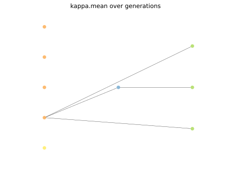

# Report Iris Uniform Distribution [-8, 8] run 3

## Best results in hall of fame

| measure       |    value |   individual |
|:--------------|---------:|-------------:|
| mean accuracy | 0.612733 |         8108 |
| max accuracy  | 0.84     |         8108 |
| mean kappa    | 0.4191   |         8108 |
| max kappa     | 0.76     |         8108 |

## Individuals in hall of fame

### Individual 8108

| key                    |     value |
|:-----------------------|----------:|
| mean log_loss:         |  0.995998 |
| mean accuracy:         |  0.612733 |
| mean kappa:            |  0.4191   |
| number of edges        | 17        |
| number of hidden nodes |  1        |
| number of layers       |  1        |
| birth                  | 91        |

#### Network

### Individual 8330

| key                    |     value |
|:-----------------------|----------:|
| mean log_loss:         |  0.995998 |
| mean accuracy:         |  0.612733 |
| mean kappa:            |  0.4191   |
| number of edges        | 17        |
| number of hidden nodes |  1        |
| number of layers       |  1        |
| birth                  | 93        |

#### Network

### Individual 12489

| key                    |      value |
|:-----------------------|-----------:|
| mean log_loss:         |   0.90482  |
| mean accuracy:         |   0.476467 |
| mean kappa:            |   0.2147   |
| number of edges        |  20        |
| number of hidden nodes |   2        |
| number of layers       |   2        |
| birth                  | 139        |

#### Network

### Individual 13253

| key                    |      value |
|:-----------------------|-----------:|
| mean log_loss:         |   0.7248   |
| mean accuracy:         |   0.469667 |
| mean kappa:            |   0.2045   |
| number of edges        |  23        |
| number of hidden nodes |   3        |
| number of layers       |   3        |
| birth                  | 148        |

#### Network

### Individual 14762

| key                    |      value |
|:-----------------------|-----------:|
| mean log_loss:         |   0.724807 |
| mean accuracy:         |   0.469667 |
| mean kappa:            |   0.2045   |
| number of edges        |  27        |
| number of hidden nodes |   4        |
| number of layers       |   4        |
| birth                  | 165        |

#### Network

### Individual 8984

| key                    |    value |
|:-----------------------|---------:|
| mean log_loss:         |   1.427  |
| mean accuracy:         |   0.541  |
| mean kappa:            |   0.3115 |
| number of edges        |  15      |
| number of hidden nodes |   0      |
| number of layers       |   0      |
| birth                  | 100      |

#### Network

### Individual 8978

| key                    |    value |
|:-----------------------|---------:|
| mean log_loss:         |   1.427  |
| mean accuracy:         |   0.541  |
| mean kappa:            |   0.3115 |
| number of edges        |  15      |
| number of hidden nodes |   0      |
| number of layers       |   0      |
| birth                  | 100      |

#### Network

### Individual 14826

| key                    |      value |
|:-----------------------|-----------:|
| mean log_loss:         |   0.7248   |
| mean accuracy:         |   0.469667 |
| mean kappa:            |   0.2045   |
| number of edges        |  26        |
| number of hidden nodes |   4        |
| number of layers       |   4        |
| birth                  | 165        |

#### Network

### Individual 14874

| key                    |      value |
|:-----------------------|-----------:|
| mean log_loss:         |   0.898151 |
| mean accuracy:         |   0.4766   |
| mean kappa:            |   0.2149   |
| number of edges        |  24        |
| number of hidden nodes |   3        |
| number of layers       |   2        |
| birth                  | 166        |

#### Network

### Individual 17583

| key                    |      value |
|:-----------------------|-----------:|
| mean log_loss:         |   0.7248   |
| mean accuracy:         |   0.469667 |
| mean kappa:            |   0.2045   |
| number of edges        |  28        |
| number of hidden nodes |   5        |
| number of layers       |   4        |
| birth                  | 196        |

#### Network

