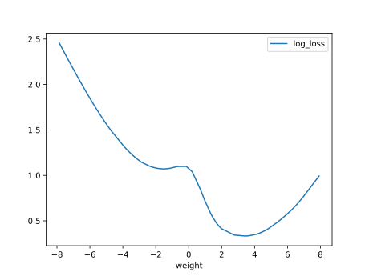

# Report Iris Uniform Distribution [-8, 8] run 4

## Best results in hall of fame

| measure       |    value |   individual |
|:--------------|---------:|-------------:|
| mean accuracy | 0.761467 |        14438 |
| max accuracy  | 0.96     |        14438 |
| mean kappa    | 0.6422   |        14438 |
| max kappa     | 0.94     |        14438 |

## Individuals in hall of fame

### Individual 14438

| key                    |      value |
|:-----------------------|-----------:|
| mean log_loss:         |   0.814834 |
| mean accuracy:         |   0.761467 |
| mean kappa:            |   0.6422   |
| number of edges        |  37        |
| number of hidden nodes |   9        |
| number of layers       |   4        |
| birth                  | 161        |

#### Network

### Individual 14676

| key                    |      value |
|:-----------------------|-----------:|
| mean log_loss:         |   0.926746 |
| mean accuracy:         |   0.638267 |
| mean kappa:            |   0.4574   |
| number of edges        |  40        |
| number of hidden nodes |  11        |
| number of layers       |   5        |
| birth                  | 164        |

#### Network

### Individual 14097

| key                    |      value |
|:-----------------------|-----------:|
| mean log_loss:         |   0.942424 |
| mean accuracy:         |   0.6314   |
| mean kappa:            |   0.4471   |
| number of edges        |  32        |
| number of hidden nodes |   7        |
| number of layers       |   3        |
| birth                  | 157        |

#### Network

### Individual 16248

| key                    |      value |
|:-----------------------|-----------:|
| mean log_loss:         |   0.775755 |
| mean accuracy:         |   0.688933 |
| mean kappa:            |   0.5334   |
| number of edges        |  37        |
| number of hidden nodes |   9        |
| number of layers       |   4        |
| birth                  | 181        |

#### Network

### Individual 13986

| key                    |      value |
|:-----------------------|-----------:|
| mean log_loss:         |   0.942424 |
| mean accuracy:         |   0.6314   |
| mean kappa:            |   0.4471   |
| number of edges        |  31        |
| number of hidden nodes |   7        |
| number of layers       |   3        |
| birth                  | 156        |

#### Network

### Individual 14219

| key                    |      value |
|:-----------------------|-----------:|
| mean log_loss:         |   0.942424 |
| mean accuracy:         |   0.6314   |
| mean kappa:            |   0.4471   |
| number of edges        |  34        |
| number of hidden nodes |   8        |
| number of layers       |   3        |
| birth                  | 158        |

#### Network

### Individual 13332

| key                    |      value |
|:-----------------------|-----------:|
| mean log_loss:         |   1.35466  |
| mean accuracy:         |   0.644667 |
| mean kappa:            |   0.467    |
| number of edges        |  30        |
| number of hidden nodes |   7        |
| number of layers       |   3        |
| birth                  | 149        |

#### Network

### Individual 14155

| key                    |      value |
|:-----------------------|-----------:|
| mean log_loss:         |   0.939264 |
| mean accuracy:         |   0.636867 |
| mean kappa:            |   0.4553   |
| number of edges        |  34        |
| number of hidden nodes |   8        |
| number of layers       |   4        |
| birth                  | 158        |

#### Network

### Individual 14225

| key                    |     value |
|:-----------------------|----------:|
| mean log_loss:         |   0.94088 |
| mean accuracy:         |   0.6296  |
| mean kappa:            |   0.4444  |
| number of edges        |  34       |
| number of hidden nodes |   8       |
| number of layers       |   4       |
| birth                  | 159       |

#### Network

### Individual 13717

| key                    |      value |
|:-----------------------|-----------:|
| mean log_loss:         |   1.07282  |
| mean accuracy:         |   0.608467 |
| mean kappa:            |   0.4127   |
| number of edges        |  28        |
| number of hidden nodes |   6        |
| number of layers       |   3        |
| birth                  | 153        |

#### Network

