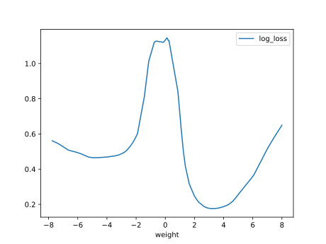

# Report Iris Uniform Distribution [-8, 8] run 5

## Best results in hall of fame

| measure       |   value |   individual |
|:--------------|--------:|-------------:|
| mean accuracy |  0.7472 |        14504 |
| max accuracy  |  0.96   |        14790 |
| mean kappa    |  0.6208 |        14504 |
| max kappa     |  0.94   |        14790 |

## Individuals in hall of fame

### Individual 14790

| key                    |      value |
|:-----------------------|-----------:|
| mean log_loss:         |   0.486455 |
| mean accuracy:         |   0.746467 |
| mean kappa:            |   0.6197   |
| number of edges        |  56        |
| number of hidden nodes |  15        |
| number of layers       |   6        |
| birth                  | 165        |

#### Network

### Individual 13348

| key                    |      value |
|:-----------------------|-----------:|
| mean log_loss:         |   0.502119 |
| mean accuracy:         |   0.742667 |
| mean kappa:            |   0.614    |
| number of edges        |  49        |
| number of hidden nodes |  13        |
| number of layers       |   6        |
| birth                  | 149        |

#### Network

### Individual 14316

| key                    |      value |
|:-----------------------|-----------:|
| mean log_loss:         |   0.499006 |
| mean accuracy:         |   0.7426   |
| mean kappa:            |   0.6139   |
| number of edges        |  51        |
| number of hidden nodes |  13        |
| number of layers       |   6        |
| birth                  | 160        |

#### Network

### Individual 13383

| key                    |      value |
|:-----------------------|-----------:|
| mean log_loss:         |   0.640726 |
| mean accuracy:         |   0.7406   |
| mean kappa:            |   0.6109   |
| number of edges        |  48        |
| number of hidden nodes |  13        |
| number of layers       |   6        |
| birth                  | 149        |

#### Network

### Individual 12210

| key                    |      value |
|:-----------------------|-----------:|
| mean log_loss:         |   0.640897 |
| mean accuracy:         |   0.7406   |
| mean kappa:            |   0.6109   |
| number of edges        |  45        |
| number of hidden nodes |  12        |
| number of layers       |   6        |
| birth                  | 136        |

#### Network

### Individual 12624

| key                    |      value |
|:-----------------------|-----------:|
| mean log_loss:         |   0.640678 |
| mean accuracy:         |   0.7406   |
| mean kappa:            |   0.6109   |
| number of edges        |  46        |
| number of hidden nodes |  12        |
| number of layers       |   6        |
| birth                  | 141        |

#### Network

### Individual 14504

| key                    |      value |
|:-----------------------|-----------:|
| mean log_loss:         |   0.485072 |
| mean accuracy:         |   0.7472   |
| mean kappa:            |   0.6208   |
| number of edges        |  53        |
| number of hidden nodes |  14        |
| number of layers       |   6        |
| birth                  | 162        |

#### Network

### Individual 14745

| key                    |      value |
|:-----------------------|-----------:|
| mean log_loss:         |   0.485818 |
| mean accuracy:         |   0.7468   |
| mean kappa:            |   0.6202   |
| number of edges        |  56        |
| number of hidden nodes |  15        |
| number of layers       |   6        |
| birth                  | 164        |

#### Network

### Individual 13903

| key                    |      value |
|:-----------------------|-----------:|
| mean log_loss:         |   0.502014 |
| mean accuracy:         |   0.745533 |
| mean kappa:            |   0.6183   |
| number of edges        |  50        |
| number of hidden nodes |  13        |
| number of layers       |   6        |
| birth                  | 155        |

#### Network

### Individual 17098

| key                    |      value |
|:-----------------------|-----------:|
| mean log_loss:         |   0.640678 |
| mean accuracy:         |   0.7406   |
| mean kappa:            |   0.6109   |
| number of edges        |  46        |
| number of hidden nodes |  12        |
| number of layers       |   6        |
| birth                  | 190        |

#### Network

