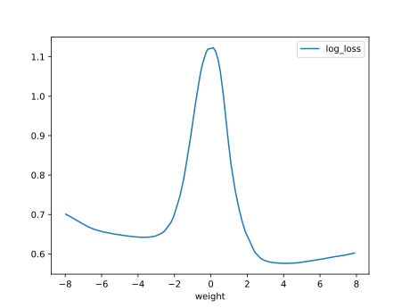
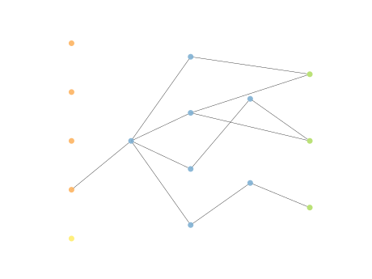
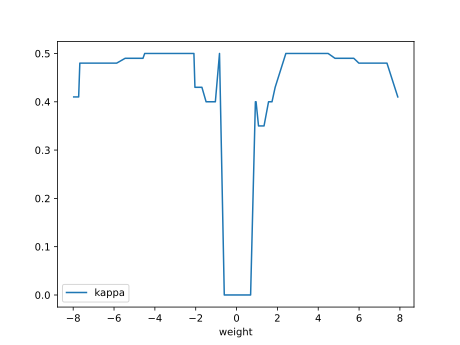
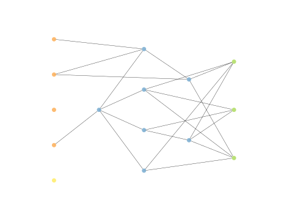

# Report Iris Uniform Distribution [-8, 8] run 6

## Best results in hall of fame

| measure       |    value |   individual |
|:--------------|---------:|-------------:|
| mean accuracy | 0.627533 |        12591 |
| max accuracy  | 0.726667 |        11182 |
| mean kappa    | 0.4413   |        12591 |
| max kappa     | 0.59     |        11182 |

## Individuals in hall of fame

### Individual 12591

| key                    |      value |
|:-----------------------|-----------:|
| mean log_loss:         |   0.696848 |
| mean accuracy:         |   0.627533 |
| mean kappa:            |   0.4413   |
| number of edges        |  45        |
| number of hidden nodes |  12        |
| number of layers       |   6        |
| birth                  | 140        |

#### Network

### Individual 10257

| key                    |      value |
|:-----------------------|-----------:|
| mean log_loss:         |   0.728556 |
| mean accuracy:         |   0.6106   |
| mean kappa:            |   0.4159   |
| number of edges        |  34        |
| number of hidden nodes |   8        |
| number of layers       |   3        |
| birth                  | 114        |

#### Network

### Individual 10536

| key                    |      value |
|:-----------------------|-----------:|
| mean log_loss:         |   0.722051 |
| mean accuracy:         |   0.6122   |
| mean kappa:            |   0.4183   |
| number of edges        |  38        |
| number of hidden nodes |  10        |
| number of layers       |   4        |
| birth                  | 118        |

#### Network

### Individual 12200

| key                    |      value |
|:-----------------------|-----------:|
| mean log_loss:         |   0.698025 |
| mean accuracy:         |   0.627533 |
| mean kappa:            |   0.4413   |
| number of edges        |  44        |
| number of hidden nodes |  12        |
| number of layers       |   6        |
| birth                  | 136        |

#### Network

### Individual 11182

| key                    |      value |
|:-----------------------|-----------:|
| mean log_loss:         |   0.704907 |
| mean accuracy:         |   0.599733 |
| mean kappa:            |   0.3996   |
| number of edges        |  40        |
| number of hidden nodes |  11        |
| number of layers       |   4        |
| birth                  | 125        |

#### Network

### Individual 9912

| key                    |      value |
|:-----------------------|-----------:|
| mean log_loss:         |   0.712063 |
| mean accuracy:         |   0.611333 |
| mean kappa:            |   0.417    |
| number of edges        |  32        |
| number of hidden nodes |   7        |
| number of layers       |   3        |
| birth                  | 111        |

#### Network

### Individual 12344

| key                    |      value |
|:-----------------------|-----------:|
| mean log_loss:         |   0.709209 |
| mean accuracy:         |   0.611    |
| mean kappa:            |   0.4165   |
| number of edges        |  30        |
| number of hidden nodes |   6        |
| number of layers       |   3        |
| birth                  | 138        |

#### Network

### Individual 10689

| key                    |      value |
|:-----------------------|-----------:|
| mean log_loss:         |   0.722051 |
| mean accuracy:         |   0.6122   |
| mean kappa:            |   0.4183   |
| number of edges        |  40        |
| number of hidden nodes |  11        |
| number of layers       |   4        |
| birth                  | 119        |

#### Network

### Individual 9374

| key                    |      value |
|:-----------------------|-----------:|
| mean log_loss:         |   0.71241  |
| mean accuracy:         |   0.605333 |
| mean kappa:            |   0.408    |
| number of edges        |  31        |
| number of hidden nodes |   7        |
| number of layers       |   3        |
| birth                  | 105        |

#### Network

### Individual 16880

| key                    |      value |
|:-----------------------|-----------:|
| mean log_loss:         |   0.679698 |
| mean accuracy:         |   0.584133 |
| mean kappa:            |   0.3762   |
| number of edges        |  41        |
| number of hidden nodes |   7        |
| number of layers       |   3        |
| birth                  | 188        |

#### Network

