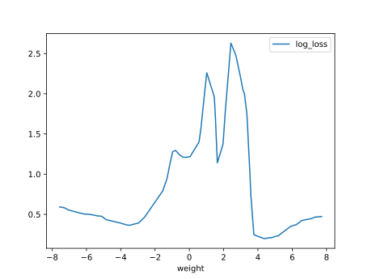
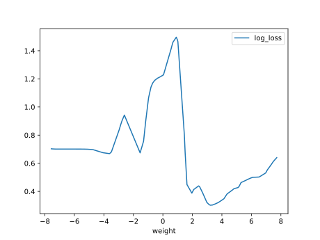

# Report Iris Uniform Distribution [-8, 8] run 7

## Best results in hall of fame

| measure       |    value |   individual |
|:--------------|---------:|-------------:|
| mean accuracy | 0.722133 |        17742 |
| max accuracy  | 0.96     |        15618 |
| mean kappa    | 0.5832   |        17742 |
| max kappa     | 0.94     |        15618 |

## Individuals in hall of fame

### Individual 15618

| key                    |      value |
|:-----------------------|-----------:|
| mean log_loss:         |   0.758795 |
| mean accuracy:         |   0.6872   |
| mean kappa:            |   0.5308   |
| number of edges        |  55        |
| number of hidden nodes |  16        |
| number of layers       |  14        |
| birth                  | 174        |

#### Network

### Individual 17742

| key                    |      value |
|:-----------------------|-----------:|
| mean log_loss:         |   0.857181 |
| mean accuracy:         |   0.722133 |
| mean kappa:            |   0.5832   |
| number of edges        |  67        |
| number of hidden nodes |  21        |
| number of layers       |  19        |
| birth                  | 198        |

#### Network

### Individual 17597

| key                    |      value |
|:-----------------------|-----------:|
| mean log_loss:         |   0.873401 |
| mean accuracy:         |   0.684333 |
| mean kappa:            |   0.5265   |
| number of edges        |  66        |
| number of hidden nodes |  21        |
| number of layers       |  19        |
| birth                  | 196        |

#### Network

### Individual 15724

| key                    |      value |
|:-----------------------|-----------:|
| mean log_loss:         |   0.671814 |
| mean accuracy:         |   0.6956   |
| mean kappa:            |   0.5434   |
| number of edges        |  57        |
| number of hidden nodes |  17        |
| number of layers       |  14        |
| birth                  | 175        |

#### Network

### Individual 16703

| key                    |      value |
|:-----------------------|-----------:|
| mean log_loss:         |   0.713944 |
| mean accuracy:         |   0.689467 |
| mean kappa:            |   0.5342   |
| number of edges        |  59        |
| number of hidden nodes |  18        |
| number of layers       |  16        |
| birth                  | 186        |

#### Network

### Individual 17284

| key                    |      value |
|:-----------------------|-----------:|
| mean log_loss:         |   0.893913 |
| mean accuracy:         |   0.6612   |
| mean kappa:            |   0.4918   |
| number of edges        |  67        |
| number of hidden nodes |  21        |
| number of layers       |  19        |
| birth                  | 193        |

#### Network

### Individual 17266

| key                    |     value |
|:-----------------------|----------:|
| mean log_loss:         |   1.00015 |
| mean accuracy:         |   0.6488  |
| mean kappa:            |   0.4732  |
| number of edges        |  66       |
| number of hidden nodes |  21       |
| number of layers       |  19       |
| birth                  | 192       |

#### Network

### Individual 16972

| key                    |      value |
|:-----------------------|-----------:|
| mean log_loss:         |   0.946614 |
| mean accuracy:         |   0.6836   |
| mean kappa:            |   0.5254   |
| number of edges        |  64        |
| number of hidden nodes |  20        |
| number of layers       |  18        |
| birth                  | 189        |

#### Network

### Individual 15776

| key                    |      value |
|:-----------------------|-----------:|
| mean log_loss:         |   0.722285 |
| mean accuracy:         |   0.685867 |
| mean kappa:            |   0.5288   |
| number of edges        |  53        |
| number of hidden nodes |  15        |
| number of layers       |  13        |
| birth                  | 176        |

#### Network

### Individual 15852

| key                    |      value |
|:-----------------------|-----------:|
| mean log_loss:         |   0.748874 |
| mean accuracy:         |   0.685733 |
| mean kappa:            |   0.5286   |
| number of edges        |  53        |
| number of hidden nodes |  15        |
| number of layers       |  13        |
| birth                  | 177        |

#### Network

