# Report Iris Uniform Distribution [-8, 8] run 8

## Best results in hall of fame

| measure       |    value |   individual |
|:--------------|---------:|-------------:|
| mean accuracy | 0.677733 |        11334 |
| max accuracy  | 0.96     |        17285 |
| mean kappa    | 0.5166   |        11334 |
| max kappa     | 0.94     |        17285 |

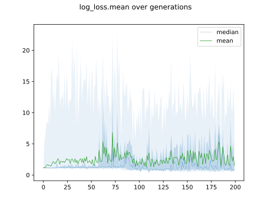

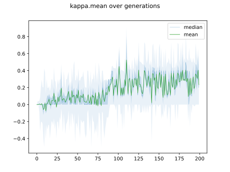

## Individuals in hall of fame

### Individual 13595

| key                    |      value |
|:-----------------------|-----------:|
| mean log_loss:         |   0.638611 |
| mean accuracy:         |   0.652533 |
| mean kappa:            |   0.4788   |
| number of edges        |  30        |
| number of hidden nodes |   4        |
| number of layers       |   3        |
| birth                  | 152        |

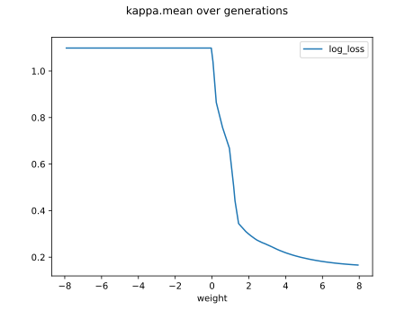

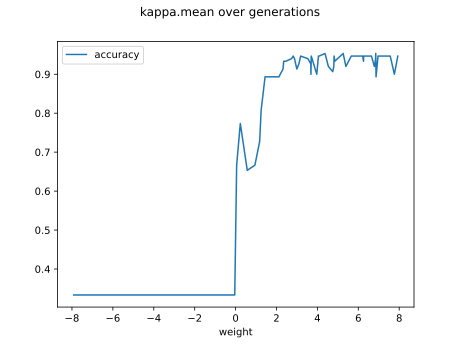

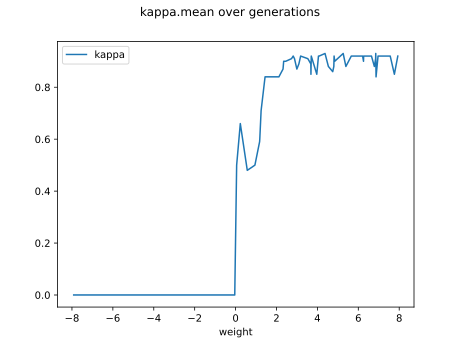

#### Network

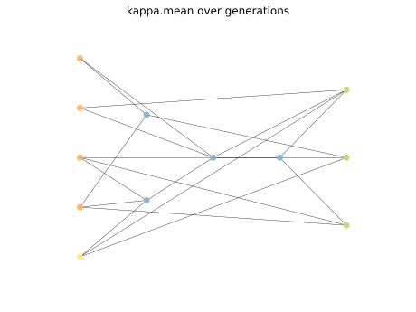

### Individual 17285

| key                    |      value |
|:-----------------------|-----------:|
| mean log_loss:         |   0.635243 |
| mean accuracy:         |   0.669667 |
| mean kappa:            |   0.5045   |
| number of edges        |  36        |
| number of hidden nodes |   7        |
| number of layers       |   2        |
| birth                  | 193        |

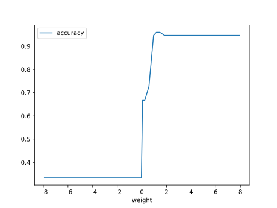

#### Network

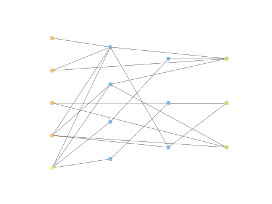

### Individual 16125

| key                    |      value |
|:-----------------------|-----------:|
| mean log_loss:         |   0.635771 |
| mean accuracy:         |   0.669667 |
| mean kappa:            |   0.5045   |
| number of edges        |  34        |
| number of hidden nodes |   6        |
| number of layers       |   2        |
| birth                  | 180        |

#### Network

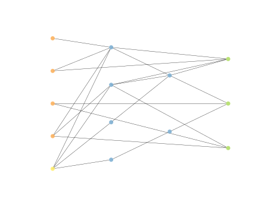

### Individual 16185

| key                    |      value |
|:-----------------------|-----------:|
| mean log_loss:         |   0.635243 |
| mean accuracy:         |   0.669667 |
| mean kappa:            |   0.5045   |
| number of edges        |  35        |
| number of hidden nodes |   7        |
| number of layers       |   2        |
| birth                  | 180        |

#### Network

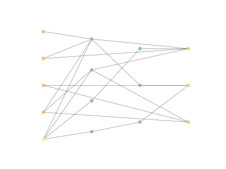

### Individual 17334

| key                    |      value |
|:-----------------------|-----------:|
| mean log_loss:         |   0.635243 |
| mean accuracy:         |   0.669667 |
| mean kappa:            |   0.5045   |
| number of edges        |  37        |
| number of hidden nodes |   8        |
| number of layers       |   2        |
| birth                  | 193        |

#### Network

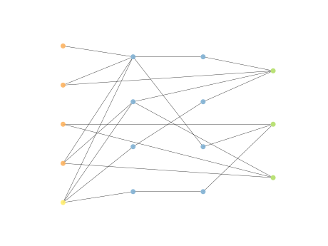

### Individual 16145

| key                    |      value |
|:-----------------------|-----------:|
| mean log_loss:         |   0.635243 |
| mean accuracy:         |   0.669667 |
| mean kappa:            |   0.5045   |
| number of edges        |  35        |
| number of hidden nodes |   7        |
| number of layers       |   2        |
| birth                  | 180        |

#### Network

### Individual 11334

| key                    |      value |
|:-----------------------|-----------:|
| mean log_loss:         |   0.638921 |
| mean accuracy:         |   0.677733 |
| mean kappa:            |   0.5166   |
| number of edges        |  33        |
| number of hidden nodes |   7        |
| number of layers       |   2        |
| birth                  | 126        |

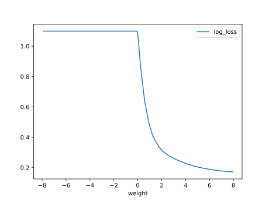

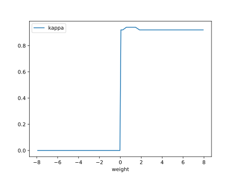

#### Network

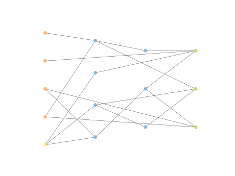

### Individual 15817

| key                    |      value |
|:-----------------------|-----------:|
| mean log_loss:         |   0.634895 |
| mean accuracy:         |   0.639733 |
| mean kappa:            |   0.4596   |
| number of edges        |  33        |
| number of hidden nodes |   5        |
| number of layers       |   3        |
| birth                  | 176        |

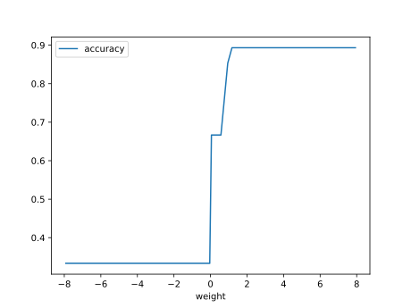

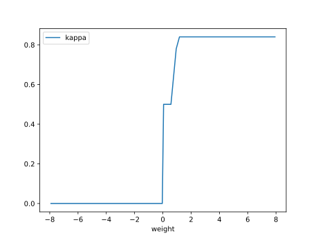

#### Network

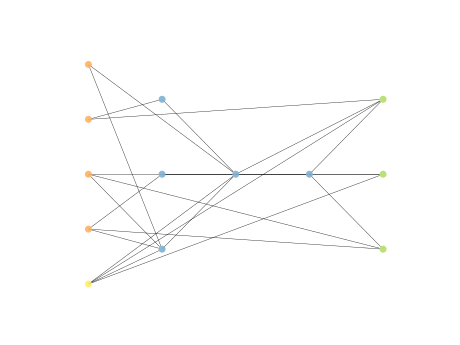

### Individual 14458

| key                    |      value |
|:-----------------------|-----------:|
| mean log_loss:         |   0.639219 |
| mean accuracy:         |   0.669667 |
| mean kappa:            |   0.5045   |
| number of edges        |  31        |
| number of hidden nodes |   5        |
| number of layers       |   2        |
| birth                  | 161        |

#### Network

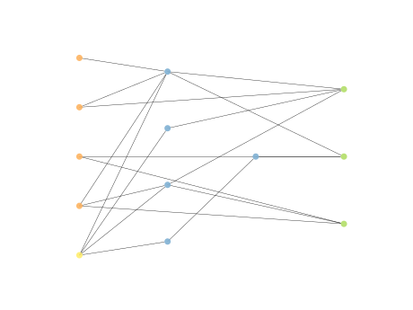

### Individual 14882

| key                    |      value |
|:-----------------------|-----------:|
| mean log_loss:         |   0.635243 |
| mean accuracy:         |   0.669667 |
| mean kappa:            |   0.5045   |
| number of edges        |  33        |
| number of hidden nodes |   6        |
| number of layers       |   2        |
| birth                  | 166        |

#### Network

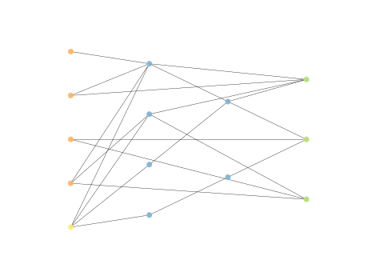

