# Report Iris Uniform Distribution [-8, 8] run 9

## Best results in hall of fame

| measure       |    value |   individual |
|:--------------|---------:|-------------:|
| mean accuracy | 0.697733 |        17358 |
| max accuracy  | 0.96     |        17170 |
| mean kappa    | 0.5466   |        17358 |
| max kappa     | 0.94     |        17170 |

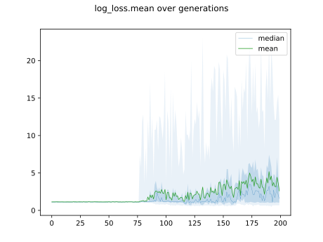

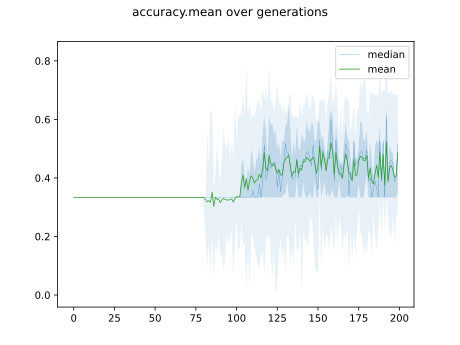

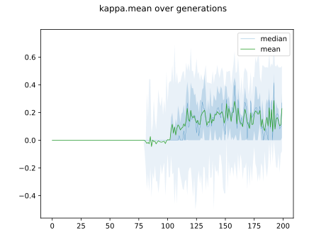

## Individuals in hall of fame

### Individual 17170

| key                    |      value |
|:-----------------------|-----------:|
| mean log_loss:         |   0.628536 |
| mean accuracy:         |   0.6976   |
| mean kappa:            |   0.5464   |
| number of edges        |  51        |
| number of hidden nodes |  14        |
| number of layers       |  12        |
| birth                  | 191        |

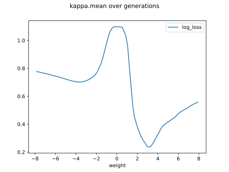

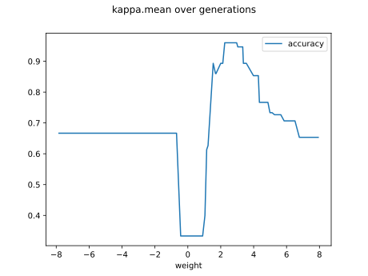

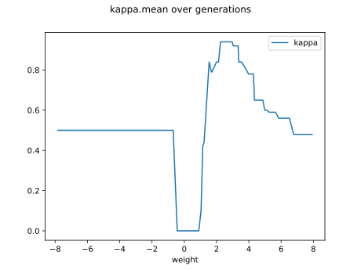

#### Network

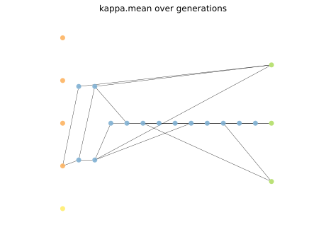

### Individual 16447

| key                    |      value |
|:-----------------------|-----------:|
| mean log_loss:         |   0.628326 |
| mean accuracy:         |   0.695533 |
| mean kappa:            |   0.5433   |
| number of edges        |  49        |
| number of hidden nodes |  13        |
| number of layers       |  11        |
| birth                  | 183        |

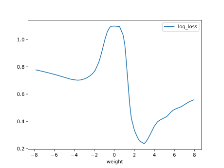

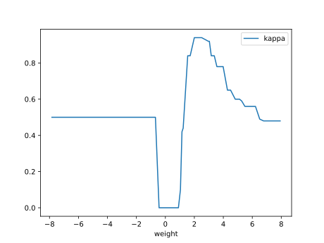

#### Network

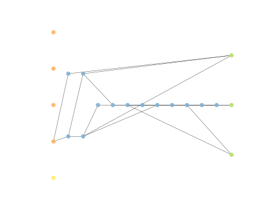

### Individual 17358

| key                    |      value |
|:-----------------------|-----------:|
| mean log_loss:         |   0.626624 |
| mean accuracy:         |   0.697733 |
| mean kappa:            |   0.5466   |
| number of edges        |  51        |
| number of hidden nodes |  14        |
| number of layers       |  12        |
| birth                  | 193        |

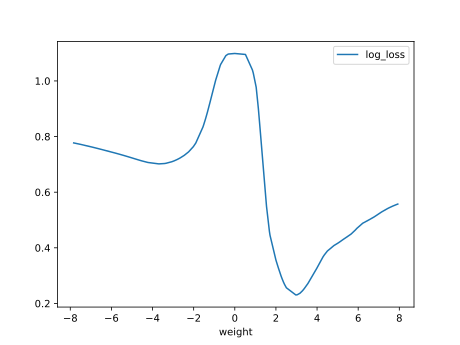

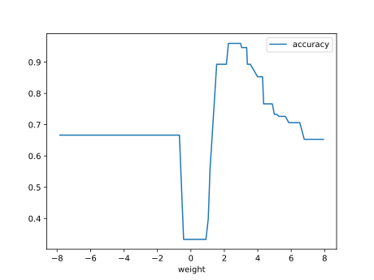

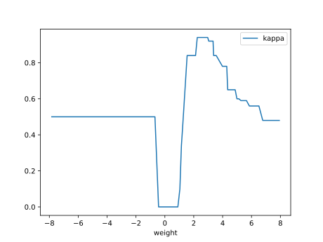

#### Network

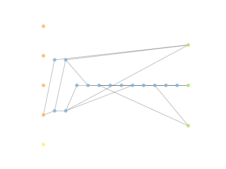

### Individual 16975

| key                    |      value |
|:-----------------------|-----------:|
| mean log_loss:         |   0.637434 |
| mean accuracy:         |   0.692133 |
| mean kappa:            |   0.5382   |
| number of edges        |  51        |
| number of hidden nodes |  14        |
| number of layers       |  12        |
| birth                  | 189        |

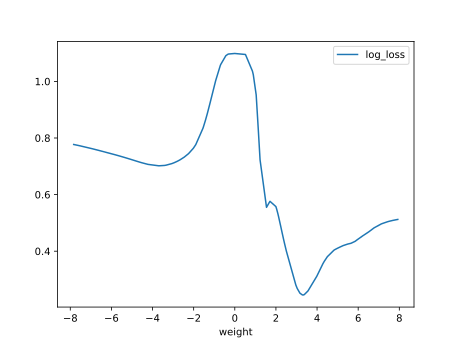

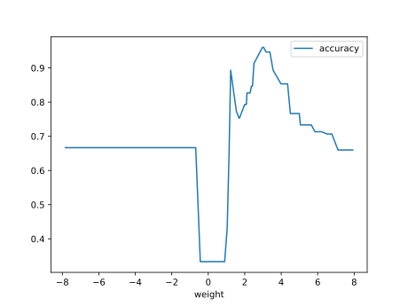

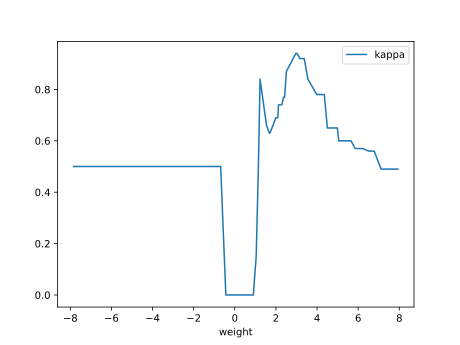

#### Network

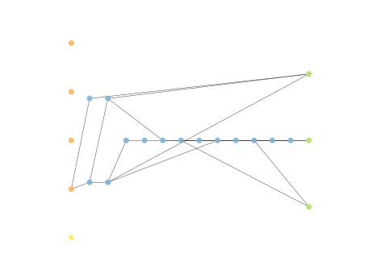

### Individual 17009

| key                    |      value |
|:-----------------------|-----------:|
| mean log_loss:         |   0.628368 |
| mean accuracy:         |   0.695533 |
| mean kappa:            |   0.5433   |
| number of edges        |  50        |
| number of hidden nodes |  13        |
| number of layers       |  11        |
| birth                  | 189        |

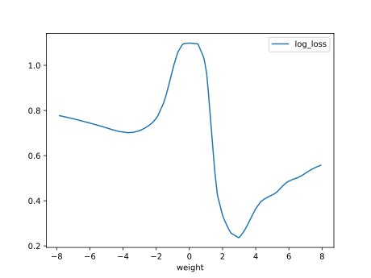

#### Network

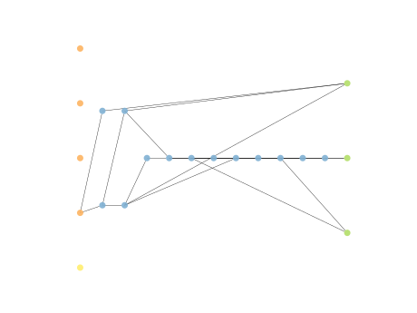

### Individual 16024

| key                    |      value |
|:-----------------------|-----------:|
| mean log_loss:         |   0.712423 |
| mean accuracy:         |   0.636    |
| mean kappa:            |   0.454    |
| number of edges        |  47        |
| number of hidden nodes |  13        |
| number of layers       |  11        |
| birth                  | 179        |

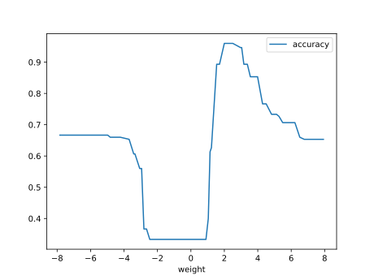

#### Network

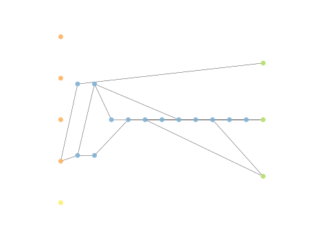

### Individual 15901

| key                    |      value |
|:-----------------------|-----------:|
| mean log_loss:         |   0.716791 |
| mean accuracy:         |   0.634867 |
| mean kappa:            |   0.4523   |
| number of edges        |  45        |
| number of hidden nodes |  12        |
| number of layers       |  11        |
| birth                  | 177        |

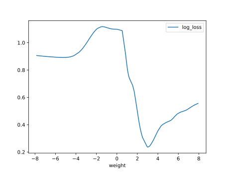

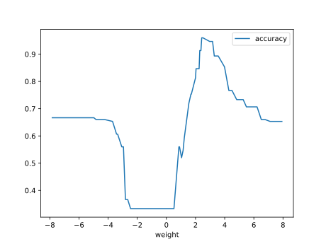

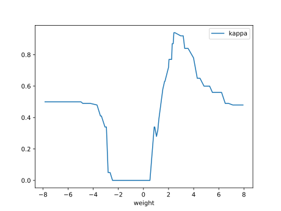

#### Network

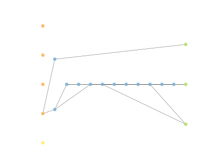

### Individual 15670

| key                    |      value |
|:-----------------------|-----------:|
| mean log_loss:         |   0.711217 |
| mean accuracy:         |   0.640867 |
| mean kappa:            |   0.4613   |
| number of edges        |  45        |
| number of hidden nodes |  12        |
| number of layers       |  11        |
| birth                  | 175        |

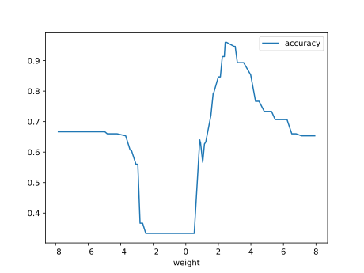

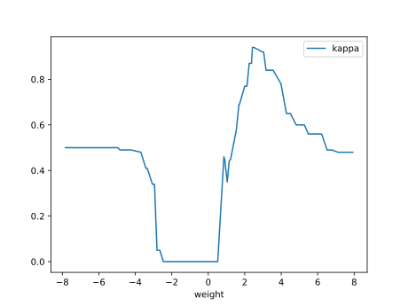

#### Network

### Individual 10090

| key                    |      value |
|:-----------------------|-----------:|
| mean log_loss:         |   0.685816 |
| mean accuracy:         |   0.619933 |
| mean kappa:            |   0.4299   |
| number of edges        |  33        |
| number of hidden nodes |   8        |
| number of layers       |   6        |
| birth                  | 113        |

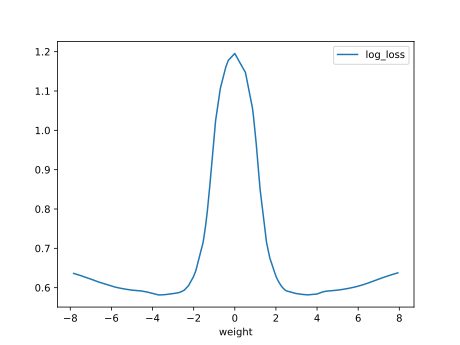

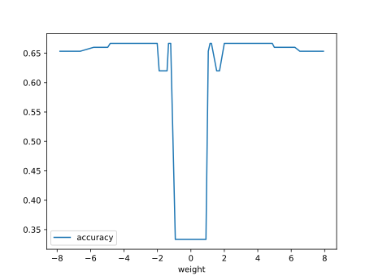

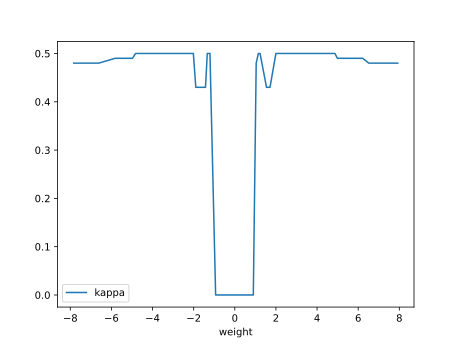

#### Network

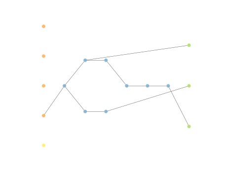

### Individual 7605

| key                    |     value |
|:-----------------------|----------:|
| mean log_loss:         |  1.01195  |
| mean accuracy:         |  0.631533 |
| mean kappa:            |  0.4473   |
| number of edges        | 21        |
| number of hidden nodes |  3        |
| number of layers       |  2        |
| birth                  | 85        |

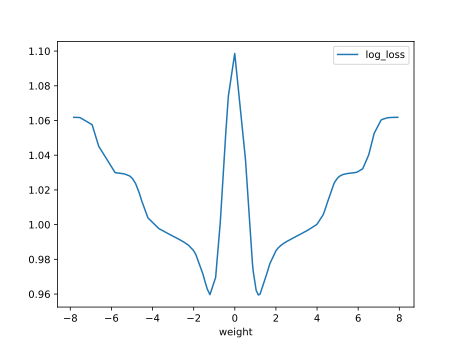

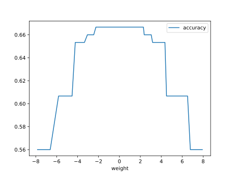

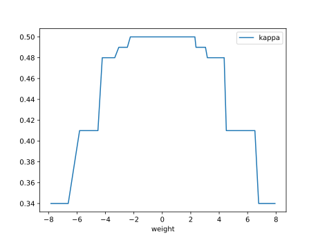

#### Network

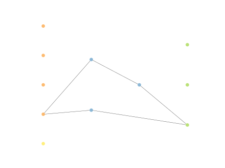

