# Report mnist256 constant 0

## Best results in hall of fame

| measure            |    value | individual   |
|:-------------------|---------:|:-------------|
| MAX:log_loss.min   | 0.61503  | 417043       |
| MIN:log_loss.min   | 0.589634 | 460201       |
| MEAN:log_loss.min  | 0.605732 |              |
| MAX:log_loss.mean  | 0.61503  | 417043       |
| MIN:log_loss.mean  | 0.589634 | 460201       |
| MEAN:log_loss.mean | 0.605732 |              |
| MAX:log_loss.max   | 0.61503  | 417043       |
| MIN:log_loss.max   | 0.589634 | 460201       |
| MEAN:log_loss.max  | 0.605732 |              |
| MAX:accuracy.min   | 0.8488   | 460201       |
| MIN:accuracy.min   | 0.8406   | 417043       |
| MEAN:accuracy.min  | 0.84418  |              |
| MAX:accuracy.mean  | 0.8488   | 460201       |
| MIN:accuracy.mean  | 0.8406   | 417043       |
| MEAN:accuracy.mean | 0.84418  |              |
| MAX:accuracy.max   | 0.8488   | 460201       |
| MIN:accuracy.max   | 0.8406   | 417043       |
| MEAN:accuracy.max  | 0.84418  |              |
| MAX:kappa.min      | 0.831886 | 460201       |
| MIN:kappa.min      | 0.822762 | 417043       |
| MEAN:kappa.min     | 0.826748 |              |
| MAX:kappa.mean     | 0.831886 | 460201       |
| MIN:kappa.mean     | 0.822762 | 417043       |
| MEAN:kappa.mean    | 0.826748 |              |
| MAX:kappa.max      | 0.831886 | 460201       |
| MIN:kappa.max      | 0.822762 | 417043       |
| MEAN:kappa.max     | 0.826748 |              |

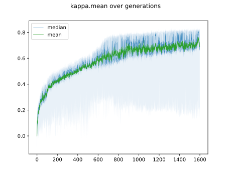

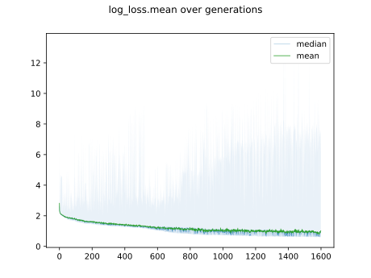

## Individuals in hall of fame

### Individual 460201

| key                    |       value |
|:-----------------------|------------:|
| mean accuracy:         |    0.8488   |
| mean kappa:            |    0.831886 |
| mean log_loss:         |    0.589634 |
| number of edges        | 2826        |
| number of hidden nodes |   76        |
| number of layers       |    4        |
| birth                  |    0        |
| number of mutations    |  400        |

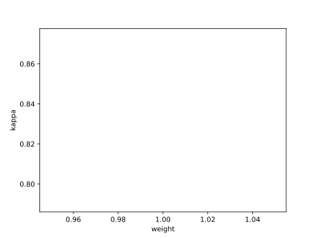

#### Confusion matrix

#### Network

### Individual 457605

| key                    |       value |
|:-----------------------|------------:|
| mean accuracy:         |    0.8461   |
| mean kappa:            |    0.828883 |
| mean log_loss:         |    0.592631 |
| number of edges        | 2826        |
| number of hidden nodes |   77        |
| number of layers       |    4        |
| birth                  |    0        |
| number of mutations    |  399        |

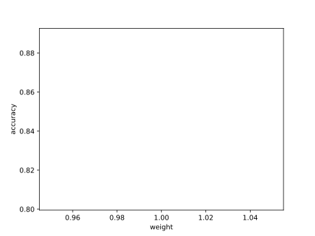

#### Confusion matrix

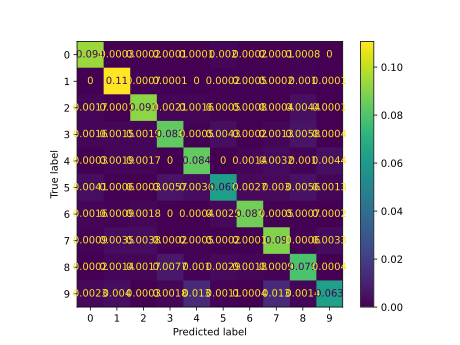

#### Network

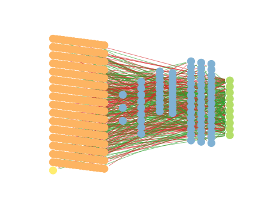

### Individual 450178

| key                    |       value |
|:-----------------------|------------:|
| mean accuracy:         |    0.8455   |
| mean kappa:            |    0.828217 |
| mean log_loss:         |    0.604731 |
| number of edges        | 2820        |
| number of hidden nodes |   76        |
| number of layers       |    4        |
| birth                  |    0        |
| number of mutations    |  395        |

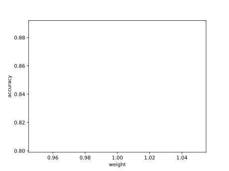

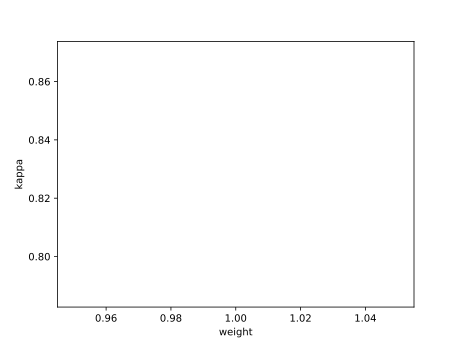

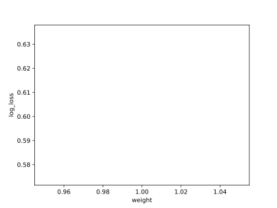

#### Confusion matrix

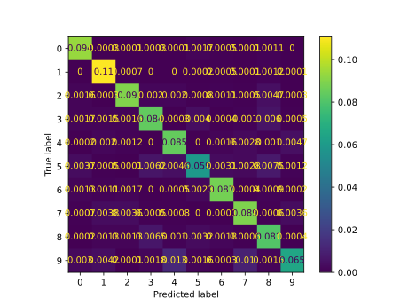

#### Network

### Individual 435877

| key                    |       value |
|:-----------------------|------------:|
| mean accuracy:         |    0.8444   |
| mean kappa:            |    0.826986 |
| mean log_loss:         |    0.610425 |
| number of edges        | 2810        |
| number of hidden nodes |   72        |
| number of layers       |    4        |
| birth                  |    0        |
| number of mutations    |  389        |

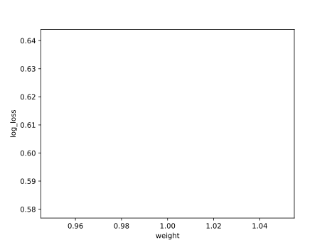

#### Confusion matrix

#### Network

### Individual 438353

| key                    |       value |
|:-----------------------|------------:|
| mean accuracy:         |    0.8441   |
| mean kappa:            |    0.826654 |
| mean log_loss:         |    0.603933 |
| number of edges        | 2819        |
| number of hidden nodes |   76        |
| number of layers       |    4        |
| birth                  |    0        |
| number of mutations    |  393        |

#### Confusion matrix

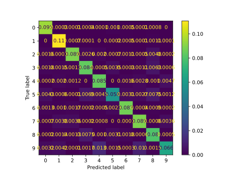

#### Network

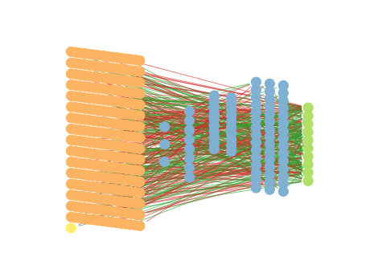

### Individual 457344

| key                    |       value |
|:-----------------------|------------:|
| mean accuracy:         |    0.8438   |
| mean kappa:            |    0.826359 |
| mean log_loss:         |    0.608373 |
| number of edges        | 2822        |
| number of hidden nodes |   76        |
| number of layers       |    4        |
| birth                  |    0        |
| number of mutations    |  397        |

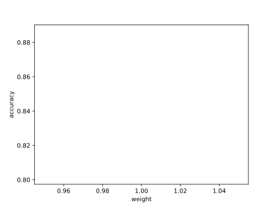

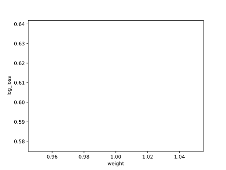

#### Confusion matrix

#### Network

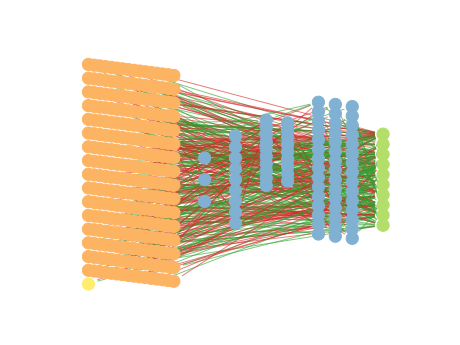

### Individual 418640

| key                    |       value |
|:-----------------------|------------:|
| mean accuracy:         |    0.8436   |
| mean kappa:            |    0.826094 |
| mean log_loss:         |    0.614845 |
| number of edges        | 2806        |
| number of hidden nodes |   70        |
| number of layers       |    4        |
| birth                  |    0        |
| number of mutations    |  384        |

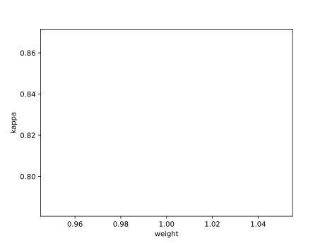

#### Confusion matrix

#### Network

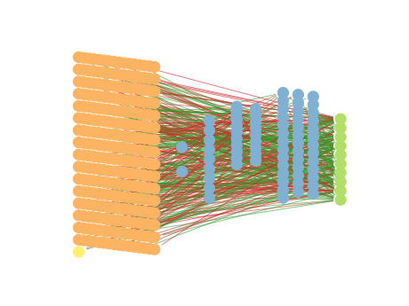

### Individual 451868

| key                    |       value |
|:-----------------------|------------:|
| mean accuracy:         |    0.8436   |
| mean kappa:            |    0.8261   |
| mean log_loss:         |    0.604143 |
| number of edges        | 2820        |
| number of hidden nodes |   76        |
| number of layers       |    4        |
| birth                  |    0        |
| number of mutations    |  395        |

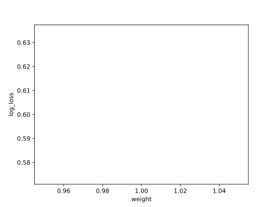

#### Confusion matrix

#### Network

### Individual 423223

| key                    |       value |
|:-----------------------|------------:|
| mean accuracy:         |    0.8413   |
| mean kappa:            |    0.823541 |
| mean log_loss:         |    0.61358  |
| number of edges        | 2806        |
| number of hidden nodes |   70        |
| number of layers       |    4        |
| birth                  |    0        |
| number of mutations    |  385        |

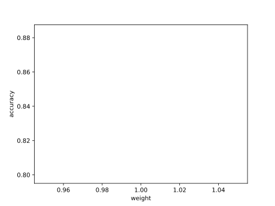

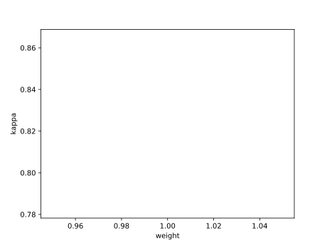

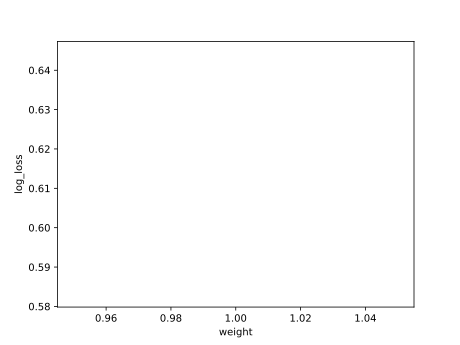

#### Confusion matrix

#### Network

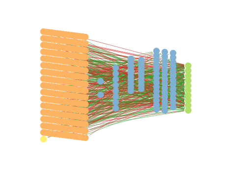

### Individual 417043

| key                    |       value |
|:-----------------------|------------:|
| mean accuracy:         |    0.8406   |
| mean kappa:            |    0.822762 |
| mean log_loss:         |    0.61503  |
| number of edges        | 2806        |
| number of hidden nodes |   70        |
| number of layers       |    4        |
| birth                  |    0        |
| number of mutations    |  383        |

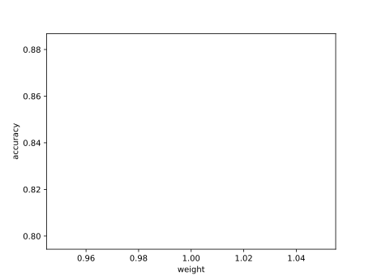

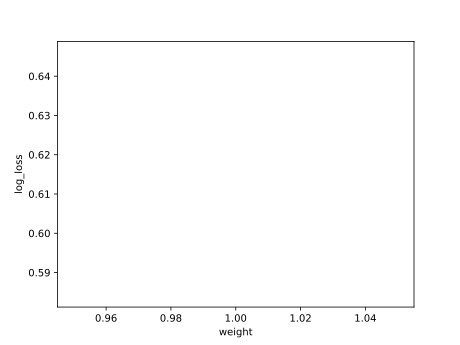

#### Confusion matrix

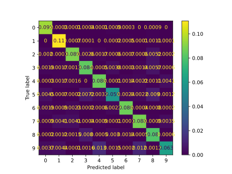

#### Network

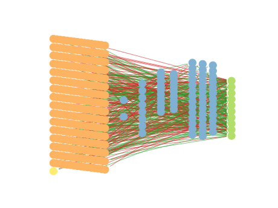

