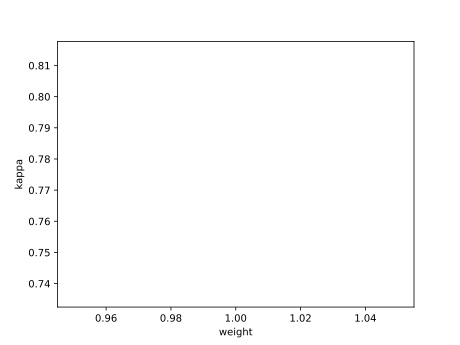

# Report mnist256 constant 1

## Best results in hall of fame

| measure            |    value | individual   |
|:-------------------|---------:|:-------------|
| MAX:log_loss.min   | 0.824328 | 366580       |
| MIN:log_loss.min   | 0.813576 | 379953       |
| MEAN:log_loss.min  | 0.81823  |              |
| MAX:log_loss.mean  | 0.824328 | 366580       |
| MIN:log_loss.mean  | 0.813576 | 379953       |
| MEAN:log_loss.mean | 0.81823  |              |
| MAX:log_loss.max   | 0.824328 | 366580       |
| MIN:log_loss.max   | 0.813576 | 379953       |
| MEAN:log_loss.max  | 0.81823  |              |
| MAX:accuracy.min   | 0.8044   | 366592       |
| MIN:accuracy.min   | 0.7916   | 456148       |
| MEAN:accuracy.min  | 0.8012   |              |
| MAX:accuracy.mean  | 0.8044   | 366592       |
| MIN:accuracy.mean  | 0.7916   | 456148       |
| MEAN:accuracy.mean | 0.8012   |              |
| MAX:accuracy.max   | 0.8044   | 366592       |
| MIN:accuracy.max   | 0.7916   | 456148       |
| MEAN:accuracy.max  | 0.8012   |              |
| MAX:kappa.min      | 0.782469 | 366592       |
| MIN:kappa.min      | 0.768212 | 456148       |
| MEAN:kappa.min     | 0.778894 |              |
| MAX:kappa.mean     | 0.782469 | 366592       |
| MIN:kappa.mean     | 0.768212 | 456148       |
| MEAN:kappa.mean    | 0.778894 |              |
| MAX:kappa.max      | 0.782469 | 366592       |
| MIN:kappa.max      | 0.768212 | 456148       |
| MEAN:kappa.max     | 0.778894 |              |

## Individuals in hall of fame

### Individual 366592

| key                    |       value |
|:-----------------------|------------:|
| mean accuracy:         |    0.8044   |
| mean kappa:            |    0.782469 |
| mean log_loss:         |    0.824254 |
| number of edges        | 2850        |
| number of hidden nodes |   74        |
| number of layers       |    5        |
| birth                  |    0        |
| number of mutations    |  322        |

#### Confusion matrix

#### Network

### Individual 366580

| key                    |       value |
|:-----------------------|------------:|
| mean accuracy:         |    0.8044   |
| mean kappa:            |    0.782469 |
| mean log_loss:         |    0.824328 |
| number of edges        | 2848        |
| number of hidden nodes |   73        |
| number of layers       |    5        |
| birth                  |    0        |
| number of mutations    |  322        |

#### Confusion matrix

#### Network

### Individual 383378

| key                    |       value |
|:-----------------------|------------:|
| mean accuracy:         |    0.8038   |
| mean kappa:            |    0.781801 |
| mean log_loss:         |    0.819998 |
| number of edges        | 2850        |
| number of hidden nodes |   73        |
| number of layers       |    5        |
| birth                  |    0        |
| number of mutations    |  322        |

#### Confusion matrix

#### Network

### Individual 379953

| key                    |       value |
|:-----------------------|------------:|
| mean accuracy:         |    0.8037   |
| mean kappa:            |    0.781665 |
| mean log_loss:         |    0.813576 |
| number of edges        | 2857        |
| number of hidden nodes |   75        |
| number of layers       |    5        |
| birth                  |    0        |
| number of mutations    |  330        |

#### Confusion matrix

#### Network

### Individual 381324

| key                    |       value |
|:-----------------------|------------:|
| mean accuracy:         |    0.8023   |
| mean kappa:            |    0.780109 |
| mean log_loss:         |    0.814213 |
| number of edges        | 2856        |
| number of hidden nodes |   75        |
| number of layers       |    5        |
| birth                  |    0        |
| number of mutations    |  330        |

#### Confusion matrix

#### Network

### Individual 387846

| key                    |       value |
|:-----------------------|------------:|
| mean accuracy:         |    0.8021   |
| mean kappa:            |    0.779894 |
| mean log_loss:         |    0.815635 |
| number of edges        | 2859        |
| number of hidden nodes |   76        |
| number of layers       |    5        |
| birth                  |    0        |
| number of mutations    |  332        |

#### Confusion matrix

#### Network

### Individual 377804

| key                    |       value |
|:-----------------------|------------:|
| mean accuracy:         |    0.8014   |
| mean kappa:            |    0.779107 |
| mean log_loss:         |    0.815084 |
| number of edges        | 2856        |
| number of hidden nodes |   75        |
| number of layers       |    5        |
| birth                  |    0        |
| number of mutations    |  328        |

#### Confusion matrix

#### Network

### Individual 377581

| key                    |       value |
|:-----------------------|------------:|
| mean accuracy:         |    0.8005   |
| mean kappa:            |    0.778112 |
| mean log_loss:         |    0.816696 |
| number of edges        | 2857        |
| number of hidden nodes |   76        |
| number of layers       |    5        |
| birth                  |    0        |
| number of mutations    |  328        |

#### Confusion matrix

#### Network

### Individual 383977

| key                    |       value |
|:-----------------------|------------:|
| mean accuracy:         |    0.7978   |
| mean kappa:            |    0.775104 |
| mean log_loss:         |    0.817327 |
| number of edges        | 2860        |
| number of hidden nodes |   76        |
| number of layers       |    5        |
| birth                  |    0        |
| number of mutations    |  332        |

#### Confusion matrix

#### Network

### Individual 456148

| key                    |       value |
|:-----------------------|------------:|
| mean accuracy:         |    0.7916   |
| mean kappa:            |    0.768212 |
| mean log_loss:         |    0.821189 |
| number of edges        | 2860        |
| number of hidden nodes |   76        |
| number of layers       |    6        |
| birth                  |    0        |
| number of mutations    |  331        |

#### Confusion matrix

#### Network

