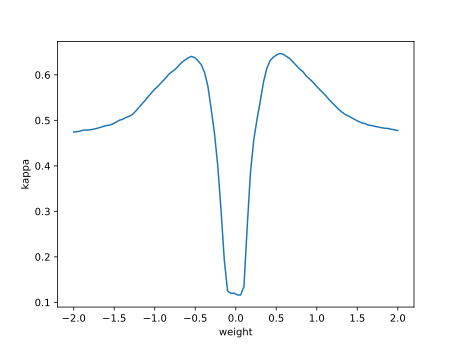

# Report mnist256 linspace -2,2 0

## Best results in hall of fame

| measure            |    value | individual   |
|:-------------------|---------:|:-------------|
| MAX:log_loss.min   | 1.34457  | 456430       |
| MIN:log_loss.min   | 1.34094  | 449714       |
| MEAN:log_loss.min  | 1.34288  |              |
| MAX:log_loss.mean  | 1.55639  | 456430       |
| MIN:log_loss.mean  | 1.55127  | 460224       |
| MEAN:log_loss.mean | 1.55304  |              |
| MAX:log_loss.max   | 2.35104  | 456430       |
| MIN:log_loss.max   | 2.35076  | 457972       |
| MEAN:log_loss.max  | 2.35101  |              |
| MAX:accuracy.min   | 0.2108   | 460224       |
| MIN:accuracy.min   | 0.2107   | 451963       |
| MEAN:accuracy.min  | 0.21076  |              |
| MAX:accuracy.mean  | 0.560039 | 460224       |
| MIN:accuracy.mean  | 0.557298 | 456430       |
| MEAN:accuracy.mean | 0.559003 |              |
| MAX:accuracy.max   | 0.6885   | 456430       |
| MIN:accuracy.max   | 0.6812   | 449714       |
| MEAN:accuracy.max  | 0.68362  |              |
| MAX:kappa.min      | 0.116179 | 451963       |
| MIN:kappa.min      | 0.116088 | 460224       |
| MEAN:kappa.min     | 0.116124 |              |
| MAX:kappa.mean     | 0.510681 | 460224       |
| MIN:kappa.mean     | 0.507644 | 456430       |
| MEAN:kappa.mean    | 0.509536 |              |
| MAX:kappa.max      | 0.653592 | 456430       |
| MIN:kappa.max      | 0.645446 | 449714       |
| MEAN:kappa.max     | 0.648147 |              |

## Individuals in hall of fame

### Individual 460224

| key                    |       value |
|:-----------------------|------------:|
| mean accuracy:         |    0.560039 |
| mean kappa:            |    0.510681 |
| mean log_loss:         |    1.55127  |
| number of edges        | 2764        |
| number of hidden nodes |   44        |
| number of layers       |    5        |
| birth                  |    0        |
| number of mutations    |  375        |

#### Confusion matrix

#### Network

### Individual 457967

| key                    |       value |
|:-----------------------|------------:|
| mean accuracy:         |    0.560039 |
| mean kappa:            |    0.510681 |
| mean log_loss:         |    1.55127  |
| number of edges        | 2764        |
| number of hidden nodes |   44        |
| number of layers       |    5        |
| birth                  |    0        |
| number of mutations    |  374        |

#### Confusion matrix

#### Network

### Individual 456231

| key                    |       value |
|:-----------------------|------------:|
| mean accuracy:         |    0.559822 |
| mean kappa:            |    0.510446 |
| mean log_loss:         |    1.55279  |
| number of edges        | 2762        |
| number of hidden nodes |   44        |
| number of layers       |    5        |
| birth                  |    0        |
| number of mutations    |  372        |

#### Confusion matrix

#### Network

### Individual 457303

| key                    |       value |
|:-----------------------|------------:|
| mean accuracy:         |    0.559778 |
| mean kappa:            |    0.510397 |
| mean log_loss:         |    1.55193  |
| number of edges        | 2763        |
| number of hidden nodes |   44        |
| number of layers       |    5        |
| birth                  |    0        |
| number of mutations    |  373        |

#### Confusion matrix

#### Network

### Individual 457972

| key                    |       value |
|:-----------------------|------------:|
| mean accuracy:         |    0.559723 |
| mean kappa:            |    0.510335 |
| mean log_loss:         |    1.55274  |
| number of edges        | 2763        |
| number of hidden nodes |   44        |
| number of layers       |    5        |
| birth                  |    0        |
| number of mutations    |  374        |

#### Confusion matrix

#### Network

### Individual 451963

| key                    |       value |
|:-----------------------|------------:|
| mean accuracy:         |    0.558405 |
| mean kappa:            |    0.508876 |
| mean log_loss:         |    1.55397  |
| number of edges        | 2759        |
| number of hidden nodes |   44        |
| number of layers       |    5        |
| birth                  |    0        |
| number of mutations    |  368        |

#### Confusion matrix

#### Network

### Individual 451919

| key                    |       value |
|:-----------------------|------------:|
| mean accuracy:         |    0.558404 |
| mean kappa:            |    0.508875 |
| mean log_loss:         |    1.55395  |
| number of edges        | 2758        |
| number of hidden nodes |   44        |
| number of layers       |    5        |
| birth                  |    0        |
| number of mutations    |  368        |

#### Confusion matrix

#### Network

### Individual 452895

| key                    |       value |
|:-----------------------|------------:|
| mean accuracy:         |    0.558403 |
| mean kappa:            |    0.508874 |
| mean log_loss:         |    1.55394  |
| number of edges        | 2759        |
| number of hidden nodes |   44        |
| number of layers       |    5        |
| birth                  |    0        |
| number of mutations    |  369        |

#### Confusion matrix

#### Network

### Individual 449714

| key                    |       value |
|:-----------------------|------------:|
| mean accuracy:         |    0.558117 |
| mean kappa:            |    0.508554 |
| mean log_loss:         |    1.55219  |
| number of edges        | 2755        |
| number of hidden nodes |   43        |
| number of layers       |    5        |
| birth                  |    0        |
| number of mutations    |  365        |

#### Confusion matrix

#### Network

### Individual 456430

| key                    |       value |
|:-----------------------|------------:|
| mean accuracy:         |    0.557298 |
| mean kappa:            |    0.507644 |
| mean log_loss:         |    1.55639  |
| number of edges        | 2761        |
| number of hidden nodes |   44        |
| number of layers       |    5        |
| birth                  |    0        |
| number of mutations    |  372        |

#### Confusion matrix

#### Network

