# Report mnist256 linspace -2,2 1

## Best results in hall of fame

| measure            |     value | individual   |
|:-------------------|----------:|:-------------|
| MAX:log_loss.min   | 1.1083    | 436322       |
| MIN:log_loss.min   | 1.10175   | 459080       |
| MEAN:log_loss.min  | 1.10459   |              |
| MAX:log_loss.mean  | 1.49238   | 459080       |
| MIN:log_loss.mean  | 1.48841   | 459576       |
| MEAN:log_loss.mean | 1.49002   |              |
| MAX:log_loss.max   | 2.40267   | 436322       |
| MIN:log_loss.max   | 2.40244   | 456481       |
| MEAN:log_loss.max  | 2.40252   |              |
| MAX:accuracy.min   | 0.1979    | 436322       |
| MIN:accuracy.min   | 0.1676    | 459576       |
| MEAN:accuracy.min  | 0.1815    |              |
| MAX:accuracy.mean  | 0.619179  | 436322       |
| MIN:accuracy.mean  | 0.607623  | 459236       |
| MEAN:accuracy.mean | 0.611101  |              |
| MAX:accuracy.max   | 0.787     | 455054       |
| MIN:accuracy.max   | 0.7843    | 458555       |
| MEAN:accuracy.max  | 0.78531   |              |
| MAX:kappa.min      | 0.107049  | 436322       |
| MIN:kappa.min      | 0.0735487 | 459576       |
| MEAN:kappa.min     | 0.0892179 |              |
| MAX:kappa.mean     | 0.576431  | 436322       |
| MIN:kappa.mean     | 0.563655  | 459236       |
| MEAN:kappa.mean    | 0.567547  |              |
| MAX:kappa.max      | 0.763307  | 455054       |
| MIN:kappa.max      | 0.760312  | 458555       |
| MEAN:kappa.max     | 0.76143   |              |

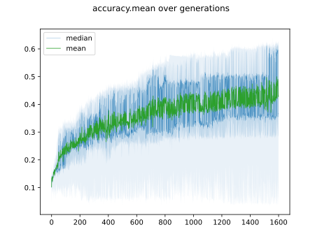

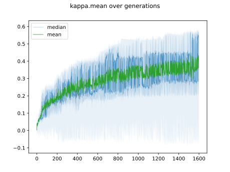

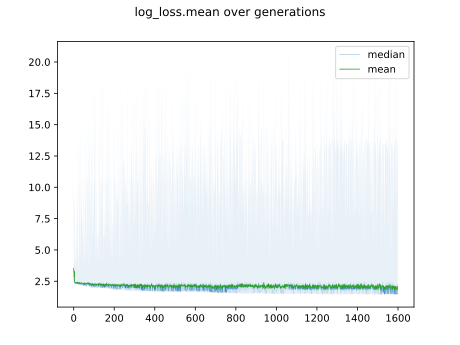

## Individuals in hall of fame

### Individual 436322

| key                    |       value |
|:-----------------------|------------:|
| mean accuracy:         |    0.619179 |
| mean kappa:            |    0.576431 |
| mean log_loss:         |    1.49227  |
| number of edges        | 2998        |
| number of hidden nodes |  143        |
| number of layers       |    7        |
| birth                  |    0        |
| number of mutations    |  476        |

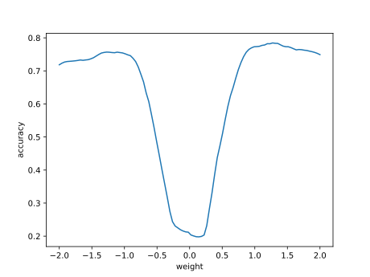

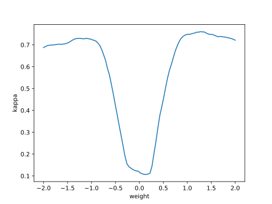

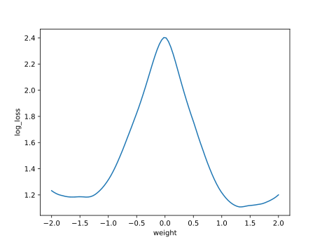

#### Confusion matrix

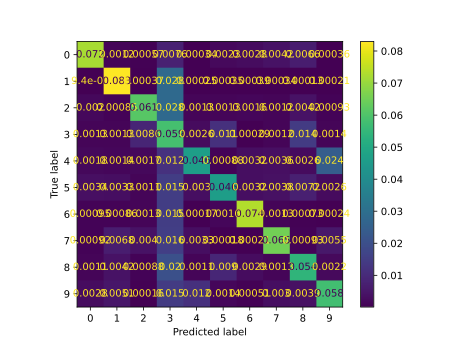

#### Network

### Individual 455054

| key                    |       value |
|:-----------------------|------------:|
| mean accuracy:         |    0.613079 |
| mean kappa:            |    0.56979  |
| mean log_loss:         |    1.48884  |
| number of edges        | 3006        |
| number of hidden nodes |  146        |
| number of layers       |    7        |
| birth                  |    0        |
| number of mutations    |  487        |

#### Confusion matrix

#### Network

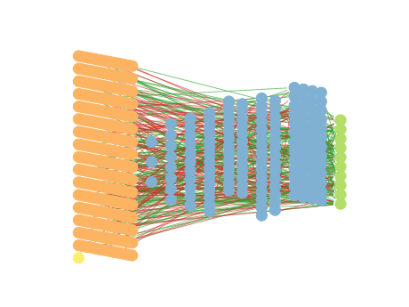

### Individual 459125

| key                    |       value |
|:-----------------------|------------:|
| mean accuracy:         |    0.612854 |
| mean kappa:            |    0.569552 |
| mean log_loss:         |    1.49031  |
| number of edges        | 3014        |
| number of hidden nodes |  149        |
| number of layers       |    7        |
| birth                  |    0        |
| number of mutations    |  493        |

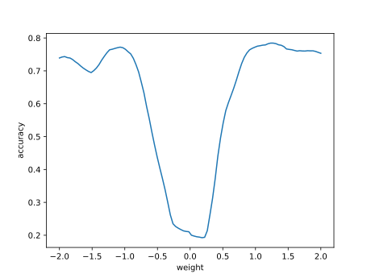

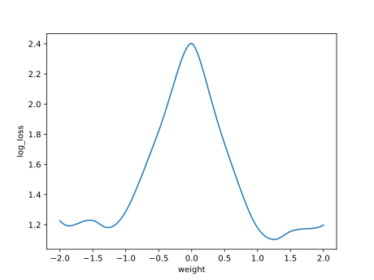

#### Confusion matrix

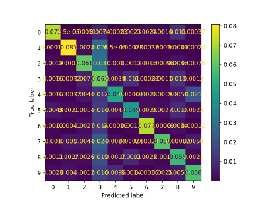

#### Network

### Individual 457920

| key                    |       value |
|:-----------------------|------------:|
| mean accuracy:         |    0.611796 |
| mean kappa:            |    0.568362 |
| mean log_loss:         |    1.49084  |
| number of edges        | 3010        |
| number of hidden nodes |  148        |
| number of layers       |    7        |
| birth                  |    0        |
| number of mutations    |  491        |

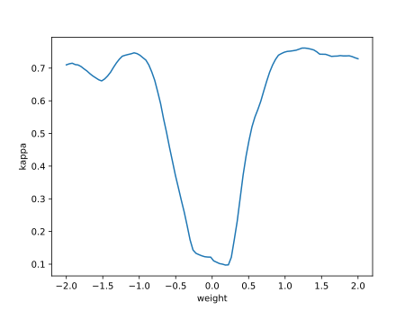

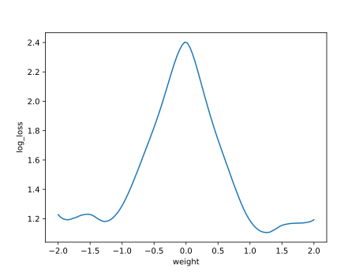

#### Confusion matrix

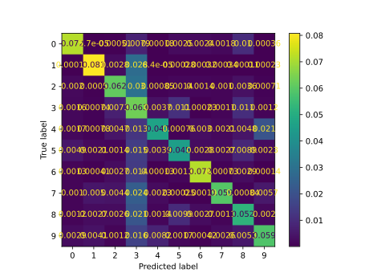

#### Network

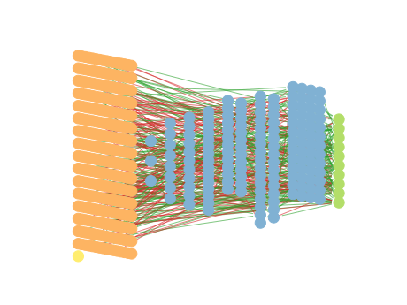

### Individual 458555

| key                    |       value |
|:-----------------------|------------:|
| mean accuracy:         |    0.611639 |
| mean kappa:            |    0.568184 |
| mean log_loss:         |    1.49038  |
| number of edges        | 3012        |
| number of hidden nodes |  148        |
| number of layers       |    7        |
| birth                  |    0        |
| number of mutations    |  492        |

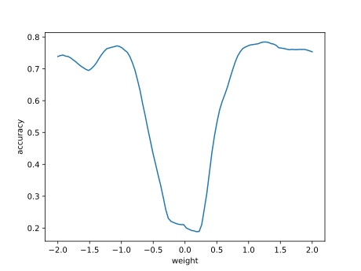

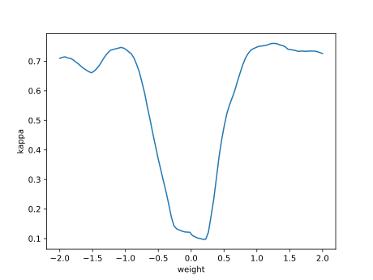

#### Confusion matrix

#### Network

### Individual 459080

| key                    |       value |
|:-----------------------|------------:|
| mean accuracy:         |    0.611588 |
| mean kappa:            |    0.568128 |
| mean log_loss:         |    1.49238  |
| number of edges        | 3014        |
| number of hidden nodes |  149        |
| number of layers       |    7        |
| birth                  |    0        |
| number of mutations    |  493        |

#### Confusion matrix

#### Network

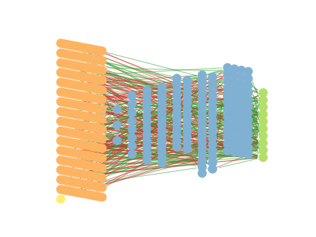

### Individual 456481

| key                    |       value |
|:-----------------------|------------:|
| mean accuracy:         |    0.607962 |
| mean kappa:            |    0.56402  |
| mean log_loss:         |    1.48899  |
| number of edges        | 3005        |
| number of hidden nodes |  145        |
| number of layers       |    7        |
| birth                  |    0        |
| number of mutations    |  488        |

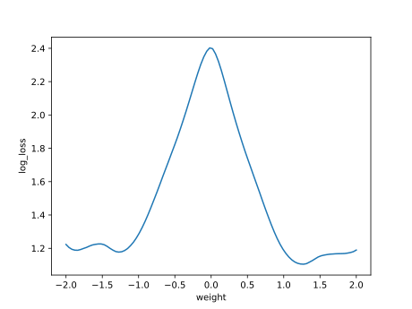

#### Confusion matrix

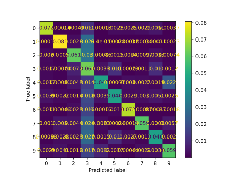

#### Network

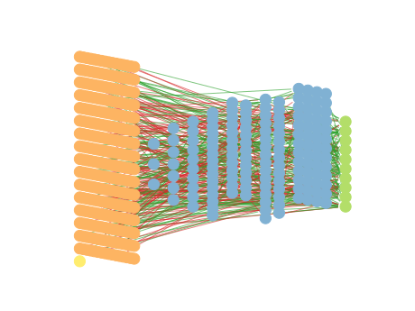

### Individual 459576

| key                    |       value |
|:-----------------------|------------:|
| mean accuracy:         |    0.607645 |
| mean kappa:            |    0.563676 |
| mean log_loss:         |    1.48841  |
| number of edges        | 3009        |
| number of hidden nodes |  147        |
| number of layers       |    7        |
| birth                  |    0        |
| number of mutations    |  492        |

#### Confusion matrix

#### Network

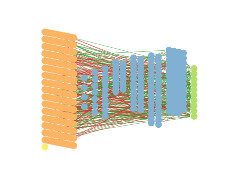

### Individual 459648

| key                    |       value |
|:-----------------------|------------:|
| mean accuracy:         |    0.607645 |
| mean kappa:            |    0.563676 |
| mean log_loss:         |    1.48841  |
| number of edges        | 3009        |
| number of hidden nodes |  147        |
| number of layers       |    7        |
| birth                  |    0        |
| number of mutations    |  493        |

#### Confusion matrix

#### Network

### Individual 459236

| key                    |       value |
|:-----------------------|------------:|
| mean accuracy:         |    0.607623 |
| mean kappa:            |    0.563655 |
| mean log_loss:         |    1.4894   |
| number of edges        | 3007        |
| number of hidden nodes |  146        |
| number of layers       |    7        |
| birth                  |    0        |
| number of mutations    |  491        |

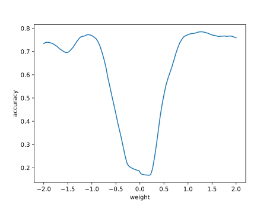

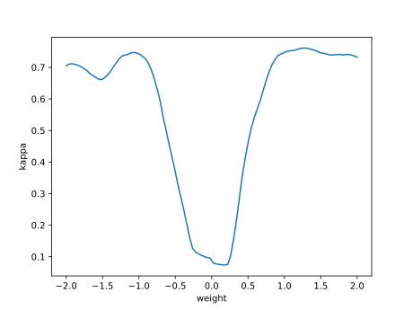

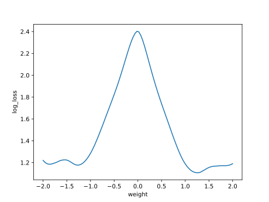

#### Confusion matrix

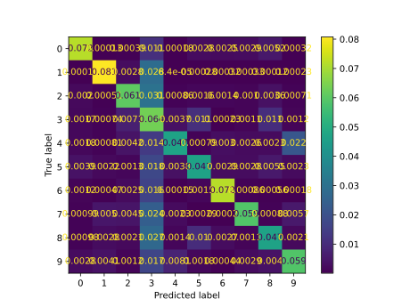

#### Network

