# Report mnist256 lognormal 0,0.5 0

## Best results in hall of fame

| measure            |    value | individual   |
|:-------------------|---------:|:-------------|
| MAX:log_loss.min   | 0.552357 | 422722       |
| MIN:log_loss.min   | 0.540287 | 455119       |
| MEAN:log_loss.min  | 0.548562 |              |
| MAX:log_loss.mean  | 0.864418 | 423293       |
| MIN:log_loss.mean  | 0.847929 | 455119       |
| MEAN:log_loss.mean | 0.855708 |              |
| MAX:log_loss.max   | 2.18961  | 459987       |
| MIN:log_loss.max   | 1.92599  | 431156       |
| MEAN:log_loss.max  | 2.04491  |              |
| MAX:accuracy.min   | 0.7142   | 459987       |
| MIN:accuracy.min   | 0.6923   | 455119       |
| MEAN:accuracy.min  | 0.71093  |              |
| MAX:accuracy.mean  | 0.805861 | 459987       |
| MIN:accuracy.mean  | 0.79913  | 455119       |
| MEAN:accuracy.mean | 0.802105 |              |
| MAX:accuracy.max   | 0.8274   | 455119       |
| MIN:accuracy.max   | 0.8218   | 422722       |
| MEAN:accuracy.max  | 0.82409  |              |
| MAX:kappa.min      | 0.682077 | 459987       |
| MIN:kappa.min      | 0.657684 | 455119       |
| MEAN:kappa.min     | 0.678478 |              |
| MAX:kappa.mean     | 0.784134 | 459987       |
| MIN:kappa.mean     | 0.776628 | 455119       |
| MEAN:kappa.mean    | 0.77996  |              |
| MAX:kappa.max      | 0.808137 | 455119       |
| MIN:kappa.max      | 0.801898 | 422722       |
| MEAN:kappa.max     | 0.804453 |              |

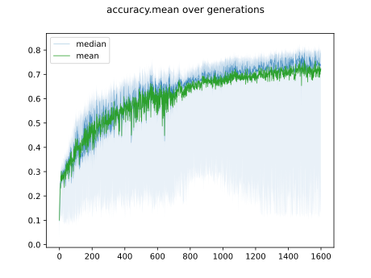

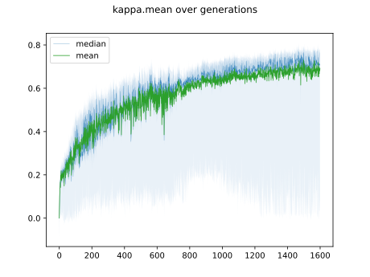

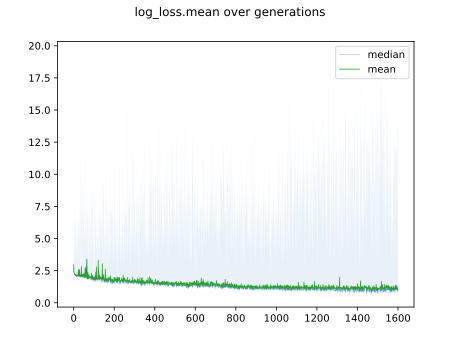

## Individuals in hall of fame

### Individual 459987

| key                    |       value |
|:-----------------------|------------:|
| mean accuracy:         |    0.805861 |
| mean kappa:            |    0.784134 |
| mean log_loss:         |    0.848247 |
| number of edges        | 2711        |
| number of hidden nodes |   43        |
| number of layers       |    4        |
| birth                  |    0        |
| number of mutations    |  309        |

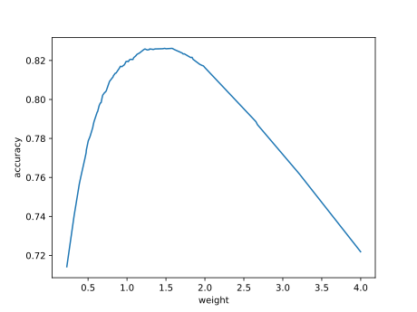

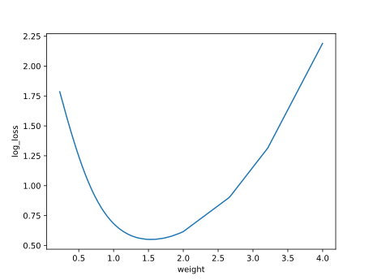

#### Confusion matrix

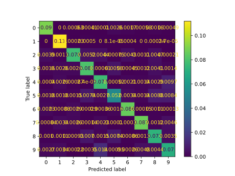

#### Network

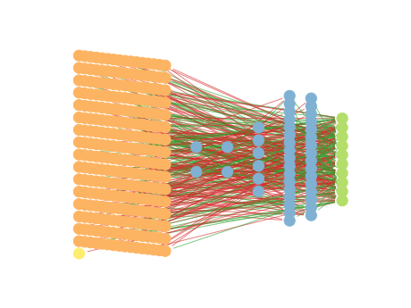

### Individual 431357

| key                    |       value |
|:-----------------------|------------:|
| mean accuracy:         |    0.804292 |
| mean kappa:            |    0.782405 |
| mean log_loss:         |    0.854972 |
| number of edges        | 2705        |
| number of hidden nodes |   40        |
| number of layers       |    4        |
| birth                  |    0        |
| number of mutations    |  302        |

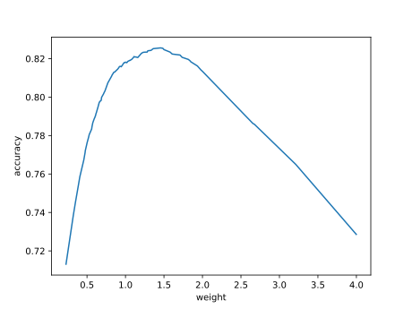

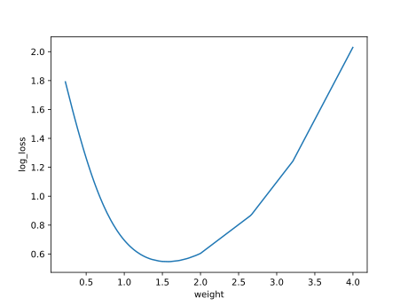

#### Confusion matrix

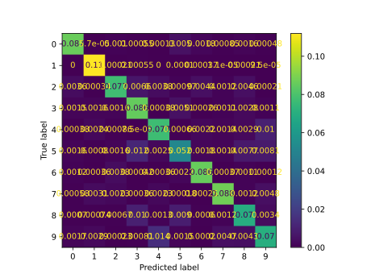

#### Network

### Individual 431569

| key                    |       value |
|:-----------------------|------------:|
| mean accuracy:         |    0.804292 |
| mean kappa:            |    0.782405 |
| mean log_loss:         |    0.854978 |
| number of edges        | 2706        |
| number of hidden nodes |   40        |
| number of layers       |    4        |
| birth                  |    0        |
| number of mutations    |  303        |

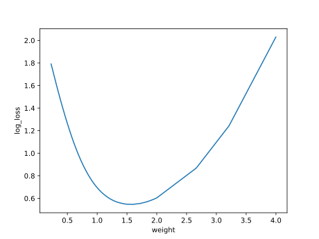

#### Confusion matrix

#### Network

### Individual 431557

| key                    |       value |
|:-----------------------|------------:|
| mean accuracy:         |    0.802692 |
| mean kappa:            |    0.78062  |
| mean log_loss:         |    0.854987 |
| number of edges        | 2705        |
| number of hidden nodes |   40        |
| number of layers       |    4        |
| birth                  |    0        |
| number of mutations    |  303        |

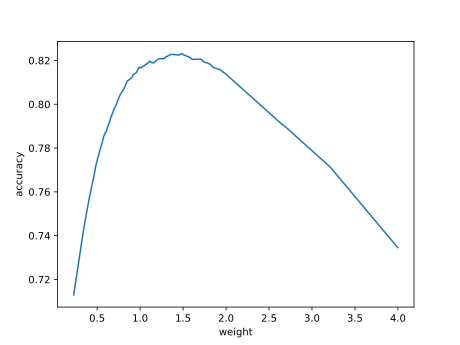

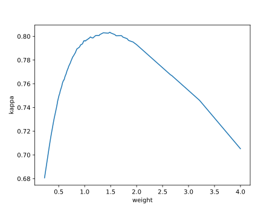

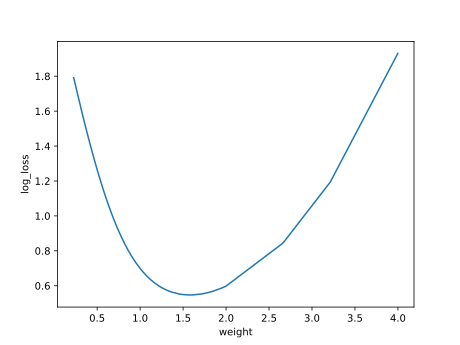

#### Confusion matrix

#### Network

### Individual 431226

| key                    |       value |
|:-----------------------|------------:|
| mean accuracy:         |    0.801754 |
| mean kappa:            |    0.779585 |
| mean log_loss:         |    0.859485 |
| number of edges        | 2704        |
| number of hidden nodes |   40        |
| number of layers       |    4        |
| birth                  |    0        |
| number of mutations    |  302        |

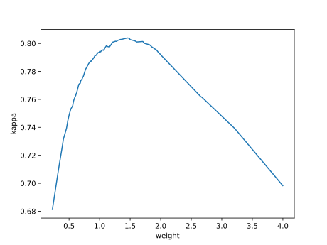

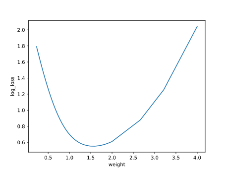

#### Confusion matrix

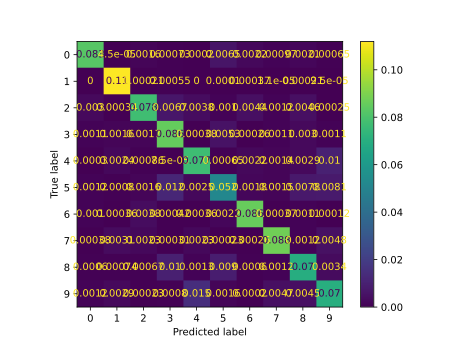

#### Network

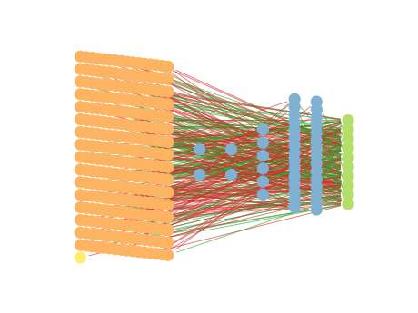

### Individual 423293

| key                    |       value |
|:-----------------------|------------:|
| mean accuracy:         |    0.801313 |
| mean kappa:            |    0.77907  |
| mean log_loss:         |    0.864418 |
| number of edges        | 2702        |
| number of hidden nodes |   40        |
| number of layers       |    4        |
| birth                  |    0        |
| number of mutations    |  298        |

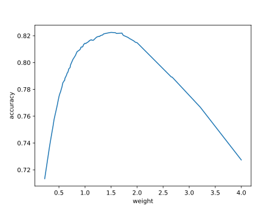

#### Confusion matrix

#### Network

### Individual 431156

| key                    |       value |
|:-----------------------|------------:|
| mean accuracy:         |    0.801151 |
| mean kappa:            |    0.778895 |
| mean log_loss:         |    0.85112  |
| number of edges        | 2706        |
| number of hidden nodes |   41        |
| number of layers       |    4        |
| birth                  |    0        |
| number of mutations    |  301        |

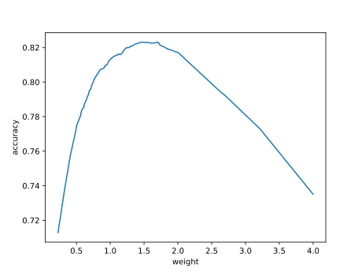

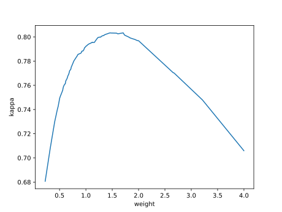

#### Confusion matrix

#### Network

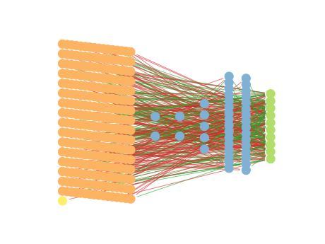

### Individual 423252

| key                    |       value |
|:-----------------------|------------:|
| mean accuracy:         |    0.800342 |
| mean kappa:            |    0.777995 |
| mean log_loss:         |    0.860459 |
| number of edges        | 2703        |
| number of hidden nodes |   40        |
| number of layers       |    4        |
| birth                  |    0        |
| number of mutations    |  298        |

#### Confusion matrix

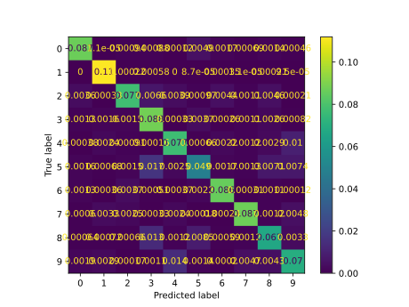

#### Network

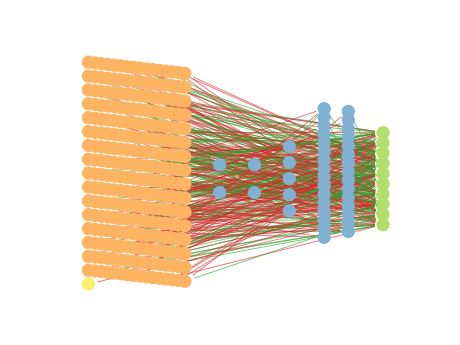

### Individual 422722

| key                    |       value |
|:-----------------------|------------:|
| mean accuracy:         |    0.800223 |
| mean kappa:            |    0.777863 |
| mean log_loss:         |    0.860483 |
| number of edges        | 2702        |
| number of hidden nodes |   40        |
| number of layers       |    4        |
| birth                  |    0        |
| number of mutations    |  297        |

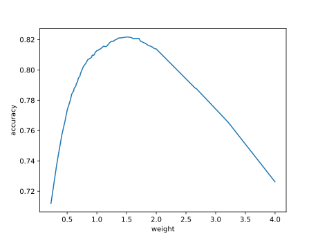

#### Confusion matrix

#### Network

### Individual 455119

| key                    |       value |
|:-----------------------|------------:|
| mean accuracy:         |    0.79913  |
| mean kappa:            |    0.776628 |
| mean log_loss:         |    0.847929 |
| number of edges        | 2708        |
| number of hidden nodes |   42        |
| number of layers       |    4        |
| birth                  |    0        |
| number of mutations    |  306        |

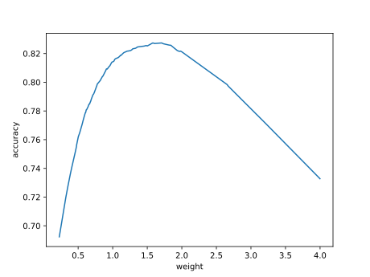

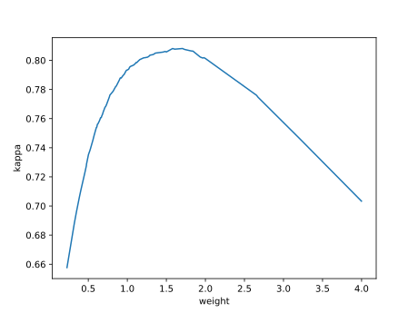

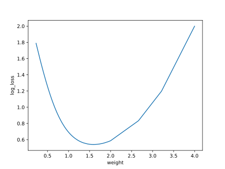

#### Confusion matrix

#### Network

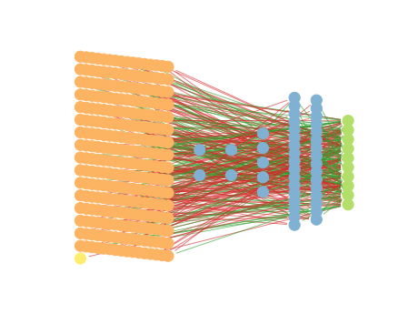

