# Report mnist256 lognormal 0,0.5 1

## Best results in hall of fame

| measure            |    value | individual   |
|:-------------------|---------:|:-------------|
| MAX:log_loss.min   | 0.968712 | 341895       |
| MIN:log_loss.min   | 0.938575 | 453126       |
| MEAN:log_loss.min  | 0.945065 |              |
| MAX:log_loss.mean  | 1.19524  | 341963       |
| MIN:log_loss.mean  | 1.18327  | 386095       |
| MEAN:log_loss.mean | 1.1865   |              |
| MAX:log_loss.max   | 2.05818  | 440827       |
| MIN:log_loss.max   | 2.05029  | 386144       |
| MEAN:log_loss.max  | 2.05363  |              |
| MAX:accuracy.min   | 0.3099   | 440827       |
| MIN:accuracy.min   | 0.2936   | 341895       |
| MEAN:accuracy.min  | 0.29873  |              |
| MAX:accuracy.mean  | 0.701507 | 425655       |
| MIN:accuracy.mean  | 0.693949 | 341963       |
| MEAN:accuracy.mean | 0.697518 |              |
| MAX:accuracy.max   | 0.7403   | 425655       |
| MIN:accuracy.max   | 0.7296   | 341895       |
| MEAN:accuracy.max  | 0.73573  |              |
| MAX:kappa.min      | 0.229755 | 440827       |
| MIN:kappa.min      | 0.2106   | 341895       |
| MEAN:kappa.min     | 0.216648 |              |
| MAX:kappa.mean     | 0.667778 | 425655       |
| MIN:kappa.mean     | 0.659278 | 341963       |
| MEAN:kappa.mean    | 0.663289 |              |
| MAX:kappa.max      | 0.711126 | 425655       |
| MIN:kappa.max      | 0.699201 | 341895       |
| MEAN:kappa.max     | 0.706024 |              |

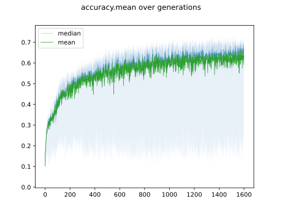

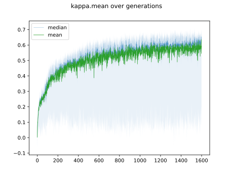

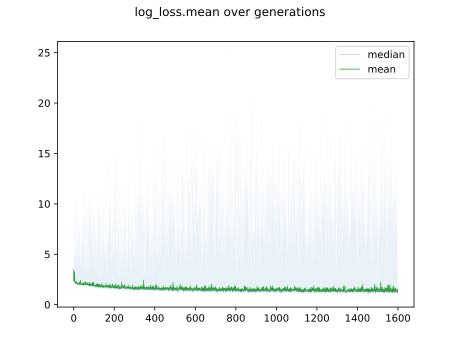

## Individuals in hall of fame

### Individual 425655

| key                    |       value |
|:-----------------------|------------:|
| mean accuracy:         |    0.701507 |
| mean kappa:            |    0.667778 |
| mean log_loss:         |    1.18647  |
| number of edges        | 2721        |
| number of hidden nodes |   40        |
| number of layers       |    3        |
| birth                  |    0        |
| number of mutations    |  183        |

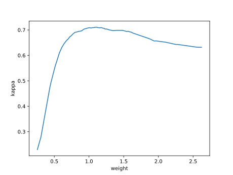

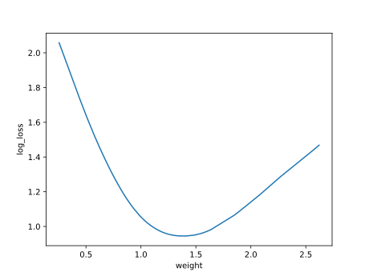

#### Confusion matrix

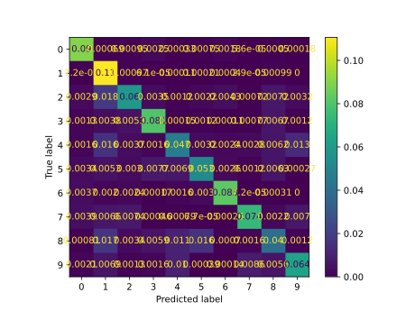

#### Network

### Individual 440827

| key                    |       value |
|:-----------------------|------------:|
| mean accuracy:         |    0.700587 |
| mean kappa:            |    0.666769 |
| mean log_loss:         |    1.18819  |
| number of edges        | 2722        |
| number of hidden nodes |   41        |
| number of layers       |    3        |
| birth                  |    0        |
| number of mutations    |  183        |

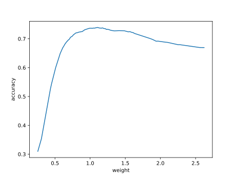

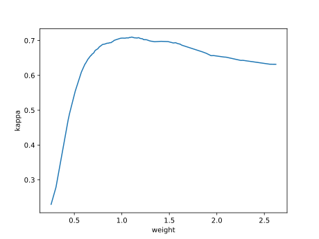

#### Confusion matrix

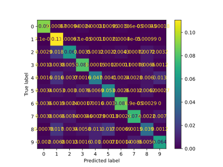

#### Network

### Individual 457547

| key                    |       value |
|:-----------------------|------------:|
| mean accuracy:         |    0.697948 |
| mean kappa:            |    0.663761 |
| mean log_loss:         |    1.18363  |
| number of edges        | 2721        |
| number of hidden nodes |   40        |
| number of layers       |    3        |
| birth                  |    0        |
| number of mutations    |  182        |

#### Confusion matrix

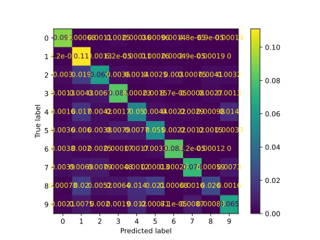

#### Network

### Individual 453126

| key                    |       value |
|:-----------------------|------------:|
| mean accuracy:         |    0.69785  |
| mean kappa:            |    0.663662 |
| mean log_loss:         |    1.18403  |
| number of edges        | 2724        |
| number of hidden nodes |   41        |
| number of layers       |    3        |
| birth                  |    0        |
| number of mutations    |  184        |

#### Confusion matrix

#### Network

### Individual 386144

| key                    |       value |
|:-----------------------|------------:|
| mean accuracy:         |    0.697783 |
| mean kappa:            |    0.663578 |
| mean log_loss:         |    1.18338  |
| number of edges        | 2723        |
| number of hidden nodes |   41        |
| number of layers       |    3        |
| birth                  |    0        |
| number of mutations    |  182        |

#### Confusion matrix

#### Network

### Individual 386095

| key                    |       value |
|:-----------------------|------------:|
| mean accuracy:         |    0.697287 |
| mean kappa:            |    0.663018 |
| mean log_loss:         |    1.18327  |
| number of edges        | 2723        |
| number of hidden nodes |   41        |
| number of layers       |    3        |
| birth                  |    0        |
| number of mutations    |  182        |

#### Confusion matrix

#### Network

### Individual 385988

| key                    |       value |
|:-----------------------|------------:|
| mean accuracy:         |    0.697114 |
| mean kappa:            |    0.662832 |
| mean log_loss:         |    1.18414  |
| number of edges        | 2722        |
| number of hidden nodes |   40        |
| number of layers       |    3        |
| birth                  |    0        |
| number of mutations    |  182        |

#### Confusion matrix

#### Network

### Individual 436523

| key                    |       value |
|:-----------------------|------------:|
| mean accuracy:         |    0.696961 |
| mean kappa:            |    0.662667 |
| mean log_loss:         |    1.18522  |
| number of edges        | 2720        |
| number of hidden nodes |   40        |
| number of layers       |    3        |
| birth                  |    0        |
| number of mutations    |  182        |

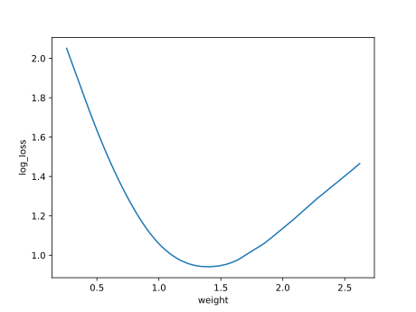

#### Confusion matrix

#### Network

### Individual 341895

| key                    |       value |
|:-----------------------|------------:|
| mean accuracy:         |    0.694192 |
| mean kappa:            |    0.659552 |
| mean log_loss:         |    1.19139  |
| number of edges        | 2714        |
| number of hidden nodes |   39        |
| number of layers       |    3        |
| birth                  |    0        |
| number of mutations    |  175        |

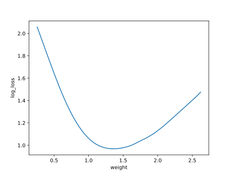

#### Confusion matrix

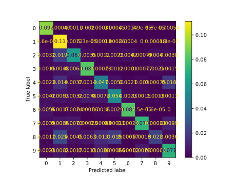

#### Network

### Individual 341963

| key                    |       value |
|:-----------------------|------------:|
| mean accuracy:         |    0.693949 |
| mean kappa:            |    0.659278 |
| mean log_loss:         |    1.19524  |
| number of edges        | 2714        |
| number of hidden nodes |   39        |
| number of layers       |    3        |
| birth                  |    0        |
| number of mutations    |  175        |

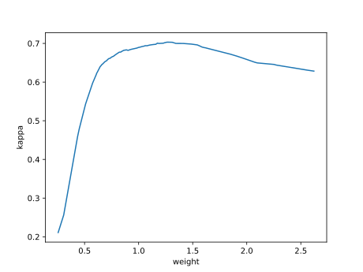

#### Confusion matrix

#### Network

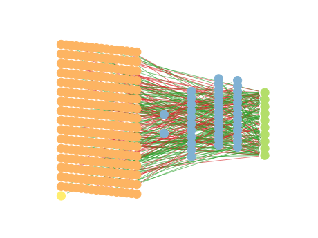

