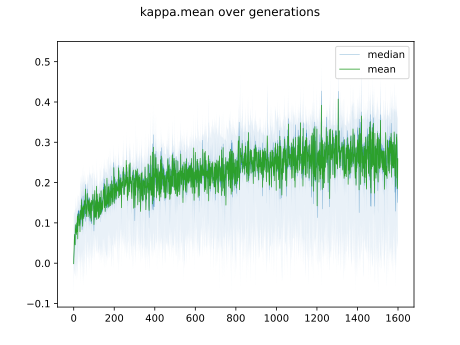
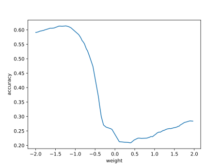

# Report mnist256 uniform -2,2 0

## Best results in hall of fame

| measure            |     value | individual   |
|:-------------------|----------:|:-------------|
| MAX:log_loss.min   | 1.57361   | 351405       |
| MIN:log_loss.min   | 1.27755   | 435302       |
| MEAN:log_loss.min  | 1.42682   |              |
| MAX:log_loss.mean  | 2.09999   | 351487       |
| MIN:log_loss.mean  | 1.82645   | 456488       |
| MEAN:log_loss.mean | 1.96006   |              |
| MAX:log_loss.max   | 3.36032   | 435302       |
| MIN:log_loss.max   | 2.36482   | 424561       |
| MEAN:log_loss.max  | 2.7526    |              |
| MAX:accuracy.min   | 0.2625    | 456488       |
| MIN:accuracy.min   | 0.166     | 351487       |
| MEAN:accuracy.min  | 0.22592   |              |
| MAX:accuracy.mean  | 0.443498  | 456488       |
| MIN:accuracy.mean  | 0.363732  | 351487       |
| MEAN:accuracy.mean | 0.404244  |              |
| MAX:accuracy.max   | 0.6181    | 435302       |
| MIN:accuracy.max   | 0.5542    | 351405       |
| MEAN:accuracy.max  | 0.58655   |              |
| MAX:kappa.min      | 0.183757  | 456488       |
| MIN:kappa.min      | 0.0734922 | 351487       |
| MEAN:kappa.min     | 0.141064  |              |
| MAX:kappa.mean     | 0.382015  | 456488       |
| MIN:kappa.mean     | 0.292715  | 351487       |
| MEAN:kappa.mean    | 0.337927  |              |
| MAX:kappa.max      | 0.575101  | 435302       |
| MIN:kappa.max      | 0.504595  | 351405       |
| MEAN:kappa.max     | 0.540261  |              |

## Individuals in hall of fame

### Individual 456488

| key                    |       value |
|:-----------------------|------------:|
| mean accuracy:         |    0.443498 |
| mean kappa:            |    0.382015 |
| mean log_loss:         |    1.82645  |
| number of edges        | 2673        |
| number of hidden nodes |   21        |
| number of layers       |    4        |
| birth                  |    0        |
| number of mutations    |  161        |

#### Confusion matrix

#### Network

### Individual 420409

| key                    |       value |
|:-----------------------|------------:|
| mean accuracy:         |    0.439118 |
| mean kappa:            |    0.376996 |
| mean log_loss:         |    1.88499  |
| number of edges        | 2662        |
| number of hidden nodes |   19        |
| number of layers       |    4        |
| birth                  |    0        |
| number of mutations    |  149        |

#### Confusion matrix

#### Network

### Individual 450269

| key                    |       value |
|:-----------------------|------------:|
| mean accuracy:         |    0.438821 |
| mean kappa:            |    0.376836 |
| mean log_loss:         |    1.83148  |
| number of edges        | 2666        |
| number of hidden nodes |   19        |
| number of layers       |    4        |
| birth                  |    0        |
| number of mutations    |  157        |

#### Confusion matrix

#### Network

### Individual 424561

| key                    |       value |
|:-----------------------|------------:|
| mean accuracy:         |    0.43387  |
| mean kappa:            |    0.371218 |
| mean log_loss:         |    1.84217  |
| number of edges        | 2666        |
| number of hidden nodes |   21        |
| number of layers       |    4        |
| birth                  |    0        |
| number of mutations    |  151        |

#### Confusion matrix

#### Network

### Individual 351405

| key                    |       value |
|:-----------------------|------------:|
| mean accuracy:         |    0.428275 |
| mean kappa:            |    0.365161 |
| mean log_loss:         |    1.86011  |
| number of edges        | 2659        |
| number of hidden nodes |   19        |
| number of layers       |    4        |
| birth                  |    0        |
| number of mutations    |  138        |

#### Confusion matrix

#### Network

### Individual 450044

| key                    |       value |
|:-----------------------|------------:|
| mean accuracy:         |    0.380082 |
| mean kappa:            |    0.310505 |
| mean log_loss:         |    2.04405  |
| number of edges        | 2696        |
| number of hidden nodes |   48        |
| number of layers       |    4        |
| birth                  |    0        |
| number of mutations    |  132        |

#### Confusion matrix

#### Network

### Individual 375735

| key                    |       value |
|:-----------------------|------------:|
| mean accuracy:         |    0.379023 |
| mean kappa:            |    0.309128 |
| mean log_loss:         |    2.04265  |
| number of edges        | 2699        |
| number of hidden nodes |   49        |
| number of layers       |    4        |
| birth                  |    0        |
| number of mutations    |  134        |

#### Confusion matrix

#### Network

### Individual 351511

| key                    |       value |
|:-----------------------|------------:|
| mean accuracy:         |    0.371521 |
| mean kappa:            |    0.301176 |
| mean log_loss:         |    2.07514  |
| number of edges        | 2687        |
| number of hidden nodes |   44        |
| number of layers       |    4        |
| birth                  |    0        |
| number of mutations    |  125        |

#### Confusion matrix

#### Network

### Individual 435302

| key                    |       value |
|:-----------------------|------------:|
| mean accuracy:         |    0.3645   |
| mean kappa:            |    0.293517 |
| mean log_loss:         |    2.09354  |
| number of edges        | 2697        |
| number of hidden nodes |   48        |
| number of layers       |    4        |
| birth                  |    0        |
| number of mutations    |  132        |

#### Confusion matrix

#### Network

### Individual 351487

| key                    |       value |
|:-----------------------|------------:|
| mean accuracy:         |    0.363732 |
| mean kappa:            |    0.292715 |
| mean log_loss:         |    2.09999  |
| number of edges        | 2688        |
| number of hidden nodes |   44        |
| number of layers       |    4        |
| birth                  |    0        |
| number of mutations    |  125        |

#### Confusion matrix

#### Network

