# Report mnist256 uniform -2,2 1

## Best results in hall of fame

| measure            |    value | individual   |
|:-------------------|---------:|:-------------|
| MAX:log_loss.min   | 1.10128  | 440735       |
| MIN:log_loss.min   | 1.03569  | 452152       |
| MEAN:log_loss.min  | 1.05357  |              |
| MAX:log_loss.mean  | 1.76188  | 427292       |
| MIN:log_loss.mean  | 1.72958  | 442571       |
| MEAN:log_loss.mean | 1.74549  |              |
| MAX:log_loss.max   | 2.41998  | 440735       |
| MIN:log_loss.max   | 2.4078   | 422784       |
| MEAN:log_loss.max  | 2.41297  |              |
| MAX:accuracy.min   | 0.2134   | 451916       |
| MIN:accuracy.min   | 0.204    | 422784       |
| MEAN:accuracy.min  | 0.2113   |              |
| MAX:accuracy.mean  | 0.468398 | 451916       |
| MIN:accuracy.mean  | 0.460243 | 440735       |
| MEAN:accuracy.mean | 0.464324 |              |
| MAX:accuracy.max   | 0.7033   | 442650       |
| MIN:accuracy.max   | 0.6677   | 440735       |
| MEAN:accuracy.max  | 0.69376  |              |
| MAX:kappa.min      | 0.120669 | 451916       |
| MIN:kappa.min      | 0.109498 | 422784       |
| MEAN:kappa.min     | 0.118947 |              |
| MAX:kappa.mean     | 0.409755 | 451916       |
| MIN:kappa.mean     | 0.40091  | 440735       |
| MEAN:kappa.mean    | 0.405413 |              |
| MAX:kappa.max      | 0.67012  | 442650       |
| MIN:kappa.max      | 0.630546 | 440735       |
| MEAN:kappa.max     | 0.659512 |              |

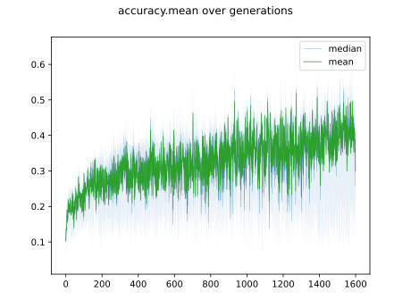

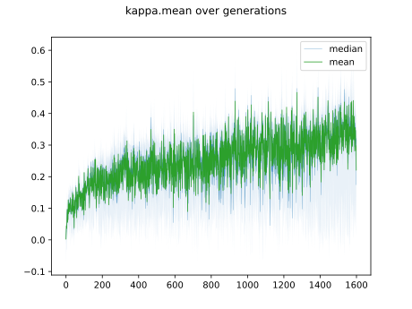

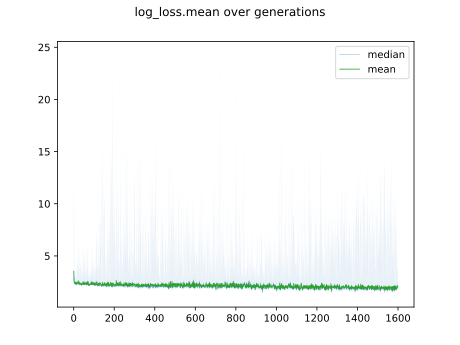

## Individuals in hall of fame

### Individual 451916

| key                    |       value |
|:-----------------------|------------:|
| mean accuracy:         |    0.468398 |
| mean kappa:            |    0.409755 |
| mean log_loss:         |    1.74768  |
| number of edges        | 2776        |
| number of hidden nodes |   76        |
| number of layers       |    5        |
| birth                  |    0        |
| number of mutations    |  198        |

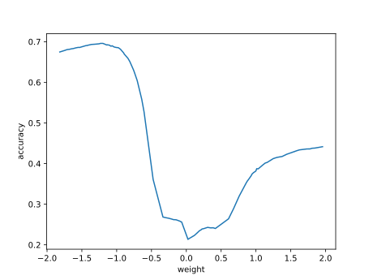

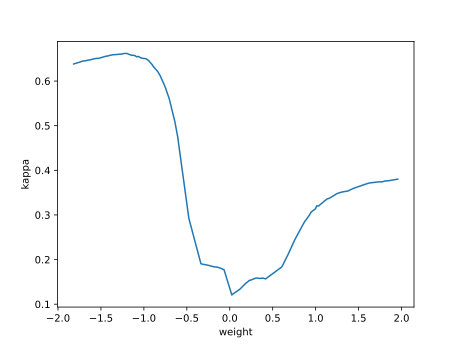

#### Confusion matrix

#### Network

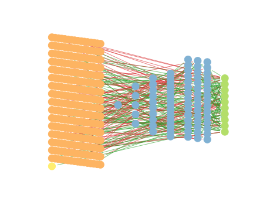

### Individual 452152

| key                    |       value |
|:-----------------------|------------:|
| mean accuracy:         |    0.466582 |
| mean kappa:            |    0.407893 |
| mean log_loss:         |    1.74394  |
| number of edges        | 2779        |
| number of hidden nodes |   77        |
| number of layers       |    5        |
| birth                  |    0        |
| number of mutations    |  199        |

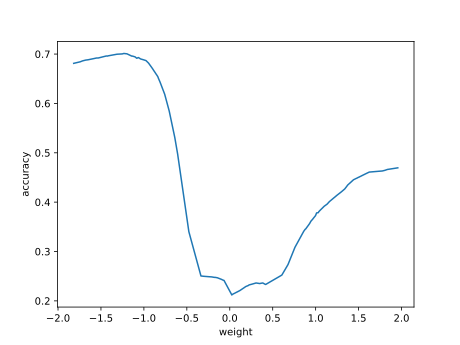

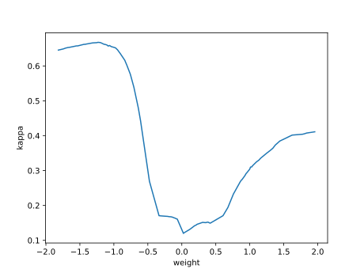

#### Confusion matrix

#### Network

### Individual 427292

| key                    |       value |
|:-----------------------|------------:|
| mean accuracy:         |    0.465656 |
| mean kappa:            |    0.406863 |
| mean log_loss:         |    1.76188  |
| number of edges        | 2774        |
| number of hidden nodes |   75        |
| number of layers       |    5        |
| birth                  |    0        |
| number of mutations    |  196        |

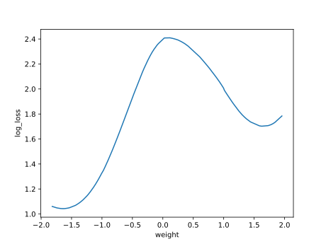

#### Confusion matrix

#### Network

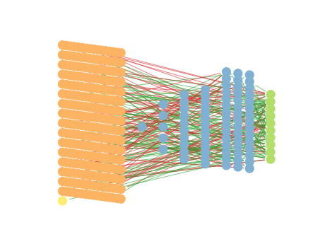

### Individual 442571

| key                    |       value |
|:-----------------------|------------:|
| mean accuracy:         |    0.465262 |
| mean kappa:            |    0.406431 |
| mean log_loss:         |    1.72958  |
| number of edges        | 2779        |
| number of hidden nodes |   77        |
| number of layers       |    5        |
| birth                  |    0        |
| number of mutations    |  200        |

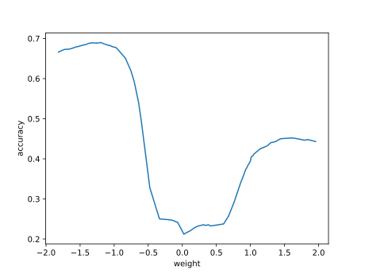

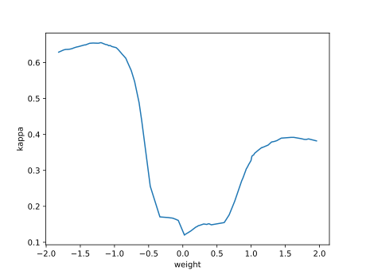

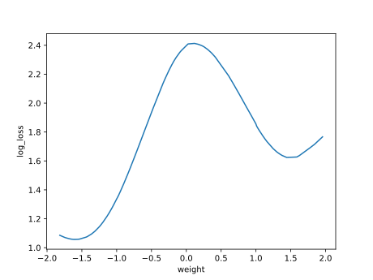

#### Confusion matrix

#### Network

### Individual 434860

| key                    |       value |
|:-----------------------|------------:|
| mean accuracy:         |    0.464749 |
| mean kappa:            |    0.405899 |
| mean log_loss:         |    1.74271  |
| number of edges        | 2776        |
| number of hidden nodes |   76        |
| number of layers       |    5        |
| birth                  |    0        |
| number of mutations    |  197        |

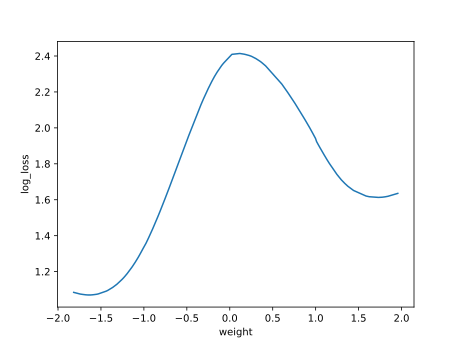

#### Confusion matrix

#### Network

### Individual 422784

| key                    |       value |
|:-----------------------|------------:|
| mean accuracy:         |    0.463672 |
| mean kappa:            |    0.404482 |
| mean log_loss:         |    1.74858  |
| number of edges        | 2771        |
| number of hidden nodes |   74        |
| number of layers       |    5        |
| birth                  |    0        |
| number of mutations    |  193        |

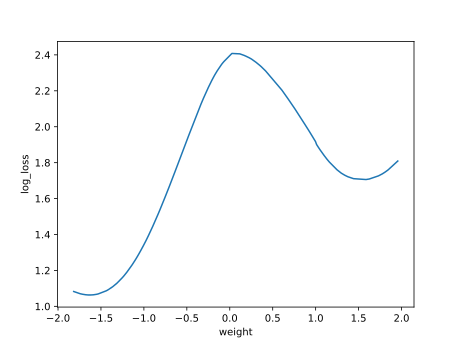

#### Confusion matrix

#### Network

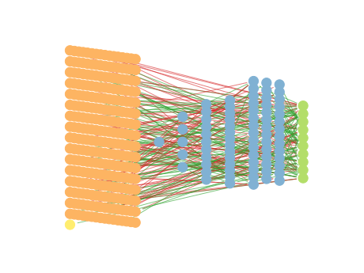

### Individual 442650

| key                    |       value |
|:-----------------------|------------:|
| mean accuracy:         |    0.463505 |
| mean kappa:            |    0.404596 |
| mean log_loss:         |    1.7451   |
| number of edges        | 2779        |
| number of hidden nodes |   77        |
| number of layers       |    5        |
| birth                  |    0        |
| number of mutations    |  200        |

#### Confusion matrix

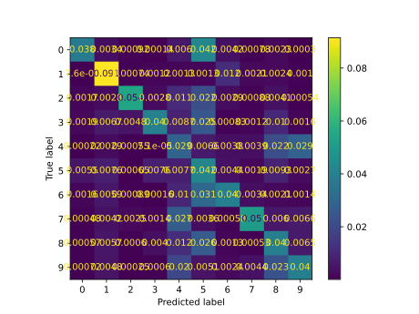

#### Network

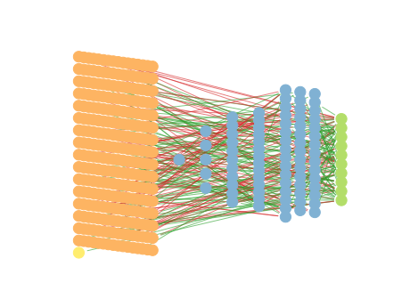

### Individual 440893

| key                    |       value |
|:-----------------------|------------:|
| mean accuracy:         |    0.462992 |
| mean kappa:            |    0.404118 |
| mean log_loss:         |    1.74169  |
| number of edges        | 2779        |
| number of hidden nodes |   77        |
| number of layers       |    5        |
| birth                  |    0        |
| number of mutations    |  199        |

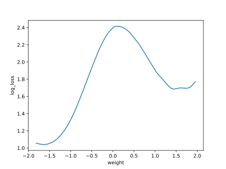

#### Confusion matrix

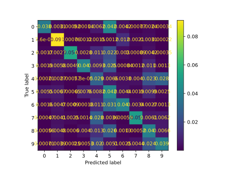

#### Network

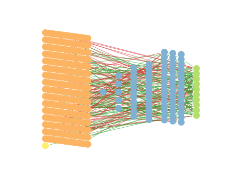

### Individual 415873

| key                    |       value |
|:-----------------------|------------:|
| mean accuracy:         |    0.462185 |
| mean kappa:            |    0.403184 |
| mean log_loss:         |    1.7507   |
| number of edges        | 2777        |
| number of hidden nodes |   76        |
| number of layers       |    5        |
| birth                  |    0        |
| number of mutations    |  198        |

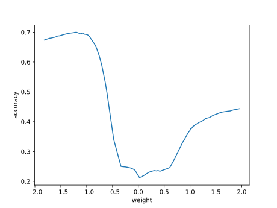

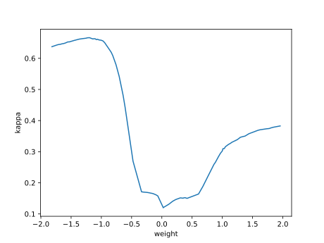

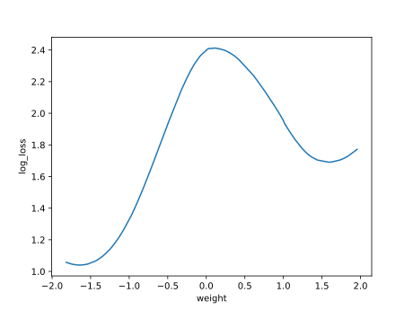

#### Confusion matrix

#### Network

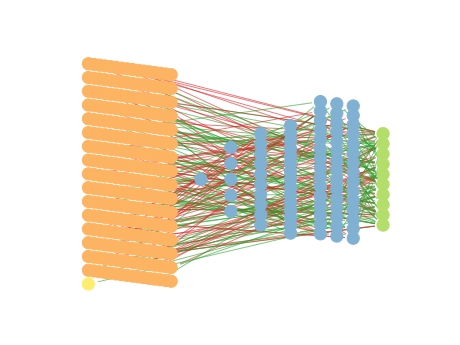

### Individual 440735

| key                    |       value |
|:-----------------------|------------:|
| mean accuracy:         |    0.460243 |
| mean kappa:            |    0.40091  |
| mean log_loss:         |    1.743    |
| number of edges        | 2777        |
| number of hidden nodes |   76        |
| number of layers       |    5        |
| birth                  |    0        |
| number of mutations    |  199        |

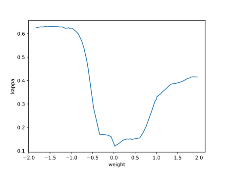

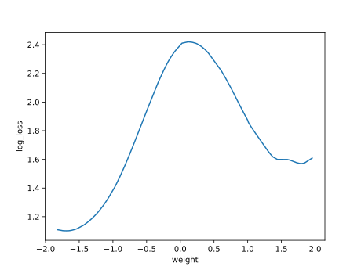

#### Confusion matrix

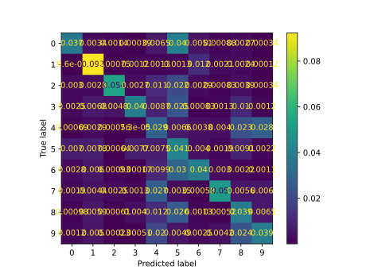

#### Network

