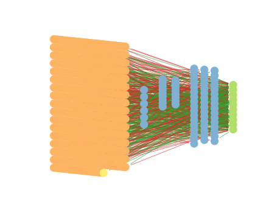

# Report mnist784 constant 0

## Best results in hall of fame

| measure            |    value | individual   |
|:-------------------|---------:|:-------------|
| MAX:log_loss.min   | 0.789482 | 393799       |
| MIN:log_loss.min   | 0.772899 | 395868       |
| MEAN:log_loss.min  | 0.778685 |              |
| MAX:log_loss.mean  | 0.789482 | 393799       |
| MIN:log_loss.mean  | 0.772899 | 395868       |
| MEAN:log_loss.mean | 0.778685 |              |
| MAX:log_loss.max   | 0.789482 | 393799       |
| MIN:log_loss.max   | 0.772899 | 395868       |
| MEAN:log_loss.max  | 0.778685 |              |
| MAX:accuracy.min   | 0.782    | 396807       |
| MIN:accuracy.min   | 0.7719   | 371924       |
| MEAN:accuracy.min  | 0.77909  |              |
| MAX:accuracy.mean  | 0.782    | 396807       |
| MIN:accuracy.mean  | 0.7719   | 371924       |
| MEAN:accuracy.mean | 0.77909  |              |
| MAX:accuracy.max   | 0.782    | 396807       |
| MIN:accuracy.max   | 0.7719   | 371924       |
| MEAN:accuracy.max  | 0.77909  |              |
| MAX:kappa.min      | 0.757602 | 396807       |
| MIN:kappa.min      | 0.746404 | 371924       |
| MEAN:kappa.min     | 0.75437  |              |
| MAX:kappa.mean     | 0.757602 | 396807       |
| MIN:kappa.mean     | 0.746404 | 371924       |
| MEAN:kappa.mean    | 0.75437  |              |
| MAX:kappa.max      | 0.757602 | 396807       |
| MIN:kappa.max      | 0.746404 | 371924       |
| MEAN:kappa.max     | 0.75437  |              |

## Individuals in hall of fame

### Individual 396807

| key                    |       value |
|:-----------------------|------------:|
| mean accuracy:         |    0.782    |
| mean kappa:            |    0.757602 |
| mean log_loss:         |    0.775502 |
| number of edges        | 8107        |
| number of hidden nodes |   74        |
| number of layers       |    4        |
| birth                  |    0        |
| number of mutations    |  308        |

#### Confusion matrix

#### Network

### Individual 395868

| key                    |       value |
|:-----------------------|------------:|
| mean accuracy:         |    0.7814   |
| mean kappa:            |    0.756923 |
| mean log_loss:         |    0.772899 |
| number of edges        | 8108        |
| number of hidden nodes |   74        |
| number of layers       |    4        |
| birth                  |    0        |
| number of mutations    |  309        |

#### Confusion matrix

#### Network

### Individual 394957

| key                    |       value |
|:-----------------------|------------:|
| mean accuracy:         |    0.7811   |
| mean kappa:            |    0.756603 |
| mean log_loss:         |    0.777071 |
| number of edges        | 8107        |
| number of hidden nodes |   74        |
| number of layers       |    4        |
| birth                  |    0        |
| number of mutations    |  307        |

#### Confusion matrix

#### Network

### Individual 395424

| key                    |       value |
|:-----------------------|------------:|
| mean accuracy:         |    0.7811   |
| mean kappa:            |    0.756599 |
| mean log_loss:         |    0.778319 |
| number of edges        | 8109        |
| number of hidden nodes |   75        |
| number of layers       |    4        |
| birth                  |    0        |
| number of mutations    |  308        |

#### Confusion matrix

#### Network

### Individual 395524

| key                    |       value |
|:-----------------------|------------:|
| mean accuracy:         |    0.7805   |
| mean kappa:            |    0.755931 |
| mean log_loss:         |    0.775762 |
| number of edges        | 8107        |
| number of hidden nodes |   74        |
| number of layers       |    4        |
| birth                  |    0        |
| number of mutations    |  308        |

#### Confusion matrix

#### Network

### Individual 396129

| key                    |       value |
|:-----------------------|------------:|
| mean accuracy:         |    0.7804   |
| mean kappa:            |    0.755819 |
| mean log_loss:         |    0.77669  |
| number of edges        | 8107        |
| number of hidden nodes |   74        |
| number of layers       |    4        |
| birth                  |    0        |
| number of mutations    |  309        |

#### Confusion matrix

#### Network

### Individual 394134

| key                    |       value |
|:-----------------------|------------:|
| mean accuracy:         |    0.78     |
| mean kappa:            |    0.755374 |
| mean log_loss:         |    0.77863  |
| number of edges        | 8107        |
| number of hidden nodes |   74        |
| number of layers       |    4        |
| birth                  |    0        |
| number of mutations    |  306        |

#### Confusion matrix

#### Network

### Individual 393865

| key                    |       value |
|:-----------------------|------------:|
| mean accuracy:         |    0.7794   |
| mean kappa:            |    0.754704 |
| mean log_loss:         |    0.778874 |
| number of edges        | 8106        |
| number of hidden nodes |   74        |
| number of layers       |    4        |
| birth                  |    0        |
| number of mutations    |  305        |

#### Confusion matrix

#### Network

### Individual 393799

| key                    |       value |
|:-----------------------|------------:|
| mean accuracy:         |    0.7731   |
| mean kappa:            |    0.747742 |
| mean log_loss:         |    0.789482 |
| number of edges        | 8099        |
| number of hidden nodes |   72        |
| number of layers       |    3        |
| birth                  |    0        |
| number of mutations    |  296        |

#### Confusion matrix

#### Network

### Individual 371924

| key                    |       value |
|:-----------------------|------------:|
| mean accuracy:         |    0.7719   |
| mean kappa:            |    0.746404 |
| mean log_loss:         |    0.783624 |
| number of edges        | 8096        |
| number of hidden nodes |   71        |
| number of layers       |    3        |
| birth                  |    0        |
| number of mutations    |  294        |

#### Confusion matrix

#### Network

