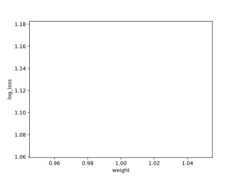

# Report mnist784 constant 1

## Best results in hall of fame

| measure            |    value | individual   |
|:-------------------|---------:|:-------------|
| MAX:log_loss.min   | 1.13411  | 381848       |
| MIN:log_loss.min   | 1.12097  | 460000       |
| MEAN:log_loss.min  | 1.1278   |              |
| MAX:log_loss.mean  | 1.13411  | 381848       |
| MIN:log_loss.mean  | 1.12097  | 460000       |
| MEAN:log_loss.mean | 1.1278   |              |
| MAX:log_loss.max   | 1.13411  | 381848       |
| MIN:log_loss.max   | 1.12097  | 460000       |
| MEAN:log_loss.max  | 1.1278   |              |
| MAX:accuracy.min   | 0.7064   | 456046       |
| MIN:accuracy.min   | 0.6982   | 404829       |
| MEAN:accuracy.min  | 0.70101  |              |
| MAX:accuracy.mean  | 0.7064   | 456046       |
| MIN:accuracy.mean  | 0.6982   | 404829       |
| MEAN:accuracy.mean | 0.70101  |              |
| MAX:accuracy.max   | 0.7064   | 456046       |
| MIN:accuracy.max   | 0.6982   | 404829       |
| MEAN:accuracy.max  | 0.70101  |              |
| MAX:kappa.min      | 0.673317 | 456046       |
| MIN:kappa.min      | 0.664191 | 404829       |
| MEAN:kappa.min     | 0.667334 |              |
| MAX:kappa.mean     | 0.673317 | 456046       |
| MIN:kappa.mean     | 0.664191 | 404829       |
| MEAN:kappa.mean    | 0.667334 |              |
| MAX:kappa.max      | 0.673317 | 456046       |
| MIN:kappa.max      | 0.664191 | 404829       |
| MEAN:kappa.max     | 0.667334 |              |

## Individuals in hall of fame

### Individual 456046

| key                    |       value |
|:-----------------------|------------:|
| mean accuracy:         |    0.7064   |
| mean kappa:            |    0.673317 |
| mean log_loss:         |    1.12699  |
| number of edges        | 8074        |
| number of hidden nodes |   66        |
| number of layers       |    4        |
| birth                  |    0        |
| number of mutations    |  268        |

#### Confusion matrix

#### Network

### Individual 460000

| key                    |       value |
|:-----------------------|------------:|
| mean accuracy:         |    0.7037   |
| mean kappa:            |    0.670336 |
| mean log_loss:         |    1.12097  |
| number of edges        | 8076        |
| number of hidden nodes |   66        |
| number of layers       |    4        |
| birth                  |    0        |
| number of mutations    |  271        |

#### Confusion matrix

#### Network

### Individual 457165

| key                    |       value |
|:-----------------------|------------:|
| mean accuracy:         |    0.7028   |
| mean kappa:            |    0.669326 |
| mean log_loss:         |    1.12225  |
| number of edges        | 8074        |
| number of hidden nodes |   66        |
| number of layers       |    4        |
| birth                  |    0        |
| number of mutations    |  270        |

#### Confusion matrix

#### Network

### Individual 456226

| key                    |       value |
|:-----------------------|------------:|
| mean accuracy:         |    0.7026   |
| mean kappa:            |    0.669099 |
| mean log_loss:         |    1.1222   |
| number of edges        | 8074        |
| number of hidden nodes |   66        |
| number of layers       |    4        |
| birth                  |    0        |
| number of mutations    |  269        |

#### Confusion matrix

#### Network

### Individual 421163

| key                    |       value |
|:-----------------------|------------:|
| mean accuracy:         |    0.7006   |
| mean kappa:            |    0.666882 |
| mean log_loss:         |    1.12775  |
| number of edges        | 8078        |
| number of hidden nodes |   67        |
| number of layers       |    4        |
| birth                  |    0        |
| number of mutations    |  270        |

#### Confusion matrix

#### Network

### Individual 435847

| key                    |       value |
|:-----------------------|------------:|
| mean accuracy:         |    0.7004   |
| mean kappa:            |    0.666687 |
| mean log_loss:         |    1.12647  |
| number of edges        | 8075        |
| number of hidden nodes |   66        |
| number of layers       |    4        |
| birth                  |    0        |
| number of mutations    |  269        |

#### Confusion matrix

#### Network

### Individual 381848

| key                    |       value |
|:-----------------------|------------:|
| mean accuracy:         |    0.6988   |
| mean kappa:            |    0.664864 |
| mean log_loss:         |    1.13411  |
| number of edges        | 8073        |
| number of hidden nodes |   66        |
| number of layers       |    4        |
| birth                  |    0        |
| number of mutations    |  262        |

#### Confusion matrix

#### Network

### Individual 425139

| key                    |       value |
|:-----------------------|------------:|
| mean accuracy:         |    0.6983   |
| mean kappa:            |    0.664319 |
| mean log_loss:         |    1.13167  |
| number of edges        | 8076        |
| number of hidden nodes |   67        |
| number of layers       |    4        |
| birth                  |    0        |
| number of mutations    |  268        |

#### Confusion matrix

#### Network

### Individual 425129

| key                    |       value |
|:-----------------------|------------:|
| mean accuracy:         |    0.6983   |
| mean kappa:            |    0.664319 |
| mean log_loss:         |    1.1317   |
| number of edges        | 8075        |
| number of hidden nodes |   66        |
| number of layers       |    4        |
| birth                  |    0        |
| number of mutations    |  268        |

#### Confusion matrix

#### Network

### Individual 404829

| key                    |       value |
|:-----------------------|------------:|
| mean accuracy:         |    0.6982   |
| mean kappa:            |    0.664191 |
| mean log_loss:         |    1.13385  |
| number of edges        | 8074        |
| number of hidden nodes |   66        |
| number of layers       |    4        |
| birth                  |    0        |
| number of mutations    |  266        |

#### Confusion matrix

#### Network

