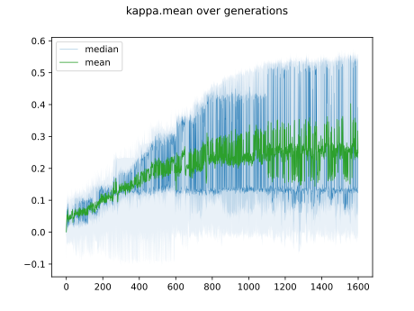
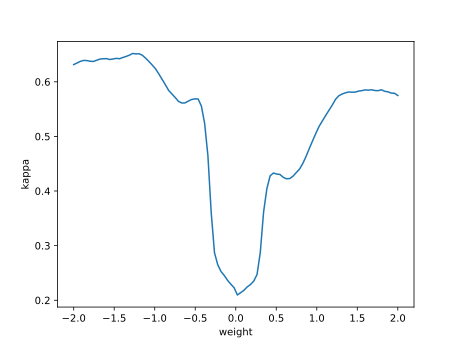

# Report mnist784 linspace -2,2 0

## Best results in hall of fame

| measure            |    value | individual   |
|:-------------------|---------:|:-------------|
| MAX:log_loss.min   | 1.29517  | 434858       |
| MIN:log_loss.min   | 1.27617  | 444629       |
| MEAN:log_loss.min  | 1.28347  |              |
| MAX:log_loss.mean  | 1.59182  | 434858       |
| MIN:log_loss.mean  | 1.576    | 459736       |
| MEAN:log_loss.mean | 1.58313  |              |
| MAX:log_loss.max   | 2.41319  | 444629       |
| MIN:log_loss.max   | 2.41268  | 455263       |
| MEAN:log_loss.max  | 2.41303  |              |
| MAX:accuracy.min   | 0.2879   | 434858       |
| MIN:accuracy.min   | 0.2733   | 431712       |
| MEAN:accuracy.min  | 0.27906  |              |
| MAX:accuracy.mean  | 0.567504 | 459736       |
| MIN:accuracy.mean  | 0.555882 | 453692       |
| MEAN:accuracy.mean | 0.561278 |              |
| MAX:accuracy.max   | 0.6931   | 444629       |
| MIN:accuracy.max   | 0.6768   | 453692       |
| MEAN:accuracy.max  | 0.68417  |              |
| MAX:kappa.min      | 0.209646 | 434858       |
| MIN:kappa.min      | 0.192712 | 431712       |
| MEAN:kappa.min     | 0.199645 |              |
| MAX:kappa.mean     | 0.519427 | 459736       |
| MIN:kappa.mean     | 0.506548 | 453692       |
| MEAN:kappa.mean    | 0.512499 |              |
| MAX:kappa.max      | 0.658784 | 444629       |
| MIN:kappa.max      | 0.640714 | 453692       |
| MEAN:kappa.max     | 0.64883  |              |

## Individuals in hall of fame

### Individual 459736

| key                    |       value |
|:-----------------------|------------:|
| mean accuracy:         |    0.567504 |
| mean kappa:            |    0.519427 |
| mean log_loss:         |    1.576    |
| number of edges        | 8224        |
| number of hidden nodes |  136        |
| number of layers       |    6        |
| birth                  |    0        |
| number of mutations    |  389        |

#### Confusion matrix

#### Network

### Individual 444629

| key                    |       value |
|:-----------------------|------------:|
| mean accuracy:         |    0.563034 |
| mean kappa:            |    0.514575 |
| mean log_loss:         |    1.58576  |
| number of edges        | 8206        |
| number of hidden nodes |  128        |
| number of layers       |    6        |
| birth                  |    0        |
| number of mutations    |  375        |

#### Confusion matrix

#### Network

### Individual 455263

| key                    |       value |
|:-----------------------|------------:|
| mean accuracy:         |    0.563004 |
| mean kappa:            |    0.514416 |
| mean log_loss:         |    1.57728  |
| number of edges        | 8213        |
| number of hidden nodes |  131        |
| number of layers       |    6        |
| birth                  |    0        |
| number of mutations    |  384        |

#### Confusion matrix

#### Network

### Individual 434858

| key                    |       value |
|:-----------------------|------------:|
| mean accuracy:         |    0.562935 |
| mean kappa:            |    0.514352 |
| mean log_loss:         |    1.59182  |
| number of edges        | 8202        |
| number of hidden nodes |  127        |
| number of layers       |    6        |
| birth                  |    0        |
| number of mutations    |  371        |

#### Confusion matrix

#### Network

### Individual 454790

| key                    |       value |
|:-----------------------|------------:|
| mean accuracy:         |    0.562934 |
| mean kappa:            |    0.514339 |
| mean log_loss:         |    1.57749  |
| number of edges        | 8213        |
| number of hidden nodes |  131        |
| number of layers       |    6        |
| birth                  |    0        |
| number of mutations    |  383        |

#### Confusion matrix

#### Network

### Individual 451942

| key                    |       value |
|:-----------------------|------------:|
| mean accuracy:         |    0.561066 |
| mean kappa:            |    0.512249 |
| mean log_loss:         |    1.58448  |
| number of edges        | 8210        |
| number of hidden nodes |  130        |
| number of layers       |    6        |
| birth                  |    0        |
| number of mutations    |  378        |

#### Confusion matrix

#### Network

### Individual 431712

| key                    |       value |
|:-----------------------|------------:|
| mean accuracy:         |    0.559774 |
| mean kappa:            |    0.510642 |
| mean log_loss:         |    1.58796  |
| number of edges        | 8206        |
| number of hidden nodes |  128        |
| number of layers       |    6        |
| birth                  |    0        |
| number of mutations    |  375        |

#### Confusion matrix

#### Network

### Individual 452463

| key                    |       value |
|:-----------------------|------------:|
| mean accuracy:         |    0.559536 |
| mean kappa:            |    0.510575 |
| mean log_loss:         |    1.5838   |
| number of edges        | 8210        |
| number of hidden nodes |  130        |
| number of layers       |    6        |
| birth                  |    0        |
| number of mutations    |  380        |

#### Confusion matrix

#### Network

### Individual 452729

| key                    |       value |
|:-----------------------|------------:|
| mean accuracy:         |    0.557115 |
| mean kappa:            |    0.507863 |
| mean log_loss:         |    1.58852  |
| number of edges        | 8210        |
| number of hidden nodes |  130        |
| number of layers       |    6        |
| birth                  |    0        |
| number of mutations    |  379        |

#### Confusion matrix

#### Network

### Individual 453692

| key                    |       value |
|:-----------------------|------------:|
| mean accuracy:         |    0.555882 |
| mean kappa:            |    0.506548 |
| mean log_loss:         |    1.57816  |
| number of edges        | 8210        |
| number of hidden nodes |  130        |
| number of layers       |    6        |
| birth                  |    0        |
| number of mutations    |  382        |

#### Confusion matrix

#### Network

