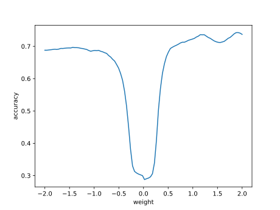

# Report mnist784 linspace -2,2 1

## Best results in hall of fame

| measure            |    value | individual   |
|:-------------------|---------:|:-------------|
| MAX:log_loss.min   | 1.22603  | 443744       |
| MIN:log_loss.min   | 1.2114   | 446940       |
| MEAN:log_loss.min  | 1.22177  |              |
| MAX:log_loss.mean  | 1.51022  | 443744       |
| MIN:log_loss.mean  | 1.49761  | 446940       |
| MEAN:log_loss.mean | 1.50598  |              |
| MAX:log_loss.max   | 2.41518  | 440040       |
| MIN:log_loss.max   | 2.41427  | 446483       |
| MEAN:log_loss.max  | 2.41481  |              |
| MAX:accuracy.min   | 0.288    | 435438       |
| MIN:accuracy.min   | 0.2832   | 446940       |
| MEAN:accuracy.min  | 0.28665  |              |
| MAX:accuracy.mean  | 0.636213 | 438022       |
| MIN:accuracy.mean  | 0.633502 | 440040       |
| MEAN:accuracy.mean | 0.635152 |              |
| MAX:accuracy.max   | 0.7439   | 445020       |
| MIN:accuracy.max   | 0.7348   | 440245       |
| MEAN:accuracy.max  | 0.73993  |              |
| MAX:kappa.min      | 0.210792 | 435438       |
| MIN:kappa.min      | 0.205484 | 440040       |
| MEAN:kappa.min     | 0.209298 |              |
| MAX:kappa.mean     | 0.595899 | 438022       |
| MIN:kappa.mean     | 0.592897 | 440040       |
| MEAN:kappa.mean    | 0.594733 |              |
| MAX:kappa.max      | 0.71529  | 445020       |
| MIN:kappa.max      | 0.705222 | 440245       |
| MEAN:kappa.max     | 0.710902 |              |

## Individuals in hall of fame

### Individual 438022

| key                    |       value |
|:-----------------------|------------:|
| mean accuracy:         |    0.636213 |
| mean kappa:            |    0.595899 |
| mean log_loss:         |    1.50807  |
| number of edges        | 8285        |
| number of hidden nodes |  136        |
| number of layers       |    8        |
| birth                  |    0        |
| number of mutations    |  496        |

#### Confusion matrix

#### Network

### Individual 439192

| key                    |       value |
|:-----------------------|------------:|
| mean accuracy:         |    0.635998 |
| mean kappa:            |    0.595672 |
| mean log_loss:         |    1.50781  |
| number of edges        | 8285        |
| number of hidden nodes |  136        |
| number of layers       |    8        |
| birth                  |    0        |
| number of mutations    |  497        |

#### Confusion matrix

#### Network

### Individual 436373

| key                    |       value |
|:-----------------------|------------:|
| mean accuracy:         |    0.635824 |
| mean kappa:            |    0.595464 |
| mean log_loss:         |    1.50819  |
| number of edges        | 8284        |
| number of hidden nodes |  136        |
| number of layers       |    8        |
| birth                  |    0        |
| number of mutations    |  494        |

#### Confusion matrix

#### Network

### Individual 446483

| key                    |       value |
|:-----------------------|------------:|
| mean accuracy:         |    0.635651 |
| mean kappa:            |    0.595303 |
| mean log_loss:         |    1.49907  |
| number of edges        | 8287        |
| number of hidden nodes |  136        |
| number of layers       |    8        |
| birth                  |    0        |
| number of mutations    |  503        |

#### Confusion matrix

#### Network

### Individual 443744

| key                    |       value |
|:-----------------------|------------:|
| mean accuracy:         |    0.635474 |
| mean kappa:            |    0.595092 |
| mean log_loss:         |    1.51022  |
| number of edges        | 8285        |
| number of hidden nodes |  136        |
| number of layers       |    8        |
| birth                  |    0        |
| number of mutations    |  498        |

#### Confusion matrix

#### Network

### Individual 435438

| key                    |       value |
|:-----------------------|------------:|
| mean accuracy:         |    0.635088 |
| mean kappa:            |    0.594648 |
| mean log_loss:         |    1.50915  |
| number of edges        | 8282        |
| number of hidden nodes |  135        |
| number of layers       |    8        |
| birth                  |    0        |
| number of mutations    |  492        |

#### Confusion matrix

#### Network

### Individual 440245

| key                    |       value |
|:-----------------------|------------:|
| mean accuracy:         |    0.634705 |
| mean kappa:            |    0.594228 |
| mean log_loss:         |    1.50601  |
| number of edges        | 8287        |
| number of hidden nodes |  137        |
| number of layers       |    8        |
| birth                  |    0        |
| number of mutations    |  499        |

#### Confusion matrix

#### Network

### Individual 445020

| key                    |       value |
|:-----------------------|------------:|
| mean accuracy:         |    0.634573 |
| mean kappa:            |    0.594109 |
| mean log_loss:         |    1.50643  |
| number of edges        | 8286        |
| number of hidden nodes |  136        |
| number of layers       |    8        |
| birth                  |    0        |
| number of mutations    |  500        |

#### Confusion matrix

#### Network

### Individual 446940

| key                    |       value |
|:-----------------------|------------:|
| mean accuracy:         |    0.634493 |
| mean kappa:            |    0.594014 |
| mean log_loss:         |    1.49761  |
| number of edges        | 8287        |
| number of hidden nodes |  136        |
| number of layers       |    8        |
| birth                  |    0        |
| number of mutations    |  504        |

#### Confusion matrix

#### Network

### Individual 440040

| key                    |       value |
|:-----------------------|------------:|
| mean accuracy:         |    0.633502 |
| mean kappa:            |    0.592897 |
| mean log_loss:         |    1.50724  |
| number of edges        | 8287        |
| number of hidden nodes |  137        |
| number of layers       |    8        |
| birth                  |    0        |
| number of mutations    |  498        |

#### Confusion matrix

#### Network

