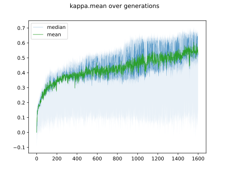
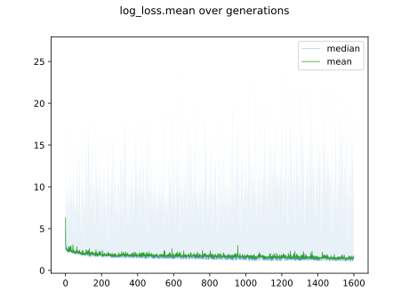

# Report mnist784 lognormal 0,0.5 0

## Best results in hall of fame

| measure            |    value | individual   |
|:-------------------|---------:|:-------------|
| MAX:log_loss.min   | 0.921338 | 437144       |
| MIN:log_loss.min   | 0.914239 | 457086       |
| MEAN:log_loss.min  | 0.917082 |              |
| MAX:log_loss.mean  | 1.13457  | 437144       |
| MIN:log_loss.mean  | 1.12331  | 457086       |
| MEAN:log_loss.mean | 1.12907  |              |
| MAX:log_loss.max   | 1.9883   | 439376       |
| MIN:log_loss.max   | 1.98035  | 457086       |
| MEAN:log_loss.max  | 1.98495  |              |
| MAX:accuracy.min   | 0.3859   | 446560       |
| MIN:accuracy.min   | 0.3674   | 437067       |
| MEAN:accuracy.min  | 0.37234  |              |
| MAX:accuracy.mean  | 0.712932 | 437976       |
| MIN:accuracy.mean  | 0.704643 | 437144       |
| MEAN:accuracy.mean | 0.708756 |              |
| MAX:accuracy.max   | 0.7467   | 437976       |
| MIN:accuracy.max   | 0.7375   | 437144       |
| MEAN:accuracy.max  | 0.74031  |              |
| MAX:kappa.min      | 0.319649 | 446560       |
| MIN:kappa.min      | 0.29935  | 437067       |
| MEAN:kappa.min     | 0.304778 |              |
| MAX:kappa.mean     | 0.680793 | 437976       |
| MIN:kappa.mean     | 0.671549 | 437144       |
| MEAN:kappa.mean    | 0.676138 |              |
| MAX:kappa.max      | 0.718356 | 437976       |
| MIN:kappa.max      | 0.708074 | 437144       |
| MEAN:kappa.max     | 0.711222 |              |

## Individuals in hall of fame

### Individual 437976

| key                    |       value |
|:-----------------------|------------:|
| mean accuracy:         |    0.712932 |
| mean kappa:            |    0.680793 |
| mean log_loss:         |    1.12752  |
| number of edges        | 8062        |
| number of hidden nodes |   70        |
| number of layers       |    3        |
| birth                  |    0        |
| number of mutations    |  230        |

#### Confusion matrix

#### Network

### Individual 438624

| key                    |       value |
|:-----------------------|------------:|
| mean accuracy:         |    0.711258 |
| mean kappa:            |    0.678942 |
| mean log_loss:         |    1.12575  |
| number of edges        | 8062        |
| number of hidden nodes |   70        |
| number of layers       |    3        |
| birth                  |    0        |
| number of mutations    |  231        |

#### Confusion matrix

#### Network

### Individual 457086

| key                    |       value |
|:-----------------------|------------:|
| mean accuracy:         |    0.710105 |
| mean kappa:            |    0.677641 |
| mean log_loss:         |    1.12331  |
| number of edges        | 8069        |
| number of hidden nodes |   73        |
| number of layers       |    3        |
| birth                  |    0        |
| number of mutations    |  240        |

#### Confusion matrix

#### Network

### Individual 446866

| key                    |      value |
|:-----------------------|-----------:|
| mean accuracy:         |    0.70872 |
| mean kappa:            |    0.6761  |
| mean log_loss:         |    1.12859 |
| number of edges        | 8064       |
| number of hidden nodes |   71       |
| number of layers       |    3       |
| birth                  |    0       |
| number of mutations    |  233       |

#### Confusion matrix

#### Network

### Individual 446920

| key                    |       value |
|:-----------------------|------------:|
| mean accuracy:         |    0.708655 |
| mean kappa:            |    0.676018 |
| mean log_loss:         |    1.12639  |
| number of edges        | 8062        |
| number of hidden nodes |   70        |
| number of layers       |    3        |
| birth                  |    0        |
| number of mutations    |  233        |

#### Confusion matrix

#### Network

### Individual 437287

| key                    |       value |
|:-----------------------|------------:|
| mean accuracy:         |    0.708486 |
| mean kappa:            |    0.67584  |
| mean log_loss:         |    1.12958  |
| number of edges        | 8061        |
| number of hidden nodes |   70        |
| number of layers       |    3        |
| birth                  |    0        |
| number of mutations    |  229        |

#### Confusion matrix

#### Network

### Individual 439376

| key                    |       value |
|:-----------------------|------------:|
| mean accuracy:         |    0.707671 |
| mean kappa:            |    0.674931 |
| mean log_loss:         |    1.13009  |
| number of edges        | 8063        |
| number of hidden nodes |   71        |
| number of layers       |    3        |
| birth                  |    0        |
| number of mutations    |  230        |

#### Confusion matrix

#### Network

### Individual 446560

| key                    |       value |
|:-----------------------|------------:|
| mean accuracy:         |    0.707656 |
| mean kappa:            |    0.674899 |
| mean log_loss:         |    1.13101  |
| number of edges        | 8062        |
| number of hidden nodes |   70        |
| number of layers       |    3        |
| birth                  |    0        |
| number of mutations    |  233        |

#### Confusion matrix

#### Network

### Individual 437067

| key                    |       value |
|:-----------------------|------------:|
| mean accuracy:         |    0.707432 |
| mean kappa:            |    0.674663 |
| mean log_loss:         |    1.13389  |
| number of edges        | 8061        |
| number of hidden nodes |   70        |
| number of layers       |    3        |
| birth                  |    0        |
| number of mutations    |  228        |

#### Confusion matrix

#### Network

### Individual 437144

| key                    |       value |
|:-----------------------|------------:|
| mean accuracy:         |    0.704643 |
| mean kappa:            |    0.671549 |
| mean log_loss:         |    1.13457  |
| number of edges        | 8061        |
| number of hidden nodes |   70        |
| number of layers       |    3        |
| birth                  |    0        |
| number of mutations    |  228        |

#### Confusion matrix

#### Network

