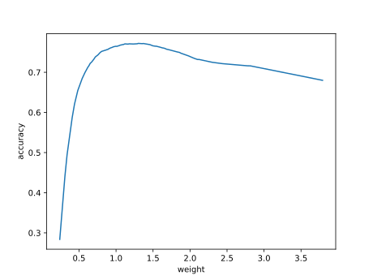
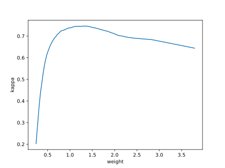

# Report mnist784 lognormal 0,0.5 1

## Best results in hall of fame

| measure            |    value | individual   |
|:-------------------|---------:|:-------------|
| MAX:log_loss.min   | 0.812331 | 428478       |
| MIN:log_loss.min   | 0.77148  | 458496       |
| MEAN:log_loss.min  | 0.795161 |              |
| MAX:log_loss.mean  | 1.10606  | 435637       |
| MIN:log_loss.mean  | 1.05509  | 458496       |
| MEAN:log_loss.mean | 1.08465  |              |
| MAX:log_loss.max   | 4.23929  | 456807       |
| MIN:log_loss.max   | 3.68851  | 451050       |
| MEAN:log_loss.max  | 3.85077  |              |
| MAX:accuracy.min   | 0.3056   | 458496       |
| MIN:accuracy.min   | 0.2782   | 428507       |
| MEAN:accuracy.min  | 0.28715  |              |
| MAX:accuracy.mean  | 0.73899  | 458496       |
| MIN:accuracy.mean  | 0.725997 | 428478       |
| MEAN:accuracy.mean | 0.732001 |              |
| MAX:accuracy.max   | 0.7766   | 458496       |
| MIN:accuracy.max   | 0.7643   | 428478       |
| MEAN:accuracy.max  | 0.76863  |              |
| MAX:kappa.min      | 0.228054 | 458496       |
| MIN:kappa.min      | 0.196712 | 428507       |
| MEAN:kappa.min     | 0.207018 |              |
| MAX:kappa.mean     | 0.709646 | 458496       |
| MIN:kappa.mean     | 0.695161 | 428478       |
| MEAN:kappa.mean    | 0.701856 |              |
| MAX:kappa.max      | 0.75148  | 458496       |
| MIN:kappa.max      | 0.737788 | 428478       |
| MEAN:kappa.max     | 0.742612 |              |

## Individuals in hall of fame

### Individual 458496

| key                    |       value |
|:-----------------------|------------:|
| mean accuracy:         |    0.73899  |
| mean kappa:            |    0.709646 |
| mean log_loss:         |    1.05509  |
| number of edges        | 8058        |
| number of hidden nodes |   70        |
| number of layers       |    3        |
| birth                  |    0        |
| number of mutations    |  242        |

#### Confusion matrix

#### Network

### Individual 454138

| key                    |       value |
|:-----------------------|------------:|
| mean accuracy:         |    0.738345 |
| mean kappa:            |    0.708936 |
| mean log_loss:         |    1.0567   |
| number of edges        | 8059        |
| number of hidden nodes |   71        |
| number of layers       |    3        |
| birth                  |    0        |
| number of mutations    |  240        |

#### Confusion matrix

#### Network

### Individual 456807

| key                    |       value |
|:-----------------------|------------:|
| mean accuracy:         |    0.73745  |
| mean kappa:            |    0.707951 |
| mean log_loss:         |    1.07865  |
| number of edges        | 8062        |
| number of hidden nodes |   73        |
| number of layers       |    4        |
| birth                  |    0        |
| number of mutations    |  240        |

#### Confusion matrix

#### Network

### Individual 451050

| key                    |       value |
|:-----------------------|------------:|
| mean accuracy:         |    0.735022 |
| mean kappa:            |    0.705238 |
| mean log_loss:         |    1.06773  |
| number of edges        | 8054        |
| number of hidden nodes |   69        |
| number of layers       |    3        |
| birth                  |    0        |
| number of mutations    |  237        |

#### Confusion matrix

#### Network

### Individual 447039

| key                    |       value |
|:-----------------------|------------:|
| mean accuracy:         |    0.734994 |
| mean kappa:            |    0.705174 |
| mean log_loss:         |    1.07969  |
| number of edges        | 8052        |
| number of hidden nodes |   69        |
| number of layers       |    3        |
| birth                  |    0        |
| number of mutations    |  233        |

#### Confusion matrix

#### Network

### Individual 447264

| key                    |       value |
|:-----------------------|------------:|
| mean accuracy:         |    0.729249 |
| mean kappa:            |    0.698777 |
| mean log_loss:         |    1.08983  |
| number of edges        | 8056        |
| number of hidden nodes |   70        |
| number of layers       |    3        |
| birth                  |    0        |
| number of mutations    |  231        |

#### Confusion matrix

#### Network

### Individual 435637

| key                    |       value |
|:-----------------------|------------:|
| mean accuracy:         |    0.727208 |
| mean kappa:            |    0.696507 |
| mean log_loss:         |    1.10606  |
| number of edges        | 8054        |
| number of hidden nodes |   70        |
| number of layers       |    3        |
| birth                  |    0        |
| number of mutations    |  229        |

#### Confusion matrix

#### Network

### Individual 428444

| key                    |       value |
|:-----------------------|------------:|
| mean accuracy:         |    0.726558 |
| mean kappa:            |    0.695786 |
| mean log_loss:         |    1.1029   |
| number of edges        | 8046        |
| number of hidden nodes |   67        |
| number of layers       |    3        |
| birth                  |    0        |
| number of mutations    |  225        |

#### Confusion matrix

#### Network

### Individual 428507

| key                    |       value |
|:-----------------------|------------:|
| mean accuracy:         |    0.7262   |
| mean kappa:            |    0.695386 |
| mean log_loss:         |    1.10436  |
| number of edges        | 8046        |
| number of hidden nodes |   67        |
| number of layers       |    3        |
| birth                  |    0        |
| number of mutations    |  225        |

#### Confusion matrix

#### Network

### Individual 428478

| key                    |       value |
|:-----------------------|------------:|
| mean accuracy:         |    0.725997 |
| mean kappa:            |    0.695161 |
| mean log_loss:         |    1.10553  |
| number of edges        | 8048        |
| number of hidden nodes |   68        |
| number of layers       |    3        |
| birth                  |    0        |
| number of mutations    |  225        |

#### Confusion matrix

#### Network

