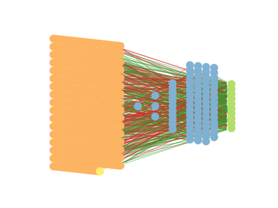

# Report mnist784 uniform -2,2 0

## Best results in hall of fame

| measure            |     value | individual   |
|:-------------------|----------:|:-------------|
| MAX:log_loss.min   | 1.1316    | 418702       |
| MIN:log_loss.min   | 1.09811   | 453543       |
| MEAN:log_loss.min  | 1.10844   |              |
| MAX:log_loss.mean  | 1.65864   | 443688       |
| MIN:log_loss.mean  | 1.62502   | 431542       |
| MEAN:log_loss.mean | 1.64652   |              |
| MAX:log_loss.max   | 2.41881   | 443688       |
| MIN:log_loss.max   | 2.41589   | 431542       |
| MEAN:log_loss.max  | 2.41734   |              |
| MAX:accuracy.min   | 0.2005    | 418702       |
| MIN:accuracy.min   | 0.1842    | 450426       |
| MEAN:accuracy.min  | 0.18583   |              |
| MAX:accuracy.mean  | 0.484579  | 450426       |
| MIN:accuracy.mean  | 0.472595  | 443688       |
| MEAN:accuracy.mean | 0.480153  |              |
| MAX:accuracy.max   | 0.6434    | 453543       |
| MIN:accuracy.max   | 0.6297    | 450433       |
| MEAN:accuracy.max  | 0.63736   |              |
| MAX:kappa.min      | 0.110281  | 418702       |
| MIN:kappa.min      | 0.0918281 | 450426       |
| MEAN:kappa.min     | 0.0936733 |              |
| MAX:kappa.mean     | 0.426835  | 450426       |
| MIN:kappa.mean     | 0.413571  | 443688       |
| MEAN:kappa.mean    | 0.421907  |              |
| MAX:kappa.max      | 0.603772  | 453543       |
| MIN:kappa.max      | 0.588694  | 450433       |
| MEAN:kappa.max     | 0.597116  |              |

## Individuals in hall of fame

### Individual 450426

| key                    |       value |
|:-----------------------|------------:|
| mean accuracy:         |    0.484579 |
| mean kappa:            |    0.426835 |
| mean log_loss:         |    1.64694  |
| number of edges        | 8067        |
| number of hidden nodes |   82        |
| number of layers       |    4        |
| birth                  |    0        |
| number of mutations    |  223        |

#### Confusion matrix

#### Network

### Individual 450432

| key                    |       value |
|:-----------------------|------------:|
| mean accuracy:         |    0.484535 |
| mean kappa:            |    0.426796 |
| mean log_loss:         |    1.64842  |
| number of edges        | 8065        |
| number of hidden nodes |   81        |
| number of layers       |    4        |
| birth                  |    0        |
| number of mutations    |  223        |

#### Confusion matrix

#### Network

### Individual 418702

| key                    |       value |
|:-----------------------|------------:|
| mean accuracy:         |    0.483496 |
| mean kappa:            |    0.425589 |
| mean log_loss:         |    1.63926  |
| number of edges        | 8058        |
| number of hidden nodes |   78        |
| number of layers       |    4        |
| birth                  |    0        |
| number of mutations    |  215        |

#### Confusion matrix

#### Network

### Individual 447875

| key                    |       value |
|:-----------------------|------------:|
| mean accuracy:         |    0.482624 |
| mean kappa:            |    0.424708 |
| mean log_loss:         |    1.6519   |
| number of edges        | 8064        |
| number of hidden nodes |   80        |
| number of layers       |    4        |
| birth                  |    0        |
| number of mutations    |  221        |

#### Confusion matrix

#### Network

### Individual 453543

| key                    |       value |
|:-----------------------|------------:|
| mean accuracy:         |    0.481243 |
| mean kappa:            |    0.423034 |
| mean log_loss:         |    1.64394  |
| number of edges        | 8057        |
| number of hidden nodes |   77        |
| number of layers       |    4        |
| birth                  |    0        |
| number of mutations    |  216        |

#### Confusion matrix

#### Network

### Individual 429642

| key                    |       value |
|:-----------------------|------------:|
| mean accuracy:         |    0.478864 |
| mean kappa:            |    0.420435 |
| mean log_loss:         |    1.64534  |
| number of edges        | 8057        |
| number of hidden nodes |   77        |
| number of layers       |    4        |
| birth                  |    0        |
| number of mutations    |  216        |

#### Confusion matrix

#### Network

### Individual 448318

| key                    |       value |
|:-----------------------|------------:|
| mean accuracy:         |    0.47831  |
| mean kappa:            |    0.419782 |
| mean log_loss:         |    1.64854  |
| number of edges        | 8056        |
| number of hidden nodes |   77        |
| number of layers       |    4        |
| birth                  |    0        |
| number of mutations    |  216        |

#### Confusion matrix

#### Network

### Individual 450433

| key                    |       value |
|:-----------------------|------------:|
| mean accuracy:         |    0.47781  |
| mean kappa:            |    0.419326 |
| mean log_loss:         |    1.65717  |
| number of edges        | 8067        |
| number of hidden nodes |   82        |
| number of layers       |    4        |
| birth                  |    0        |
| number of mutations    |  223        |

#### Confusion matrix

#### Network

### Individual 431542

| key                    |      value |
|:-----------------------|-----------:|
| mean accuracy:         |    0.47747 |
| mean kappa:            |    0.41899 |
| mean log_loss:         |    1.62502 |
| number of edges        | 8060       |
| number of hidden nodes |   78       |
| number of layers       |    4       |
| birth                  |    0       |
| number of mutations    |  219       |

#### Confusion matrix

#### Network

### Individual 443688

| key                    |       value |
|:-----------------------|------------:|
| mean accuracy:         |    0.472595 |
| mean kappa:            |    0.413571 |
| mean log_loss:         |    1.65864  |
| number of edges        | 8056        |
| number of hidden nodes |   77        |
| number of layers       |    4        |
| birth                  |    0        |
| number of mutations    |  216        |

#### Confusion matrix

#### Network

