# Report mnist784 uniform -2,2 1

## Best results in hall of fame

| measure            |    value | individual   |
|:-------------------|---------:|:-------------|
| MAX:log_loss.min   | 1.29032  | 413739       |
| MIN:log_loss.min   | 1.13697  | 450038       |
| MEAN:log_loss.min  | 1.16954  |              |
| MAX:log_loss.mean  | 2.01163  | 413739       |
| MIN:log_loss.mean  | 1.83954  | 450038       |
| MEAN:log_loss.mean | 1.89894  |              |
| MAX:log_loss.max   | 2.7275   | 413845       |
| MIN:log_loss.max   | 2.44188  | 449859       |
| MEAN:log_loss.max  | 2.499    |              |
| MAX:accuracy.min   | 0.1135   | 449422       |
| MIN:accuracy.min   | 0.1135   | 449422       |
| MEAN:accuracy.min  | 0.1135   |              |
| MAX:accuracy.mean  | 0.425772 | 449422       |
| MIN:accuracy.mean  | 0.381611 | 413739       |
| MEAN:accuracy.mean | 0.412849 |              |
| MAX:accuracy.max   | 0.6923   | 453213       |
| MIN:accuracy.max   | 0.6532   | 413739       |
| MEAN:accuracy.max  | 0.68257  |              |
| MAX:kappa.min      | 0        | 449422       |
| MIN:kappa.min      | 0        | 449422       |
| MEAN:kappa.min     | 0        |              |
| MAX:kappa.mean     | 0.357824 | 449422       |
| MIN:kappa.mean     | 0.30861  | 413739       |
| MEAN:kappa.mean    | 0.343441 |              |
| MAX:kappa.max      | 0.657639 | 453213       |
| MIN:kappa.max      | 0.614157 | 413739       |
| MEAN:kappa.max     | 0.646814 |              |

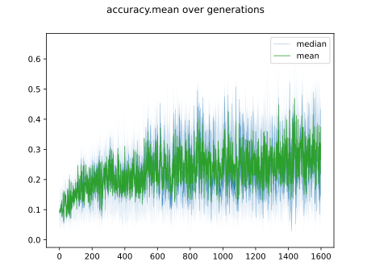

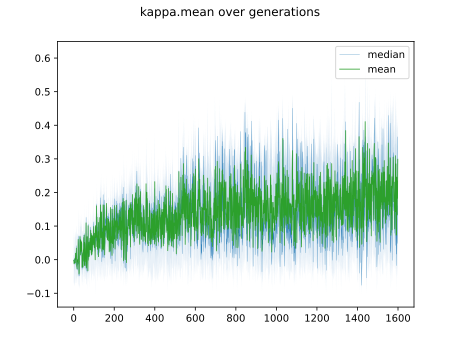

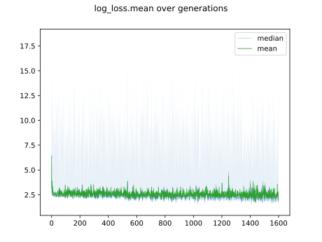

## Individuals in hall of fame

### Individual 449422

| key                    |       value |
|:-----------------------|------------:|
| mean accuracy:         |    0.425772 |
| mean kappa:            |    0.357824 |
| mean log_loss:         |    1.84091  |
| number of edges        | 8046        |
| number of hidden nodes |   71        |
| number of layers       |    3        |
| birth                  |    0        |
| number of mutations    |  197        |

#### Confusion matrix

#### Network

### Individual 453215

| key                    |       value |
|:-----------------------|------------:|
| mean accuracy:         |    0.425399 |
| mean kappa:            |    0.357413 |
| mean log_loss:         |    1.84897  |
| number of edges        | 8048        |
| number of hidden nodes |   72        |
| number of layers       |    3        |
| birth                  |    0        |
| number of mutations    |  200        |

#### Confusion matrix

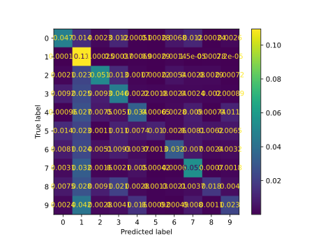

#### Network

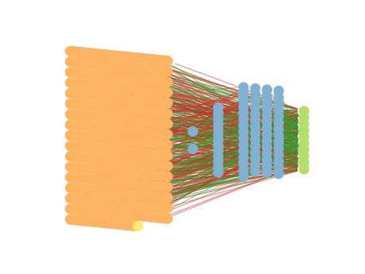

### Individual 450038

| key                    |       value |
|:-----------------------|------------:|
| mean accuracy:         |    0.425078 |
| mean kappa:            |    0.357009 |
| mean log_loss:         |    1.83954  |
| number of edges        | 8046        |
| number of hidden nodes |   71        |
| number of layers       |    3        |
| birth                  |    0        |
| number of mutations    |  199        |

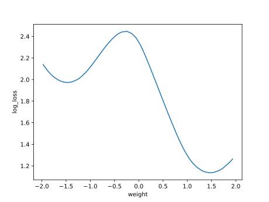

#### Confusion matrix

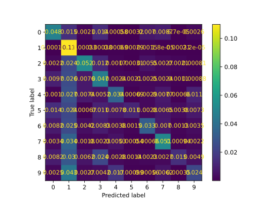

#### Network

### Individual 453278

| key                    |       value |
|:-----------------------|------------:|
| mean accuracy:         |    0.424248 |
| mean kappa:            |    0.356102 |
| mean log_loss:         |    1.84779  |
| number of edges        | 8048        |
| number of hidden nodes |   72        |
| number of layers       |    3        |
| birth                  |    0        |
| number of mutations    |  200        |

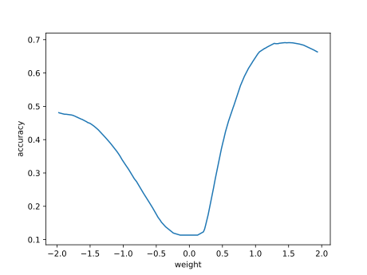

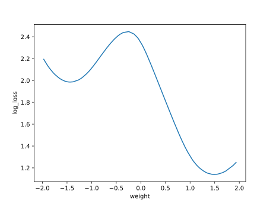

#### Confusion matrix

#### Network

### Individual 450144

| key                    |       value |
|:-----------------------|------------:|
| mean accuracy:         |    0.424195 |
| mean kappa:            |    0.35606  |
| mean log_loss:         |    1.84981  |
| number of edges        | 8046        |
| number of hidden nodes |   71        |
| number of layers       |    3        |
| birth                  |    0        |
| number of mutations    |  199        |

#### Confusion matrix

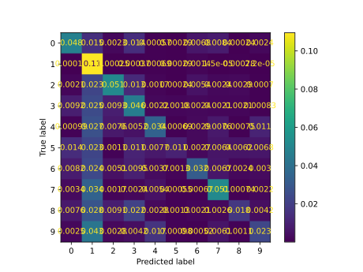

#### Network

### Individual 449859

| key                    |       value |
|:-----------------------|------------:|
| mean accuracy:         |    0.422082 |
| mean kappa:            |    0.353976 |
| mean log_loss:         |    1.87421  |
| number of edges        | 8046        |
| number of hidden nodes |   71        |
| number of layers       |    3        |
| birth                  |    0        |
| number of mutations    |  199        |

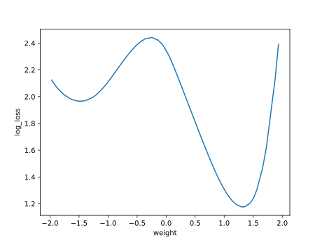

#### Confusion matrix

#### Network

### Individual 453213

| key                    |       value |
|:-----------------------|------------:|
| mean accuracy:         |    0.418833 |
| mean kappa:            |    0.350088 |
| mean log_loss:         |    1.88481  |
| number of edges        | 8046        |
| number of hidden nodes |   71        |
| number of layers       |    3        |
| birth                  |    0        |
| number of mutations    |  200        |

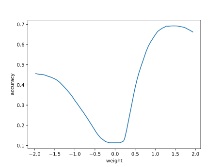

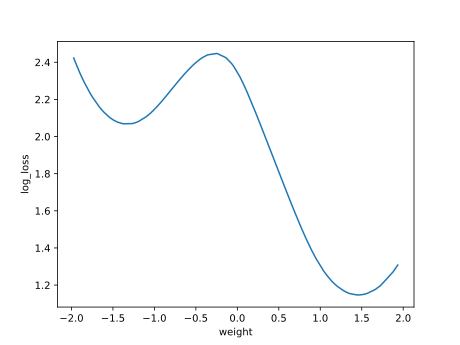

#### Confusion matrix

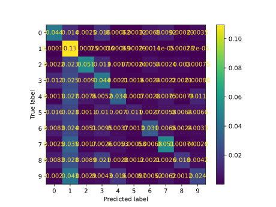

#### Network

### Individual 413845

| key                    |       value |
|:-----------------------|------------:|
| mean accuracy:         |    0.39085  |
| mean kappa:            |    0.318818 |
| mean log_loss:         |    2.00987  |
| number of edges        | 8019        |
| number of hidden nodes |   60        |
| number of layers       |    3        |
| birth                  |    0        |
| number of mutations    |  171        |

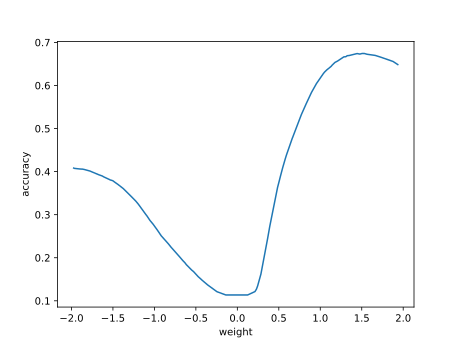

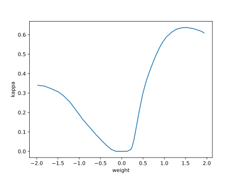

#### Confusion matrix

#### Network

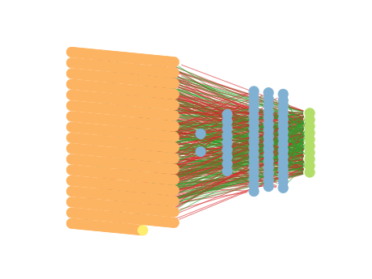

### Individual 413644

| key                    |       value |
|:-----------------------|------------:|
| mean accuracy:         |    0.390418 |
| mean kappa:            |    0.318506 |
| mean log_loss:         |    1.98187  |
| number of edges        | 8027        |
| number of hidden nodes |   64        |
| number of layers       |    3        |
| birth                  |    0        |
| number of mutations    |  178        |

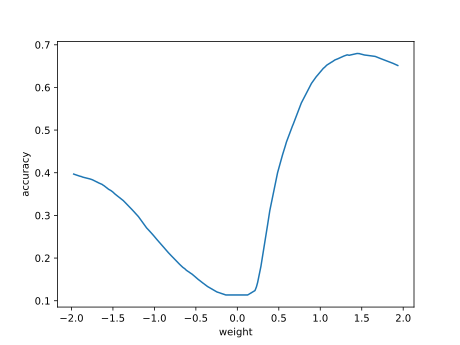

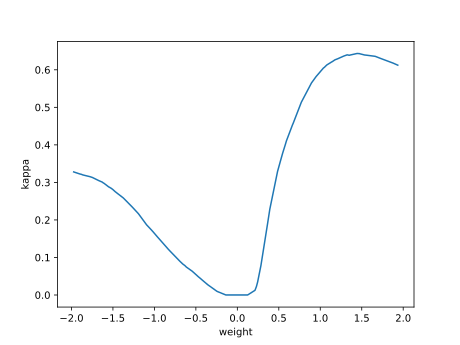

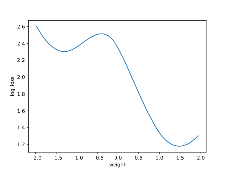

#### Confusion matrix

#### Network

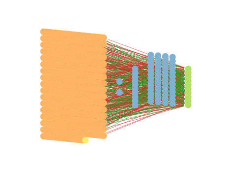

### Individual 413739

| key                    |       value |
|:-----------------------|------------:|
| mean accuracy:         |    0.381611 |
| mean kappa:            |    0.30861  |
| mean log_loss:         |    2.01163  |
| number of edges        | 8027        |
| number of hidden nodes |   64        |
| number of layers       |    3        |
| birth                  |    0        |
| number of mutations    |  178        |

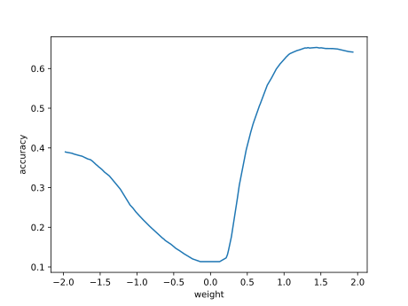

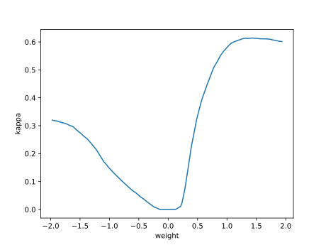

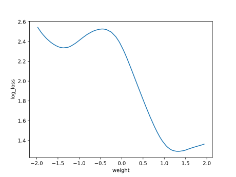

#### Confusion matrix

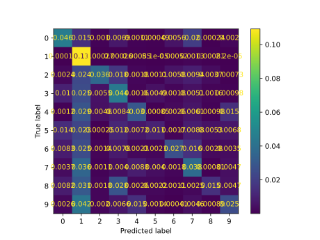

#### Network

