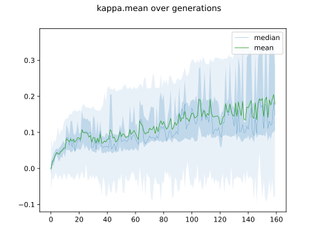
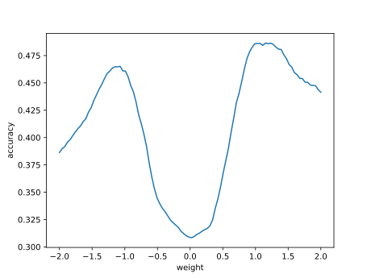

# Report mnist256 linspace -2,2 0

## Best results in hall of fame

| measure            |    value | individual   |
|:-------------------|---------:|:-------------|
| MAX:accuracy.min   | 0.3084   | 45433        |
| MIN:accuracy.min   | 0.3083   | 41563        |
| MEAN:accuracy.min  | 0.30839  |              |
| MAX:accuracy.mean  | 0.427712 | 45433        |
| MIN:accuracy.mean  | 0.411023 | 41563        |
| MEAN:accuracy.mean | 0.418296 |              |
| MAX:accuracy.max   | 0.5265   | 45433        |
| MIN:accuracy.max   | 0.4861   | 41563        |
| MEAN:accuracy.max  | 0.50754  |              |
| MAX:kappa.min      | 0.232262 | 45433        |
| MIN:kappa.min      | 0.232169 | 41563        |
| MEAN:kappa.min     | 0.232252 |              |
| MAX:kappa.mean     | 0.363735 | 45433        |
| MIN:kappa.mean     | 0.345163 | 41563        |
| MEAN:kappa.mean    | 0.353285 |              |
| MAX:kappa.max      | 0.47323  | 45433        |
| MIN:kappa.max      | 0.428316 | 41563        |
| MEAN:kappa.max     | 0.452157 |              |
| MAX:log_loss.min   | 1.69915  | 42795        |
| MIN:log_loss.min   | 1.63041  | 45433        |
| MEAN:log_loss.min  | 1.6703   |              |
| MAX:log_loss.mean  | 1.95994  | 45212        |
| MIN:log_loss.mean  | 1.90927  | 45433        |
| MEAN:log_loss.mean | 1.9315   |              |
| MAX:log_loss.max   | 2.39922  | 45212        |
| MIN:log_loss.max   | 2.39747  | 42942        |
| MEAN:log_loss.max  | 2.39773  |              |

## Individuals in hall of fame

### Individual 45433

| key                    |       value |
|:-----------------------|------------:|
| mean accuracy:         |    0.427712 |
| mean kappa:            |    0.363735 |
| mean log_loss:         |    1.90927  |
| number of edges        | 2657        |
| number of hidden nodes |   31        |
| number of layers       |    2        |
| birth                  |    0        |
| number of mutations    |   88        |

#### Confusion matrix

#### Network

### Individual 45203

| key                    |       value |
|:-----------------------|------------:|
| mean accuracy:         |    0.424366 |
| mean kappa:            |    0.360048 |
| mean log_loss:         |    1.91934  |
| number of edges        | 2656        |
| number of hidden nodes |   31        |
| number of layers       |    2        |
| birth                  |    0        |
| number of mutations    |   87        |

#### Confusion matrix

#### Network

### Individual 44171

| key                    |       value |
|:-----------------------|------------:|
| mean accuracy:         |    0.422172 |
| mean kappa:            |    0.357639 |
| mean log_loss:         |    1.92475  |
| number of edges        | 2655        |
| number of hidden nodes |   31        |
| number of layers       |    2        |
| birth                  |    0        |
| number of mutations    |   86        |

#### Confusion matrix

#### Network

### Individual 44640

| key                    |       value |
|:-----------------------|------------:|
| mean accuracy:         |    0.422172 |
| mean kappa:            |    0.357639 |
| mean log_loss:         |    1.92475  |
| number of edges        | 2655        |
| number of hidden nodes |   31        |
| number of layers       |    2        |
| birth                  |    0        |
| number of mutations    |   87        |

#### Confusion matrix

#### Network

### Individual 44230

| key                    |       value |
|:-----------------------|------------:|
| mean accuracy:         |    0.417794 |
| mean kappa:            |    0.352728 |
| mean log_loss:         |    1.92977  |
| number of edges        | 2656        |
| number of hidden nodes |   31        |
| number of layers       |    2        |
| birth                  |    0        |
| number of mutations    |   86        |

#### Confusion matrix

#### Network

### Individual 43968

| key                    |       value |
|:-----------------------|------------:|
| mean accuracy:         |    0.417708 |
| mean kappa:            |    0.352633 |
| mean log_loss:         |    1.93011  |
| number of edges        | 2655        |
| number of hidden nodes |   31        |
| number of layers       |    2        |
| birth                  |    0        |
| number of mutations    |   85        |

#### Confusion matrix

#### Network

### Individual 45212

| key                    |       value |
|:-----------------------|------------:|
| mean accuracy:         |    0.417184 |
| mean kappa:            |    0.352076 |
| mean log_loss:         |    1.95994  |
| number of edges        | 2658        |
| number of hidden nodes |   32        |
| number of layers       |    2        |
| birth                  |    0        |
| number of mutations    |   88        |

#### Confusion matrix

#### Network

### Individual 42942

| key                    |       value |
|:-----------------------|------------:|
| mean accuracy:         |    0.411792 |
| mean kappa:            |    0.346017 |
| mean log_loss:         |    1.93732  |
| number of edges        | 2653        |
| number of hidden nodes |   30        |
| number of layers       |    2        |
| birth                  |    0        |
| number of mutations    |   84        |

#### Confusion matrix

#### Network

### Individual 42795

| key                    |       value |
|:-----------------------|------------:|
| mean accuracy:         |    0.411037 |
| mean kappa:            |    0.345172 |
| mean log_loss:         |    1.93987  |
| number of edges        | 2652        |
| number of hidden nodes |   30        |
| number of layers       |    2        |
| birth                  |    0        |
| number of mutations    |   83        |

#### Confusion matrix

#### Network

### Individual 41563

| key                    |       value |
|:-----------------------|------------:|
| mean accuracy:         |    0.411023 |
| mean kappa:            |    0.345163 |
| mean log_loss:         |    1.9399   |
| number of edges        | 2650        |
| number of hidden nodes |   29        |
| number of layers       |    2        |
| birth                  |    0        |
| number of mutations    |   82        |

#### Confusion matrix

#### Network

