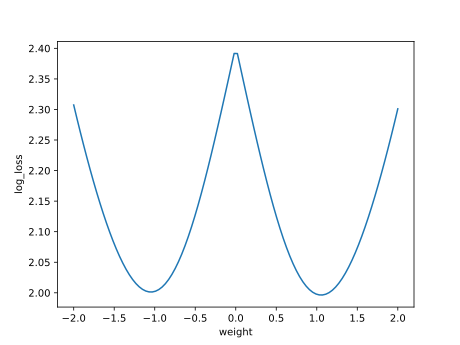
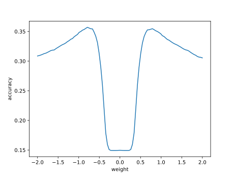
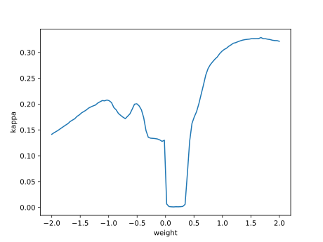

# Report mnist256 linspace -2,2 1

## Best results in hall of fame

| measure            |       value | individual   |
|:-------------------|------------:|:-------------|
| MAX:accuracy.min   | 0.1493      | 43488        |
| MIN:accuracy.min   | 0.0991      | 40849        |
| MEAN:accuracy.min  | 0.14428     |              |
| MAX:accuracy.mean  | 0.300602    | 43488        |
| MIN:accuracy.mean  | 0.2827      | 40849        |
| MEAN:accuracy.mean | 0.298076    |              |
| MAX:accuracy.max   | 0.3968      | 40849        |
| MIN:accuracy.max   | 0.3571      | 40941        |
| MEAN:accuracy.max  | 0.36426     |              |
| MAX:kappa.min      | 0.0529716   | 43488        |
| MIN:kappa.min      | 0.000976091 | 40849        |
| MEAN:kappa.min     | 0.047772    |              |
| MAX:kappa.mean     | 0.222269    | 43488        |
| MIN:kappa.mean     | 0.203627    | 40849        |
| MEAN:kappa.mean    | 0.21959     |              |
| MAX:kappa.max      | 0.328911    | 40849        |
| MIN:kappa.max      | 0.285126    | 40941        |
| MEAN:kappa.max     | 0.29303     |              |
| MAX:log_loss.min   | 2.00375     | 40974        |
| MIN:log_loss.min   | 1.66759     | 40849        |
| MEAN:log_loss.min  | 1.96295     |              |
| MAX:log_loss.mean  | 2.14125     | 42913        |
| MIN:log_loss.mean  | 2.0093      | 40849        |
| MEAN:log_loss.mean | 2.11608     |              |
| MAX:log_loss.max   | 2.40934     | 40849        |
| MIN:log_loss.max   | 2.39164     | 43938        |
| MEAN:log_loss.max  | 2.39352     |              |

## Individuals in hall of fame

### Individual 43488

| key                    |       value |
|:-----------------------|------------:|
| mean accuracy:         |    0.300602 |
| mean kappa:            |    0.222269 |
| mean log_loss:         |    2.12885  |
| number of edges        | 2573        |
| number of hidden nodes |    1        |
| number of layers       |    1        |
| birth                  |    0        |
| number of mutations    |   44        |

#### Confusion matrix

#### Network

### Individual 43938

| key                    |       value |
|:-----------------------|------------:|
| mean accuracy:         |    0.30056  |
| mean kappa:            |    0.222223 |
| mean log_loss:         |    2.12144  |
| number of edges        | 2574        |
| number of hidden nodes |    1        |
| number of layers       |    1        |
| birth                  |    0        |
| number of mutations    |   44        |

#### Confusion matrix

#### Network

### Individual 43429

| key                    |       value |
|:-----------------------|------------:|
| mean accuracy:         |    0.300559 |
| mean kappa:            |    0.222222 |
| mean log_loss:         |    2.12169  |
| number of edges        | 2573        |
| number of hidden nodes |    1        |
| number of layers       |    1        |
| birth                  |    0        |
| number of mutations    |   43        |

#### Confusion matrix

#### Network

### Individual 42387

| key                    |       value |
|:-----------------------|------------:|
| mean accuracy:         |    0.300556 |
| mean kappa:            |    0.222215 |
| mean log_loss:         |    2.13387  |
| number of edges        | 2570        |
| number of hidden nodes |    0        |
| number of layers       |    0        |
| birth                  |    0        |
| number of mutations    |   41        |

#### Confusion matrix

#### Network

### Individual 42913

| key                    |       value |
|:-----------------------|------------:|
| mean accuracy:         |    0.300524 |
| mean kappa:            |    0.22218  |
| mean log_loss:         |    2.14125  |
| number of edges        | 2570        |
| number of hidden nodes |    0        |
| number of layers       |    0        |
| birth                  |    0        |
| number of mutations    |   42        |

#### Confusion matrix

#### Network

### Individual 40974

| key                    |       value |
|:-----------------------|------------:|
| mean accuracy:         |    0.300408 |
| mean kappa:            |    0.222014 |
| mean log_loss:         |    2.13803  |
| number of edges        | 2570        |
| number of hidden nodes |    0        |
| number of layers       |    0        |
| birth                  |    0        |
| number of mutations    |   40        |

#### Confusion matrix

#### Network

### Individual 45446

| key                    |       value |
|:-----------------------|------------:|
| mean accuracy:         |    0.300031 |
| mean kappa:            |    0.221643 |
| mean log_loss:         |    2.11922  |
| number of edges        | 2575        |
| number of hidden nodes |    1        |
| number of layers       |    1        |
| birth                  |    0        |
| number of mutations    |   46        |

#### Confusion matrix

#### Network

### Individual 44543

| key                    |       value |
|:-----------------------|------------:|
| mean accuracy:         |    0.299918 |
| mean kappa:            |    0.221522 |
| mean log_loss:         |    2.11975  |
| number of edges        | 2574        |
| number of hidden nodes |    1        |
| number of layers       |    1        |
| birth                  |    0        |
| number of mutations    |   45        |

#### Confusion matrix

#### Network

### Individual 40941

| key                    |       value |
|:-----------------------|------------:|
| mean accuracy:         |    0.2949   |
| mean kappa:            |    0.215987 |
| mean log_loss:         |    2.12737  |
| number of edges        | 2572        |
| number of hidden nodes |    1        |
| number of layers       |    1        |
| birth                  |    0        |
| number of mutations    |   40        |

#### Confusion matrix

#### Network

### Individual 40849

| key                    |       value |
|:-----------------------|------------:|
| mean accuracy:         |    0.2827   |
| mean kappa:            |    0.203627 |
| mean log_loss:         |    2.0093   |
| number of edges        | 2660        |
| number of hidden nodes |   39        |
| number of layers       |    4        |
| birth                  |    0        |
| number of mutations    |   82        |

#### Confusion matrix

#### Network

