# Report mnist784 linspace -2,2 0

## Best results in hall of fame

| measure            |     value | individual   |
|:-------------------|----------:|:-------------|
| MAX:accuracy.min   | 0.1475    | 44016        |
| MIN:accuracy.min   | 0.1475    | 44016        |
| MEAN:accuracy.min  | 0.1475    |              |
| MAX:accuracy.mean  | 0.336774  | 44016        |
| MIN:accuracy.mean  | 0.323732  | 35469        |
| MEAN:accuracy.mean | 0.329558  |              |
| MAX:accuracy.max   | 0.4979    | 44016        |
| MIN:accuracy.max   | 0.4541    | 35469        |
| MEAN:accuracy.max  | 0.47599   |              |
| MAX:kappa.min      | 0.0409449 | 44016        |
| MIN:kappa.min      | 0.0409437 | 39864        |
| MEAN:kappa.min     | 0.0409441 |              |
| MAX:kappa.mean     | 0.259321  | 44016        |
| MIN:kappa.mean     | 0.244552  | 35469        |
| MEAN:kappa.mean    | 0.251243  |              |
| MAX:kappa.max      | 0.441654  | 44424        |
| MIN:kappa.max      | 0.393262  | 35469        |
| MEAN:kappa.max     | 0.417458  |              |
| MAX:log_loss.min   | 1.867     | 35469        |
| MIN:log_loss.min   | 1.71436   | 44621        |
| MEAN:log_loss.min  | 1.80917   |              |
| MAX:log_loss.mean  | 2.02652   | 35469        |
| MIN:log_loss.mean  | 1.95612   | 44621        |
| MEAN:log_loss.mean | 1.99758   |              |
| MAX:log_loss.max   | 2.38388   | 44621        |
| MIN:log_loss.max   | 2.35478   | 35469        |
| MEAN:log_loss.max  | 2.36805   |              |

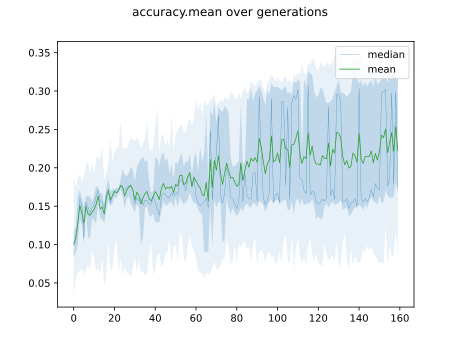

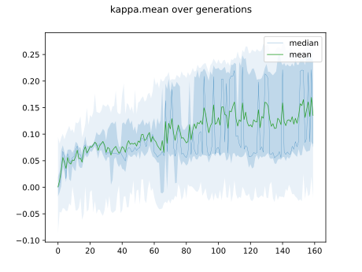

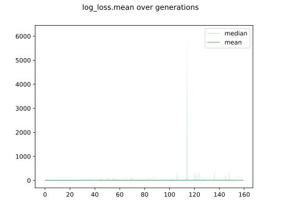

## Individuals in hall of fame

### Individual 44016

| key                    |       value |
|:-----------------------|------------:|
| mean accuracy:         |    0.336774 |
| mean kappa:            |    0.259321 |
| mean log_loss:         |    1.96734  |
| number of edges        | 7957        |
| number of hidden nodes |   34        |
| number of layers       |    2        |
| birth                  |    0        |
| number of mutations    |  107        |

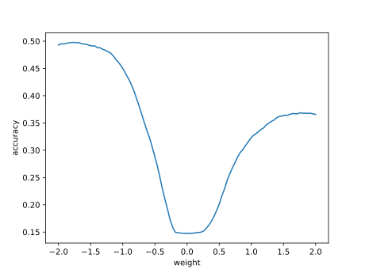

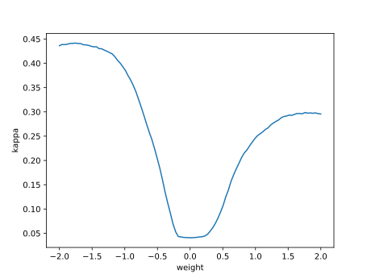

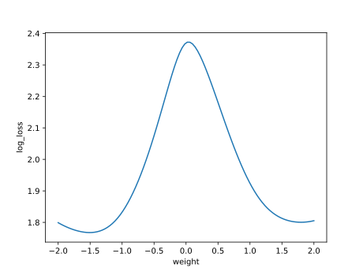

#### Confusion matrix

#### Network

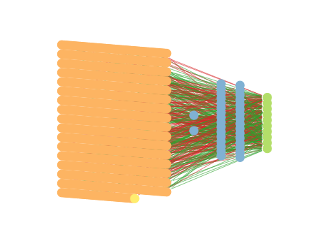

### Individual 44424

| key                    |       value |
|:-----------------------|------------:|
| mean accuracy:         |    0.336395 |
| mean kappa:            |    0.258944 |
| mean log_loss:         |    1.96203  |
| number of edges        | 7956        |
| number of hidden nodes |   33        |
| number of layers       |    2        |
| birth                  |    0        |
| number of mutations    |  107        |

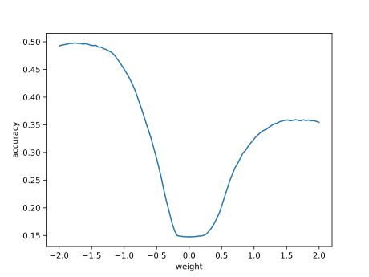

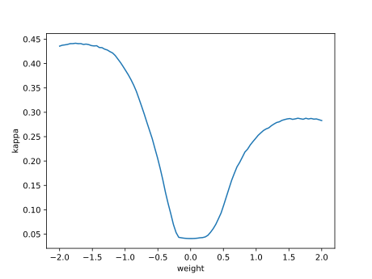

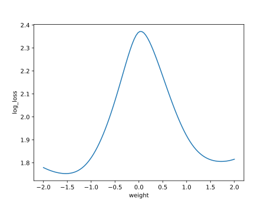

#### Confusion matrix

#### Network

### Individual 39864

| key                    |       value |
|:-----------------------|------------:|
| mean accuracy:         |    0.335282 |
| mean kappa:            |    0.257696 |
| mean log_loss:         |    1.98527  |
| number of edges        | 7948        |
| number of hidden nodes |   31        |
| number of layers       |    1        |
| birth                  |    0        |
| number of mutations    |   99        |

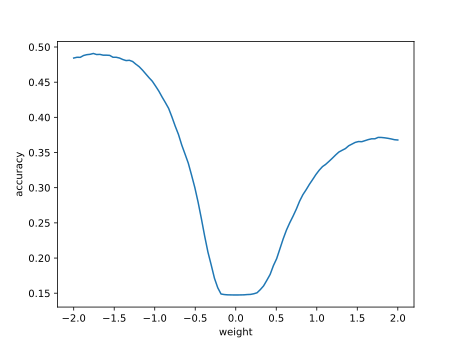

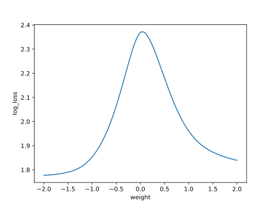

#### Confusion matrix

#### Network

### Individual 44621

| key                    |       value |
|:-----------------------|------------:|
| mean accuracy:         |    0.332623 |
| mean kappa:            |    0.254925 |
| mean log_loss:         |    1.95612  |
| number of edges        | 7955        |
| number of hidden nodes |   33        |
| number of layers       |    2        |
| birth                  |    0        |
| number of mutations    |  107        |

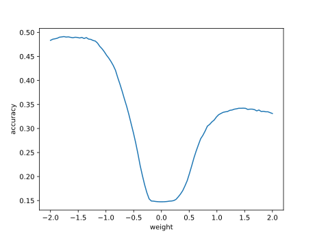

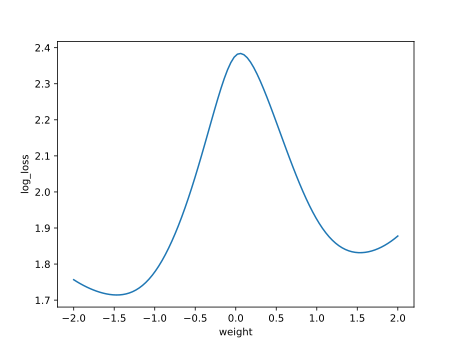

#### Confusion matrix

#### Network

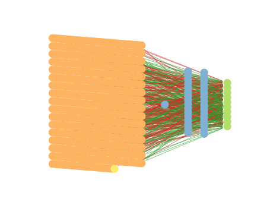

### Individual 37240

| key                    |       value |
|:-----------------------|------------:|
| mean accuracy:         |    0.328572 |
| mean kappa:            |    0.25007  |
| mean log_loss:         |    2.01616  |
| number of edges        | 7945        |
| number of hidden nodes |   31        |
| number of layers       |    1        |
| birth                  |    0        |
| number of mutations    |   94        |

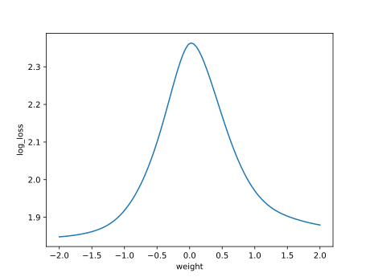

#### Confusion matrix

#### Network

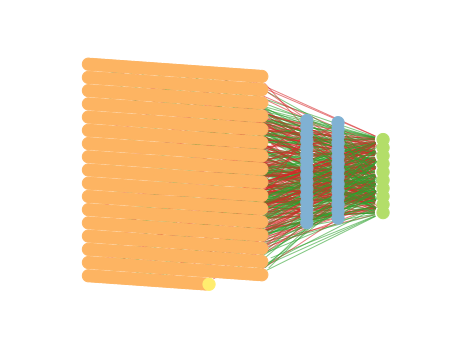

### Individual 36655

| key                    |       value |
|:-----------------------|------------:|
| mean accuracy:         |    0.326439 |
| mean kappa:            |    0.247671 |
| mean log_loss:         |    2.01871  |
| number of edges        | 7944        |
| number of hidden nodes |   31        |
| number of layers       |    1        |
| birth                  |    0        |
| number of mutations    |   93        |

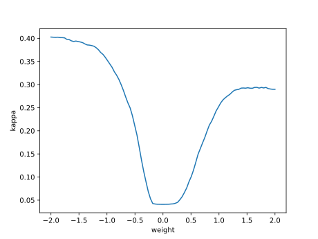

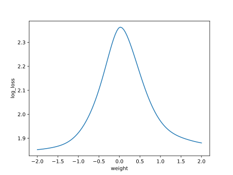

#### Confusion matrix

#### Network

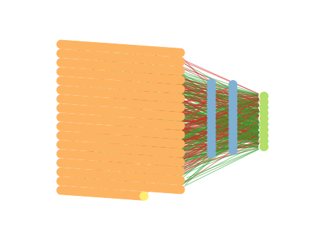

### Individual 39168

| key                    |       value |
|:-----------------------|------------:|
| mean accuracy:         |    0.32607  |
| mean kappa:            |    0.247375 |
| mean log_loss:         |    1.99987  |
| number of edges        | 7946        |
| number of hidden nodes |   31        |
| number of layers       |    1        |
| birth                  |    0        |
| number of mutations    |   98        |

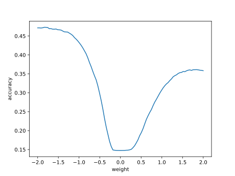

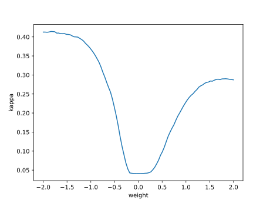

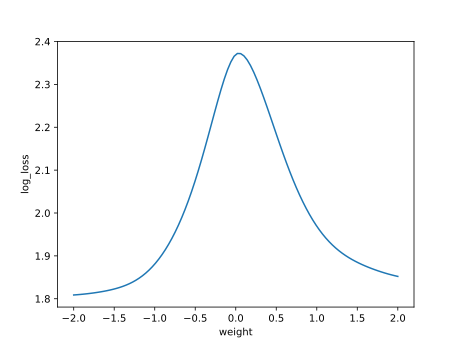

#### Confusion matrix

#### Network

### Individual 37153

| key                    |       value |
|:-----------------------|------------:|
| mean accuracy:         |    0.32505  |
| mean kappa:            |    0.246187 |
| mean log_loss:         |    2.02556  |
| number of edges        | 7946        |
| number of hidden nodes |   32        |
| number of layers       |    1        |
| birth                  |    0        |
| number of mutations    |   94        |

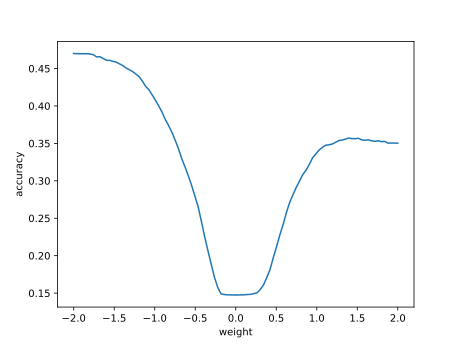

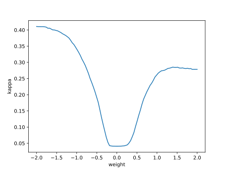

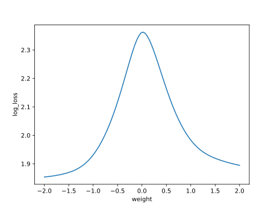

#### Confusion matrix

#### Network

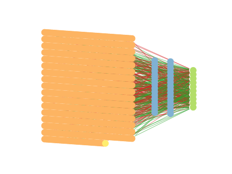

### Individual 36814

| key                    |       value |
|:-----------------------|------------:|
| mean accuracy:         |    0.324641 |
| mean kappa:            |    0.24569  |
| mean log_loss:         |    2.01823  |
| number of edges        | 7944        |
| number of hidden nodes |   31        |
| number of layers       |    1        |
| birth                  |    0        |
| number of mutations    |   93        |

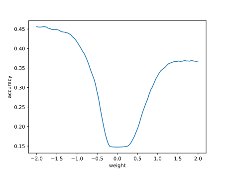

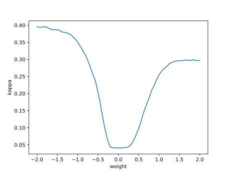

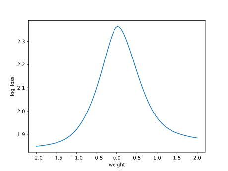

#### Confusion matrix

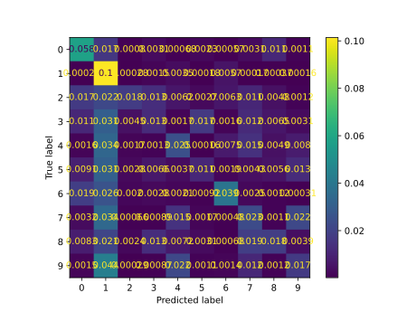

#### Network

### Individual 35469

| key                    |       value |
|:-----------------------|------------:|
| mean accuracy:         |    0.323732 |
| mean kappa:            |    0.244552 |
| mean log_loss:         |    2.02652  |
| number of edges        | 7944        |
| number of hidden nodes |   31        |
| number of layers       |    1        |
| birth                  |    0        |
| number of mutations    |   91        |

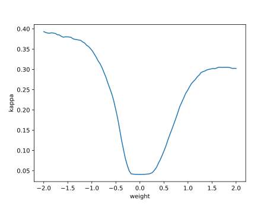

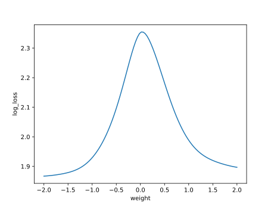

#### Confusion matrix

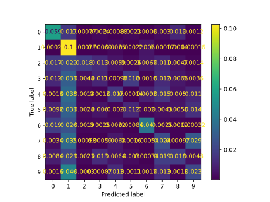

#### Network

