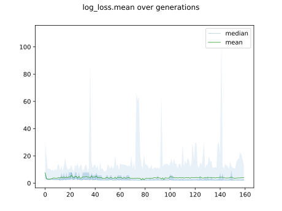
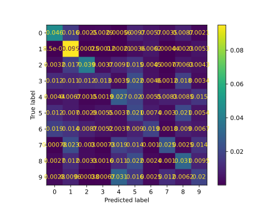

# Report mnist784 linspace -2,2 1

## Best results in hall of fame

| measure            |    value | individual   |
|:-------------------|---------:|:-------------|
| MAX:accuracy.min   | 0.2201   | 45436        |
| MIN:accuracy.min   | 0.2165   | 43849        |
| MEAN:accuracy.min  | 0.2177   |              |
| MAX:accuracy.mean  | 0.346959 | 45436        |
| MIN:accuracy.mean  | 0.336844 | 43728        |
| MEAN:accuracy.mean | 0.340548 |              |
| MAX:accuracy.max   | 0.4661   | 39794        |
| MIN:accuracy.max   | 0.4293   | 43728        |
| MEAN:accuracy.max  | 0.43814  |              |
| MAX:kappa.min      | 0.135582 | 45436        |
| MIN:kappa.min      | 0.130282 | 43849        |
| MEAN:kappa.min     | 0.132019 |              |
| MAX:kappa.mean     | 0.274395 | 45436        |
| MIN:kappa.mean     | 0.26264  | 43728        |
| MEAN:kappa.mean    | 0.266925 |              |
| MAX:kappa.max      | 0.406129 | 39794        |
| MIN:kappa.max      | 0.365217 | 43728        |
| MEAN:kappa.max     | 0.375032 |              |
| MAX:log_loss.min   | 1.81734  | 36864        |
| MIN:log_loss.min   | 1.79241  | 43897        |
| MEAN:log_loss.min  | 1.80436  |              |
| MAX:log_loss.mean  | 2.06262  | 36864        |
| MIN:log_loss.mean  | 2.03638  | 45436        |
| MEAN:log_loss.mean | 2.0455   |              |
| MAX:log_loss.max   | 2.39919  | 36864        |
| MIN:log_loss.max   | 2.3988   | 39794        |
| MEAN:log_loss.max  | 2.39895  |              |

## Individuals in hall of fame

### Individual 45436

| key                    |       value |
|:-----------------------|------------:|
| mean accuracy:         |    0.346959 |
| mean kappa:            |    0.274395 |
| mean log_loss:         |    2.03638  |
| number of edges        | 7951        |
| number of hidden nodes |   39        |
| number of layers       |    2        |
| birth                  |    0        |
| number of mutations    |  102        |

#### Confusion matrix

#### Network

### Individual 44644

| key                    |       value |
|:-----------------------|------------:|
| mean accuracy:         |    0.343028 |
| mean kappa:            |    0.270028 |
| mean log_loss:         |    2.03706  |
| number of edges        | 7949        |
| number of hidden nodes |   38        |
| number of layers       |    2        |
| birth                  |    0        |
| number of mutations    |  101        |

#### Confusion matrix

#### Network

### Individual 45268

| key                    |       value |
|:-----------------------|------------:|
| mean accuracy:         |    0.343019 |
| mean kappa:            |    0.270018 |
| mean log_loss:         |    2.03706  |
| number of edges        | 7950        |
| number of hidden nodes |   38        |
| number of layers       |    2        |
| birth                  |    0        |
| number of mutations    |  102        |

#### Confusion matrix

#### Network

### Individual 44367

| key                    |       value |
|:-----------------------|------------:|
| mean accuracy:         |    0.341183 |
| mean kappa:            |    0.267591 |
| mean log_loss:         |    2.04143  |
| number of edges        | 7949        |
| number of hidden nodes |   38        |
| number of layers       |    2        |
| birth                  |    0        |
| number of mutations    |  100        |

#### Confusion matrix

#### Network

### Individual 39794

| key                    |       value |
|:-----------------------|------------:|
| mean accuracy:         |    0.340853 |
| mean kappa:            |    0.267199 |
| mean log_loss:         |    2.05794  |
| number of edges        | 7942        |
| number of hidden nodes |   38        |
| number of layers       |    2        |
| birth                  |    0        |
| number of mutations    |   93        |

#### Confusion matrix

#### Network

### Individual 44351

| key                    |       value |
|:-----------------------|------------:|
| mean accuracy:         |    0.339677 |
| mean kappa:            |    0.265771 |
| mean log_loss:         |    2.04316  |
| number of edges        | 7947        |
| number of hidden nodes |   37        |
| number of layers       |    2        |
| birth                  |    0        |
| number of mutations    |   99        |

#### Confusion matrix

#### Network

### Individual 43849

| key                    |       value |
|:-----------------------|------------:|
| mean accuracy:         |    0.33846  |
| mean kappa:            |    0.264425 |
| mean log_loss:         |    2.04572  |
| number of edges        | 7946        |
| number of hidden nodes |   37        |
| number of layers       |    2        |
| birth                  |    0        |
| number of mutations    |   98        |

#### Confusion matrix

#### Network

### Individual 43897

| key                    |       value |
|:-----------------------|------------:|
| mean accuracy:         |    0.338281 |
| mean kappa:            |    0.264246 |
| mean log_loss:         |    2.04508  |
| number of edges        | 7945        |
| number of hidden nodes |   37        |
| number of layers       |    2        |
| birth                  |    0        |
| number of mutations    |   98        |

#### Confusion matrix

#### Network

### Individual 36864

| key                    |       value |
|:-----------------------|------------:|
| mean accuracy:         |    0.337171 |
| mean kappa:            |    0.262932 |
| mean log_loss:         |    2.06262  |
| number of edges        | 7936        |
| number of hidden nodes |   35        |
| number of layers       |    2        |
| birth                  |    0        |
| number of mutations    |   91        |

#### Confusion matrix

#### Network

### Individual 43728

| key                    |       value |
|:-----------------------|------------:|
| mean accuracy:         |    0.336844 |
| mean kappa:            |    0.26264  |
| mean log_loss:         |    2.04851  |
| number of edges        | 7945        |
| number of hidden nodes |   37        |
| number of layers       |    2        |
| birth                  |    0        |
| number of mutations    |   97        |

#### Confusion matrix

#### Network

